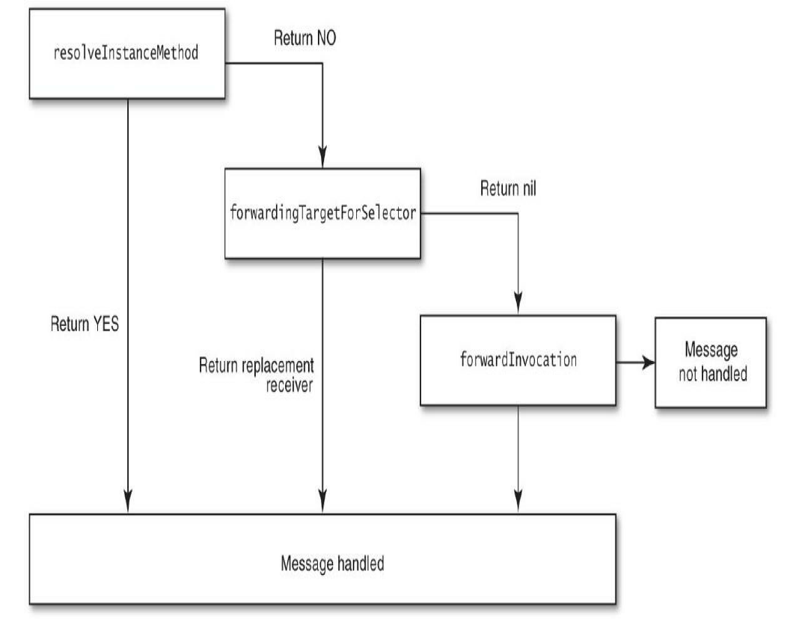

# iOS Runtime相关

<!--
create time: 2018-12-03 11:14:48
Author: <黄东鸿>
-->

[玉令天下博客的Objective-C Runtime](http://yulingtianxia.com/blog/2014/11/05/objective-c-runtime/)

[顾鹏博客的Objective-C Runtime](http://tech.glowing.com/cn/objective-c-runtime/) 或者 [http://ju.outofmemory.cn/entry/108810](http://ju.outofmemory.cn/entry/108810)

[Objective-C 中的消息与消息转发](https://blog.ibireme.com/2013/11/26/objective-c-messaging/)

[Sam_Lau 简书博客的Objective-C特性：Runtime](http://www.jianshu.com/p/25a319aee33d)

[神经病院 Objective-C Runtime 入院第一天—— isa 和 Class](https://halfrost.com/objc_runtime_isa_class/)

[RunTime解析](https://xiaozhuanlan.com/topic/2895160743#sectionruntime-1) -- 汇总的文章吧，可以看看

[objc runtime 源码](https://opensource.apple.com/source/objc4/objc4-646/runtime/)

## 一、谈谈你对Runtime的理解

`Runtime` 是 Objective-C 的动态运行时库，正是有了`Runtime`，Objective-C 才有了面向对象的特性（Objective-C是基于C语言的扩展）和灵活的动态特性。我们常说，Objective-C 是一门动态语言，是因为它的代码运行不总是在编译期决定的，而是有一部分工作推迟到了运行时才动态执行的，Objective-C可以在运行时动态地创建类和对象、进行消息传递和转发。

`Runtime` 中有一个重要的概念叫做**“消息”**，消息的执行会使用到一些编译器为实现动态特性而创建的数据结构和函数，Objc 中的类、方法和协议等在 runtime 中都由一些数据结构来定义。

了解 `Runtime`，就要先了解它的核心 -- `消息传递和转发机制`。

在 Objective-C 中，调用一个对象的某个方法 `[receiver message]`，其实是在给这个对象发送一条消息，它会被编译器转化为：

	objc_msgSend(receiver, selector)
	
如果消息的接收者能够找到对应的selector，那么就相当于直接执行了接收者这个对象的特定方法；否则，消息要么被转发，或是临时向接收者添加这个selector对应的实现内容，要么就干脆玩完奔溃掉。

所以可以看出 `[receiver message]` 这不是简简单单的方法调用，这只是在编译阶段确定了要向接收者发送 `message` 这条消息，而 `receiver` 将要如何响应这条消息，就要看运行时发生的情况来决定了。

利用 runtime，我们可以做很多比较酷的事情，比如：

* 热更新，JSPatch直接调用 `objc_msgForward`来实现其核心功能的，做到了让JS调用/替换任意OC方法，让iOS APP具备热更新的能力。
* 给Category添加属性
* 黑魔法：使用 Method Swizzling 替换 系统方法的实现 

### Runtime术语

`objc_msgSend` 定义是这样的：

```
id objc_msgSend ( id self, SEL op, ... );
```

第一个参数类型为id，它是一个指向类实例的指针：

```
typedef struct objc_object *id;
```

在 `objc-private.h` 源码中，`objc_object`的定义是这样的：

```
struct objc_object {
private:
    isa_t isa;

public:

    // ISA() assumes this is NOT a tagged pointer object
    Class ISA();

    // getIsa() allows this to be a tagged pointer object
    Class getIsa();
    ... 此处省略其他方法声明
}
```

每个对象都有一个 `isa` 指针，指向它的类对象，其实是一个指向 `objc_class` 结构体的指针

```objective-c
struct objc_class {
    Class isa  OBJC_ISA_AVAILABILITY;

#if !__OBJC2__
    Class super_class                                        OBJC2_UNAVAILABLE;
    const char *name                                         OBJC2_UNAVAILABLE;
    long version                                             OBJC2_UNAVAILABLE;
    long info                                                OBJC2_UNAVAILABLE;
    long instance_size                                       OBJC2_UNAVAILABLE;
    struct objc_ivar_list *ivars                             OBJC2_UNAVAILABLE;
    struct objc_method_list **methodLists                    OBJC2_UNAVAILABLE;
    struct objc_cache *cache                                 OBJC2_UNAVAILABLE;
    struct objc_protocol_list *protocols                     OBJC2_UNAVAILABLE;
#endif

} OBJC2_UNAVAILABLE;
```

可以看到运行时一个类还关联了它的超类指针，类名，成员变量，方法，缓存，还有附属的协议。

* `isa` : 指向类对象的元类（Meta Class），因为Objc的类的本身也是一个Object，为了处理这个关系，runtime就创造了Meta Class，当给类发送[NSObject alloc]这样消息时，实际上是把这个消息发给了Class Object
* `super_class` : 实例对象对应的父类
* `name` : 类名
* `ivars` : 成员变量列表（链表）
* `methodLists` : 方法列表（链表）
* `cache` : 方法缓存，用来缓存经常访问的方法。对象接到一个消息会根据isa指针查找消息对象，这时会在method Lists中遍历，如果cache了，常用的方法调用时就能够提高调用的效率。
* `protocols` : 协议列表（链表）

objc_class中也有一个isa对象，这是因为一个 ObjC 类本身同时也是一个对象，为了处理类和对象的关系，runtime 库创建了一种叫做元类 (Meta Class) 的东西，类对象所属类型就叫做元类，它用来表述类对象本身所具备的元数据。

每个类仅有一个类对象，而每个类对象仅有一个与之相关的元类。当你发出一个类似[NSObject alloc]的消息时，你事实上是把这个消息发给了一个类对象 (Class Object) ，这个类对象必须是一个元类的实例，而这个元类同时也是一个根元类 (root meta class) 的实例。**所有的元类最终都指向根元类为其超类。所有的元类的方法列表都有能够响应消息的类方法。**所以当 [NSObject alloc] 这条消息发给类对象的时候，objc_msgSend()会去它的元类里面去查找能够响应消息的方法，如果找到了，然后对这个类对象执行方法调用。


上图实线是 super_class 指针，虚线是isa指针。 有趣的是**根元类的超类是NSObject，而isa指向了自己，而NSObject的超类为nil，也就是它没有超类**。


`Cache`为方法调用的性能进行优化，通俗地讲，每当实例对象接收到一个消息时，它不会直接在isa指向的类的方法列表中遍历查找能够响应消息的方法，因为这样效率太低了，而是优先在`Cache`中查找。Runtime 系统会把被调用的方法存到`Cache`中（理论上讲一个方法如果被调用，那么它有可能今后还会被调用），下次查找的时候效率更高。

### 消息传递和转发机制

#### objc_msgSend函数

前面已经对`objc_msgSend`进行了一点介绍，看起来像是`objc_msgSend`返回了数据，其实`objc_msgSend`从不返回数据而是你的方法被调用后返回了数据。

下面详细叙述下消息发送步骤：

1. 检测这个 selector 是不是要忽略的。比如 Mac OS X 开发，有了垃圾回收就不理会 retain, release 这些函数了。
2. 检测这个 target 是不是 nil 对象。ObjC 的特性是允许对一个 nil 对象执行任何一个方法不会 Crash，因为会被忽略掉。
3. 如果上面两个都过了，那就开始查找这个类的 IMP，先从 cache 里面找，完了找得到就跳到对应的函数去执行。
4. 如果 cache 找不到就找一下方法分发表。
5. 如果分发表找不到就到超类的分发表去找，一直找，直到找到NSObject类为止。
6. 如果还找不到就要开始进入动态方法解析了，后面会提到。


#### 消息转发



`_objc_msgForward`消息转发做了如下几件事：

1. 调用 `resolveInstanceMethod` 方法，允许用户在此时为该Class动态添加实现。如果有实现了，则调用并返回。如果仍没实现，继续下面的动作。
2. 调用`forwardingTargetForSelector:`方法，尝试找到一个能响应该消息的对象。如果获取到，则直接转发给它。如果返回了nil或self，继续下面的动作。
3. 调用`methodSignatureForSelector:`方法，尝试获得一个方法签名。
4. 调用`forwardInvocation:`方法，将地3步获取到的方法签名包装成Invocation传入，如何处理就在这里面了。每个对象都从 NSObject 类中继承了 `forwardInvocation:`方法，然而，NSObject中的方法实现只是简单地调用了 `doesNotRecognizeSelector:`抛出异常。

上面这4个方法均是模板方法，开发者可以override，由runtime来调用。最常见的实现消息转发，就是重写方法3和4，吞掉一个消息或者代理给其他对象都是没问题的。

##### 动态方法解析

我们可以通过分别重载 `resolveInstanceMethod:` 和 `resolveClassMethod:` 方法分别添加实例方法实现和类方法实现。因为当 Runtime 系统在Cache和方法分发表中（包括超类）找不到要执行的方法时，Runtime会调用 `resolveInstanceMethod:` 或 `resolveClassMethod:` 来给程序员一次动态添加方法实现的机会。我们需要用 `class_addMethod` 函数完成向特定类添加特定方法实现的操作：

```
void dynamicMethodIMP(id self, SEL _cmd) {
    // implementation ....
}
@implementation MyClass
+ (BOOL)resolveInstanceMethod:(SEL)aSEL
{
    if (aSEL == @selector(resolveThisMethodDynamically)) {
          class_addMethod([self class], aSEL, (IMP) dynamicMethodIMP, "v@:");
          return YES;
    }
    return [super resolveInstanceMethod:aSEL];
}
@end
```

上面的例子为resolveThisMethodDynamically方法添加了实现内容，也就是dynamicMethodIMP方法中的代码。其中 “v@:” 表示返回值和参数，这个符号涉及 [Type Encoding](https://developer.apple.com/library/archive/documentation/Cocoa/Conceptual/ObjCRuntimeGuide/Articles/ocrtTypeEncodings.html)

动态方法解析会在消息转发机制浸入前执行。如果 `respondsToSelector:` 或 `instancesRespondToSelector:` 方法被执行，动态方法解析器将会被首先给予一个提供该方法选择器对应的IMP的机会。如果你想让该方法选择器被传送到转发机制，那么就让`resolveInstanceMethod:` 返回 `NO`。

##### 重定向

在消息转发机制执行前，Runtime 系统会再给我们一次偷梁换柱的机会，即通过重载 `- (id)forwardingTargetForSelector:(SEL)aSelector` 方法替换消息的接受者为其他对象：

```objective-c
- (id)forwardingTargetForSelector:(SEL)aSelector
{
    if(aSelector == @selector(mysteriousMethod:)){
        return alternateObject;
    }
    return [super forwardingTargetForSelector:aSelector];
}
```

毕竟消息转发要耗费更多时间，抓住这次机会将消息重定向给别人是个不错的选择，如果此方法返回nil或self，则会进入消息转发机制(`forwardInvocation:`);否则将向返回的对象重新发送消息。

如果想替换类方法的接受者，需要覆写 `+ (id)forwardingTargetForSelector:(SEL)aSelector` 方法，并返回类对象：

```
+ (id)forwardingTargetForSelector:(SEL)aSelector {
	if(aSelector == @selector(xxx)) {
		return NSClassFromString(@"Class name");
	}
	return [super forwardingTargetForSelector:aSelector];
}
```

##### 转发

当消息转发机制被触发时，`forwardInvocation:` 方法会被执行，我们可以重写这个方法来定义我们的转发逻辑：

```
- (void)forwardInvocation:(NSInvocation *)anInvocation
{
    if ([someOtherObject respondsToSelector:
            [anInvocation selector]])
        [anInvocation invokeWithTarget:someOtherObject];
    else
        [super forwardInvocation:anInvocation];
}
```

该消息的唯一参数是个 `NSInvocation` 类型的对象——该对象封装了原始的消息和消息的参数。我们可以实现 `forwardInvocation:` 方法来对不能处理的消息做一些默认的处理，也可以将消息转发给其他对象来处理，而不抛出错误。

这里需要注意的是参数 `anInvocation` 是从哪的来的呢？其实在 `forwardInvocation:` 消息发送前，Runtime系统会向对象发送 `methodSignatureForSelector:` 消息，并取到返回的方法签名用于生成 `NSInvocation` 对象。所以我们在重写 `forwardInvocation:` 的同时也要重写`methodSignatureForSelector:` 方法，否则会抛异常。

当一个对象由于没有相应的方法实现而无法响应某消息时，运行时系统将通过 `forwardInvocation:`消息通知该对象。每个对象都从 `NSObject` 类中继承了 `forwardInvocation:` 方法。然而，`NSObject` 中的方法实现只是简单地调用了 `doesNotRecognizeSelector:`。通过实现我们自己的 `forwardInvocation:` 方法，我们可以在该方法实现中将消息转发给其它对象。

`forwardInvocation:` 方法就像一个不能识别的消息的分发中心，将这些消息转发给不同接收对象。或者它也可以象一个运输站将所有的消息都发送给同一个接收对象。它可以将一个消息翻译成另外一个消息，或者简单的”吃掉“某些消息，因此没有响应也没有错误。`forwardInvocation:` 方法也可以对不同的消息提供同样的响应，这一切都取决于方法的具体实现。该方法所提供是将不同的对象链接到消息链的能力。

注意： `forwardInvocation:`方法只有在消息接收对象中无法正常响应消息时才会被调用。 所以，如果我们希望一个对象将 negotiate 消息转发给其它对象，则这个对象不能有 negotiate 方法。否则，`forwardInvocation:`将不可能会被调用。

 
## 二、Runtime如何实现weak属性？（runtime如何实现weak变量的自动置nil？）

[Runtime如何实现weak属性？](http://solacode.github.io/2015/10/21/Runtime%E5%A6%82%E4%BD%95%E5%AE%9E%E7%8E%B0weak%E5%B1%9E%E6%80%A7%EF%BC%9F/)

[weak是怎么实现的](http://www.jianshu.com/p/fe9865814668)

[Why is weak_table_t a member of SideTable in Objective-C runtime?](http://stackoverflow.com/questions/35427340/why-is-weak-table-t-a-member-of-sidetable-in-objective-c-runtime)

要实现 weak 属性，首先要搞清楚 weak 属性的特点：

> weak 此特质表明该属性定义了一种“非拥有关系” (nonowning relationship)。为这种属性设置新值时，设置方法既不保留新值，也不释放旧值。此特质同 assign 类似， 然而在属性所指的对象遭到摧毁时，属性值也会清空(nil out)。

那么 runtime 如何实现 weak 变量的自动置nil？

> runtime 对注册的类， 会进行布局，对于 weak 对象会放入一个 hash 表中。 用 weak 指向的对象内存地址作为 key，当此对象的引用计数为0的时候会 dealloc，假如 weak 指向的对象内存地址是a，那么就会以a为键， 在这个 weak 表中搜索，找到所有以a为键的 weak 对象，从而设置为 nil。

（注：在下文的《使用runtime Associate方法关联的对象，需要在主对象dealloc的时候释放么？》里给出的“对象的内存销毁时间表”也提到`__weak`引用的解除时间。）

先看下 runtime 里源码的实现：

 ```Objective-C
/**
 * The internal structure stored in the weak references table. 
 * It maintains and stores
 * a hash set of weak references pointing to an object.
 * If out_of_line==0, the set is instead a small inline array.
 */
#define WEAK_INLINE_COUNT 4
struct weak_entry_t {
    DisguisedPtr<objc_object> referent;
    union {
        struct {
            weak_referrer_t *referrers;
            uintptr_t        out_of_line : 1;
            uintptr_t        num_refs : PTR_MINUS_1;
            uintptr_t        mask;
            uintptr_t        max_hash_displacement;
        };
        struct {
            // out_of_line=0 is LSB of one of these (don't care which)
            weak_referrer_t  inline_referrers[WEAK_INLINE_COUNT];
        };
    };
};

/**
 * The global weak references table. Stores object ids as keys,
 * and weak_entry_t structs as their values.
 */
struct weak_table_t {
    weak_entry_t *weak_entries;
    size_t    num_entries;
    uintptr_t mask;
    uintptr_t max_hash_displacement;
};
 ```

具体完整实现参照 [objc/objc-weak.h](https://opensource.apple.com/source/objc4/objc4-646/runtime/objc-weak.h) 。


我们可以设计一个函数（伪代码）来表示上述机制：

`objc_storeWeak(&a, b)`函数：

`objc_storeWeak`函数把第二个参数--赋值对象（b）的内存地址作为键值key，将第一个参数--weak修饰的属性变量（a）的内存地址（&a）作为value，注册到 weak 表中。如果第二个参数（b）为0（nil），那么把变量（a）的内存地址（&a）从weak表中删除，

你可以把`objc_storeWeak(&a, b)`理解为：`objc_storeWeak(value, key)`，并且当key变nil，将value置nil。

在b非nil时，a和b指向同一个内存地址，在b变nil时，a变nil。此时向a发送消息不会崩溃：在Objective-C中向nil发送消息是安全的。

而如果a是由 assign 修饰的，则：
在 b 非 nil 时，a 和 b 指向同一个内存地址，在 b 变 nil 时，a 还是指向该内存地址，变野指针。此时向 a 发送消息极易崩溃。


下面我们将基于`objc_storeWeak(&a, b)`函数，使用伪代码模拟“runtime如何实现weak属性”：
 
```Objective-C
// 使用伪代码模拟：runtime如何实现weak属性
// http://weibo.com/luohanchenyilong/
// https://github.com/ChenYilong

 id obj1;
 objc_initWeak(&obj1, obj);
/*obj引用计数变为0，变量作用域结束*/
 objc_destroyWeak(&obj1);
```

下面对用到的两个方法`objc_initWeak`和`objc_destroyWeak`做下解释：

总体说来，作用是：
通过`objc_initWeak`函数初始化“附有weak修饰符的变量（obj1）”，在变量作用域结束时通过`objc_destoryWeak`函数释放该变量（obj1）。

下面分别介绍下方法的内部实现：

`objc_initWeak`函数的实现是这样的：在将“附有weak修饰符的变量（obj1）”初始化为0（nil）后，会将“赋值对象”（obj）作为参数，调用`objc_storeWeak`函数。
 
```Objective-C
obj1 = 0；
obj_storeWeak(&obj1, obj);
```

也就是说：

>  weak 修饰的指针默认值是 nil （在Objective-C中向nil发送消息是安全的）

然后`obj_destroyWeak`函数将0（nil）作为参数，调用`objc_storeWeak`函数。

`objc_storeWeak(&obj1, 0);`

前面的源代码与下列源代码相同。

```Objective-C
// 使用伪代码模拟：runtime如何实现weak属性
// http://weibo.com/luohanchenyilong/
// https://github.com/ChenYilong

id obj1;
obj1 = 0;
objc_storeWeak(&obj1, obj);
/* ... obj的引用计数变为0，被置nil ... */
objc_storeWeak(&obj1, 0);
```

`objc_storeWeak` 函数把第二个参数--赋值对象（obj）的内存地址作为键值，将第一个参数--weak修饰的属性变量（obj1）的内存地址注册到 weak 表中。如果第二个参数（obj）为0（nil），那么把变量（obj1）的地址从 weak 表中删除。

使用伪代码是为了方便理解，下面我们“真枪实弹”地实现下：

> 如何让不使用weak修饰的@property，拥有weak的效果。

我们从setter方法入手：

 ```Objective-C
- (void)setObject:(NSObject *)object
{
    objc_setAssociatedObject(self, "object", object, OBJC_ASSOCIATION_ASSIGN);
    [object cyl_runAtDealloc:^{
        _object = nil;
    }];
}
 ```

也就是有两个步骤：

 1. 在setter方法中做如下设置：


 ```Objective-C
        objc_setAssociatedObject(self, "object", object, OBJC_ASSOCIATION_ASSIGN);
 ```

 2. 在属性所指的对象遭到摧毁时，属性值也会清空(nil out)。做到这点，同样要借助 runtime：
 
 ```Objective-C
//要销毁的目标对象
id objectToBeDeallocated;
//可以理解为一个“事件”：当上面的目标对象销毁时，同时要发生的“事件”。
id objectWeWantToBeReleasedWhenThatHappens;
objc_setAssociatedObject(objectToBeDeallocted,
                         someUniqueKey,
                         objectWeWantToBeReleasedWhenThatHappens,
                         OBJC_ASSOCIATION_RETAIN);
```

知道了思路，我们就开始实现 `cyl_runAtDealloc` 方法，实现过程分两部分：

第一部分：创建一个类，可以理解为一个“事件”：当目标对象销毁时，同时要发生的“事件”。借助 block 执行“事件”。

// .h文件

 ```Objective-C
// .h文件
// http://weibo.com/luohanchenyilong/
// https://github.com/ChenYilong
// 这个类，可以理解为一个“事件”：当目标对象销毁时，同时要发生的“事件”。借助block执行“事件”。

typedef void (^voidBlock)(void);

@interface CYLBlockExecutor : NSObject

- (id)initWithBlock:(voidBlock)block;

@end
 ```

// .m文件

 ```Objective-C
// .m文件
// http://weibo.com/luohanchenyilong/
// https://github.com/ChenYilong
// 这个类，可以理解为一个“事件”：当目标对象销毁时，同时要发生的“事件”。借助block执行“事件”。

#import "CYLBlockExecutor.h"

@interface CYLBlockExecutor() {
    voidBlock _block;
}
@implementation CYLBlockExecutor

- (id)initWithBlock:(voidBlock)aBlock
{
    self = [super init];
    
    if (self) {
        _block = [aBlock copy];
    }
    
    return self;
}

- (void)dealloc
{
    _block ? _block() : nil;
}

@end
 ```

第二部分：核心代码：利用runtime实现`cyl_runAtDealloc`方法

 ```Objective-C
// CYLNSObject+RunAtDealloc.h文件
// http://weibo.com/luohanchenyilong/
// https://github.com/ChenYilong
// 利用runtime实现cyl_runAtDealloc方法

#import "CYLBlockExecutor.h"

const void *runAtDeallocBlockKey = &runAtDeallocBlockKey;

@interface NSObject (CYLRunAtDealloc)

- (void)cyl_runAtDealloc:(voidBlock)block;

@end


// CYLNSObject+RunAtDealloc.m文件
// http://weibo.com/luohanchenyilong/
// https://github.com/ChenYilong
// 利用runtime实现cyl_runAtDealloc方法

#import "CYLNSObject+RunAtDealloc.h"
#import "CYLBlockExecutor.h"

@implementation NSObject (CYLRunAtDealloc)

- (void)cyl_runAtDealloc:(voidBlock)block
{
    if (block) {
        CYLBlockExecutor *executor = [[CYLBlockExecutor alloc] initWithBlock:block];
        
        objc_setAssociatedObject(self,
                                 runAtDeallocBlockKey,
                                 executor,
                                 OBJC_ASSOCIATION_RETAIN);
    }
}

@end
 ```

使用方法：
导入

 ```Objective-C
    #import "CYLNSObject+RunAtDealloc.h"
 ```

然后就可以使用了：


 ```Objective-C
NSObject *foo = [[NSObject alloc] init];

[foo cyl_runAtDealloc:^{
    NSLog(@"正在释放foo!");
}];
 ```

如果对 `cyl_runAtDealloc` 的实现原理有兴趣，可以看下这篇博文 [***Fun With the Objective-C Runtime: Run Code at Deallocation of Any Object***](http://stackoverflow.com/a/31560217/3395008)


-----

## 三、runtime 中的其他问题

### 1. 使用runtime Associate方法关联的对象，需要在主对象dealloc的时候释放么？

不需要。

既然会被销毁，那么具体在什么时间点？

> 根据[ ***WWDC 2011, Session 322 (第36分22秒)*** ](https://developer.apple.com/videos/wwdc/2011/#322-video)中发布的内存销毁时间表，被关联的对象在生命周期内要比对象本身释放的晚很多。它们会在被 NSObject -dealloc 调用的 object_dispose() 方法中释放。

对象的内存销毁时间表（[参考链接](http://stackoverflow.com/a/10843510/3395008)），分四个步骤：

 1. 调用 -release ：引用计数变为零
     * 对象正在被销毁，生命周期即将结束.
     * 不能再有新的 __weak 弱引用， 否则将指向 nil.
     * 调用 [self dealloc] 
 2. 父类 调用 -dealloc
     * 继承关系中最底层的子类 在调用 -dealloc
     * 如果是 MRC 代码 则会手动释放实例变量们（iVars）
     * 继承关系中每一层的父类 都在调用 -dealloc
 3. NSObject 调 -dealloc
     * 只做一件事：调用 Objective-C runtime 中的 object_dispose() 方法
 4. 调用 object_dispose()
     * 为 C++ 的实例变量们（iVars）调用 destructors 
     * 为 ARC 状态下的 实例变量们（iVars） 调用 -release 
     * 解除所有使用 runtime Associate方法关联的对象
     * 解除所有 __weak 引用
     * 调用 free()

### 2. objc中向一个nil对象发送消息将会发生什么？

[What happen when we call a method on a nil object? (Objective C)
](https://medium.com/@dzungnguyen.hcm/what-happen-when-we-call-a-method-on-a-nil-object-objective-c-5a0aacd7a240)

在 Objective-C 中向 nil 发送消息是完全有效的——只是在运行时不会有任何作用:

1. 如果一个方法返回值是一个对象，那么发送给nil的消息将返回0(nil)。例如：  
 
    ```Objective-C
    Person * motherInlaw = [[aPerson spouse] mother];
    ```

    如果 spouse 对象为 nil，那么发送给 nil 的消息 mother 也将返回 nil。

2. 如果方法返回值为指针类型，其指针大小为小于或者等于sizeof(void*)，float，double，long double 或者 long long 的整型标量，发送给 nil 的消息将返回0。
2. 如果方法返回值为结构体，发送给 nil 的消息将返回的结构体中的各个字段的值将都是0.0。
2. 如果方法的返回值不是上述提到的几种情况，那么发送给 nil 的消息的返回值将是 undefined 的。

回到本题，如果向一个nil对象发送消息，首先在寻找对象的isa指针时就是0地址返回了，所以不会出现任何错误。

### 3. 一个objc对象如何进行内存布局？（考虑有父类的情况）

- 所有父类的成员变量和自己的成员变量都会存放在该对象所对应的存储空间中.
- 每一个对象内部都有一个isa指针,指向他的类对象,类对象中存放着
 1. 方法列表（对象能够接收的消息列表）
 2. 成员变量的列表
 3. 属性列表

 它内部也有一个isa指针指向元对象(meta class),元对象内部存放的是类方法列表,类对象内部还有一个superclass的指针,指向他的父类对象。

每个 Objective-C 对象都有相同的结构，如下图所示：

 

翻译过来就是

|  Objective-C 对象的结构图 | 
 ------------- |
 ISA指针 |
 根类的实例变量 |
 倒数第二层父类的实例变量 |
 ... |
 父类的实例变量 |
 类的实例变量 | 

- 根对象就是NSObject，它的superclass指针指向nil
- 类对象既然称为对象，那它也是一个实例。类对象中也有一个isa指针指向它的元类(meta class)，即类对象是元类的实例。元类内部存放的是类方法列表，根元类的isa指针指向自己，superclass指针指向NSObject类。

如图:


### 4. Self & Super

参考链接：[刨根问底Objective－C Runtime（1）－ Self & Super](http://www.cocoachina.com/ios/20141224/10740.html)

下面的代码输出什么？

```Objective-C
@implementation Son : Father
- (id)init
{
    self = [super init];
    if (self) {
        NSLog(@"%@", NSStringFromClass([self class]));
        NSLog(@"%@", NSStringFromClass([super class]));
    }
    return self;
}
@end
```

**答案：** 都输出 Son

	NSStringFromClass([self class]) = Son
	NSStringFromClass([super class]) = Son
 

这个题目主要是考察关于 Objective-C 中对 self 和 super 的理解。

self 是类的隐藏参数，指向当前调用方法的这个类的实例。而 super 是一个 Magic Keyword， 它本质是一个编译器标示符，和 self 是指向的同一个消息接受者。上面的例子不管调用[self class]还是[super class]，接受消息的对象都是当前 Son ＊xxx 这个对象。而不同的是，super是告诉编译器，调用 class 这个方法时，要去父类的方法，而不是本类里的。

当使用 self 调用方法时，会从当前类的方法列表中开始找，如果没有，就从父类中再找；而当使用 super 时，则从父类的方法列表中开始找。然后调用父类的这个方法。

真的是这样吗？继续看。使用clang重写命令:

 ```shell
$ clang -rewrite-objc test.m
 ```

发现上述代码被转化为:


 ```Objective-C
NSLog((NSString *)&__NSConstantStringImpl__var_folders_gm_0jk35cwn1d3326x0061qym280000gn_T_main_a5cecc_mi_0, NSStringFromClass(((Class (*)(id, SEL))(void *)objc_msgSend)((id)self, sel_registerName("class"))));
NSLog((NSString *)&__NSConstantStringImpl__var_folders_gm_0jk35cwn1d3326x0061qym280000gn_T_main_a5cecc_mi_1, NSStringFromClass(((Class (*)(__rw_objc_super *, SEL))(void *)objc_msgSendSuper)((__rw_objc_super){ (id)self, (id)class_getSuperclass(objc_getClass("Son")) }, sel_registerName("class"))));
 ```

从上面的代码中，我们可以发现在调用 [self class] 时，会转化成 `objc_msgSend`函数。看下函数定义：

 ```Objective-C
id objc_msgSend(id self, SEL op, ...)
 ```
 
我们把 self 做为第一个参数传递进去。

而在调用 [super class]时，会转化成 `objc_msgSendSuper`函数。看下函数定义:


 ```Objective-C
id objc_msgSendSuper(struct objc_super *super, SEL op, ...)
 ```

第一个参数是 `objc_super` 这样一个结构体，其定义如下:


 ```Objective-C
struct objc_super {
   __unsafe_unretained id receiver;
   __unsafe_unretained Class super_class;
};
 ```

结构体有两个成员，第一个成员是 receiver, 类似于上面的 `objc_msgSend`函数第一个参数self 。第二个成员是记录当前类的父类是什么。

所以，当调用 ［self class] 时，实际先调用的是 `objc_msgSend`函数，第一个参数是 Son当前的这个实例，然后在 Son 这个类里面去找 - (Class)class这个方法，没有，去父类 Father里找，也没有，最后在 NSObject类中发现这个方法。而 - (Class)class的实现就是返回self的类别，故上述输出结果为 Son。

objc Runtime开源代码对- (Class)class方法的实现:


 ```Objective-C
- (Class)class {
    return object_getClass(self);
}
 ```

而当调用 `[super class]` 时，会转换成 `objc_msgSendSuper` 函数。第一步先构造 `objc_super` 结构体，结构体第一个成员就是 `self` 。
第二个成员是 `(id)class_getSuperclass(objc_getClass(“Son”))` , 实际该函数输出结果为 Father。

第二步是去 Father这个类里去找 `- (Class)class`，没有，然后去NSObject类去找，找到了。最后内部是使用 `objc_msgSend(objc_super->receiver, @selector(class))` 去调用，

此时已经和 `[self class]` 调用相同了，故上述输出结果仍然返回 Son。

### 5. 为什么不推荐在init和dealloc函数中使用accessor（点语法）

在唐巧大神的Blog，有一篇 2011 年发表过的额文章 -– 不要在 `init` 和 `dealloc` 函数中使用 accessor，即调用get,set方法的点语法，相信绝大多数人都这么做过（包括我）。其中提到苹果的开发者文档中讲解cocoa内存管理的文章第16页有一节的题目为：`Don’t Use Accessor Methods in Initializer Methods and dealloc`，可惜文档也没有说明原因。唐巧在搜寻了一些资料后并未得出确切结论，只是认为一种说法比较靠谱 —— 因为在 init 和 dealloc 中，对象的存在与否还不确定，所以给对象发消息可能不会成功。事实上并非如此。

下为《禅与 Objective-C 编程艺术》的原文引用

> objc 创建对象的特性为两步创建：
> 
> 1. alloc
> 负责创建对象，这个过程包括分配足够的内存来保存对象，写入 isa指针，初始化引用计数，以及重置所有实例变量。
> 
> 2. init
> 负责初始化对象，这意味着使对象处于可用状态。这通常意味着为对象的实例变量赋予合理有用的值。
> 
> alloc 方法将返回一个有效的未初始化的对象实例。每一个对这个实例发送的消息会被转换成一次objc_msgSend() 函数的调用，形参 self 的实参是 alloc 返回的指针；这样 self在所有方法的作用域内都能够被访问。 按照惯例，为了完成两步创建，新创建的实例第一个被调用的方法将是 init方法。注意，NSObject 在实现 init 时，只是简单的返回了 self。


**可见alloc完后就可以直接对对象发送消息了，不存在可能不成功的情况。**

所以接下来想和大家一起探讨下为什么不能在init和dealloc中使用accessor。

原因

我认为，**不能在 init 和 dealloc 中使用 accessor 的原因是由于面向对象的继承、多态特性与accessor可能造成的副作用联合导致的。继承和多态导致在父类的实现中调用accessor可能导致调用到子类重写的accessor，而此时子类部分并未完全初始化或已经销毁，导致原有的假设不成立，从而出现一系列的逻辑问题甚至崩溃**。为了更清晰地阐述，以下分别从init和dealloc上举例说明。

init example:

```
@interface BaseClass : NSObject
@property(nonatomic) NSString* info;
@end

@implementation BaseClass
- (instancetype)init {
  if ([super init]) {
      self.info = @"baseInfo";
  }
  return self;
}
@end
```

```
SubClass:
@interface SubClass : BaseClass
@end

@interface SubClass ()
@property (nonatomic) NSString* subInfo;
@end

@implementation SubClass
- (instancetype)init {
  if (self = [super init]) {
      self.subInfo = @"subInfo";
  }
  return self;
}

- (void)setInfo:(NSString *)info {
  [super setInfo:info];
  NSString* copyString = [NSString stringWithString:self.subInfo];
  NSLog(@"%@",copyString);
}
@end
```

当执行 `[[SubClass alloc]init]` 时会调用父类在 Init 方法。其中调用了 accessor，去初始化父类部分的 info 属性。看起来十分正常，但一旦子类重写了该方法，那么由于多态此时调用的就是子类的 accessor 方法！子类的 accessor 实现中的代码都是以子类部分已初始化完全为前提编写，即子类部分已经初始化完毕，完全可用，而现实情况是其 init 方法并没有执行完，对此假设并不成立，从而可能造成崩溃。以上例子有人造的痕迹，现实中更多的是某个方法被少调用一次，出现逻辑错误。

dealloc example

```
@interface BaseClass : NSObject
@property(nonatomic) NSString* info;
@end

@implementation BaseClass
- (void)dealloc {
  self.info = nil;
}
@end
```

```
@interface SubClass : BaseClass
@property (nonatomic) NSString* debugInfo;
@end

@implementation SubClass
- (instancetype)init {
  if (self = [super init]) {
      _debugInfo = @"This is SubClass";
  }
  return self;
}

- (void)setInfo:(NSString *)info {
  NSLog(@"%@",[NSString stringWithString:self.debugInfo]);
}

- (void)dealloc {
  _debugInfo = nil;
}
@end
```

在 SubClass 的实例对象销毁时，首先调用子类的 dealloc，再调用父类的 dealloc。如果父类在 dealloc 时调用了 accessor 并且该 accessor 被子类重写，就会调用到子类的 accessor。而此时子类的 dealloc 已经被调用了，基于其完整的假设已经不成立，那么再执行子类的代码会存在一定风险，如上例就会崩溃。

结语

在 init 和 dealloc 中使用 accessor 是存在风险的。即使现在代码没有问题，难保将来维护或扩展时会出现问题。只有将苹果所说的 `Don’t Use Accessor Methods in Initializer Methods and dealloc` 当作一条编程规范，才能从根本上规避这个问题。

### 6. runtime 如何通过 selector 找到对应的 IMP 地址？（分别考虑类方法和实例方法）

[Objective-C runtime源码学习之IMP寻址（不包括消息转发部分）](https://blog.csdn.net/dp948080952/article/details/52563064)

[OC-RunTime: 总结消息转发中用到的知识点](http://www.veryitman.com/2018/04/05/OC-RunTime-%E6%80%BB%E7%BB%93%E6%B6%88%E6%81%AF%E8%BD%AC%E5%8F%91%E4%B8%AD%E7%94%A8%E5%88%B0%E7%9A%84%E7%9F%A5%E8%AF%86%E7%82%B9/)

每一个类对象中都一个对象方法列表，而类方法列表是存放在类对象中 isa 指针指向的元类对象中。
方法列表中每个方法结构体中记录着方法的名称、方法实现、以及参数类型，其实 selector 本质就是方法名称，通过这个方法名称就可以在方法列表中找到对应的方法实现。
当我们发送一个消息给一个 NSObject 对象时，这条消息会在对象的类对象方法列表里查找。
当我们发送一个消息给一个类时，这条消息会在类的 Meta Class 对象的方法列表里查找。

### 7. objc中的类方法和实例方法有什么本质区别和联系？

类方法：

 1. 类方法是属于类对象的
 2. 类方法只能通过类对象调用
 2. 类方法中的self是类对象
 2. 类方法可以调用其他的类方法
 2. 类方法中不能访问成员变量
 2. 类方法中不能直接调用对象方法

实例方法：

 1. 实例方法是属于实例对象的
 2. 实例方法只能通过实例对象调用
 2. 实例方法中的self是实例对象
 2. 实例方法中可以访问成员变量
 2. 实例方法中直接调用实例方法
 2. 实例方法中也可以调用类方法(通过类名)

### 8. `_objc_msgForward`函数是做什么的，直接调用它将会发生什么？

> `_objc_msgForward`是 IMP 类型，用于消息转发的：当向一个对象发送一条消息，但它并没有实现的时候，`_objc_msgForward`会尝试做消息转发。

我们可以这样创建一个`_objc_msgForward`对象：

    IMP msgForwardIMP = _objc_msgForward;

在[上篇](https://github.com/ChenYilong/iOSInterviewQuestions)中的《objc中向一个对象发送消息`[obj foo]`和`objc_msgSend()`函数之间有什么关系？》曾提到`objc_msgSend`在“消息传递”中的作用。在“消息传递”过程中，`objc_msgSend`的动作比较清晰：首先在 Class 中的缓存查找 IMP （没缓存则初始化缓存），如果没找到，则向父类的 Class 查找。如果一直查找到根类仍旧没有实现，则用`_objc_msgForward`函数指针代替 IMP 。最后，执行这个 IMP 。

Objective-C运行时是开源的，所以我们可以看到它的实现。打开[ ***Apple Open Source 里Mac代码里的obj包*** ](http://www.opensource.apple.com/tarballs/objc4/)下载一个最新版本，找到 `objc-runtime-new.mm`，进入之后搜索`_objc_msgForward`。


里面有对`_objc_msgForward`的功能解释：


```Objective-C
/***********************************************************************
* lookUpImpOrForward.
* The standard IMP lookup. 
* initialize==NO tries to avoid +initialize (but sometimes fails)
* cache==NO skips optimistic unlocked lookup (but uses cache elsewhere)
* Most callers should use initialize==YES and cache==YES.
* inst is an instance of cls or a subclass thereof, or nil if none is known. 
*   If cls is an un-initialized metaclass then a non-nil inst is faster.
* May return _objc_msgForward_impcache. IMPs destined for external use 
*   must be converted to _objc_msgForward or _objc_msgForward_stret.
*   If you don't want forwarding at all, use lookUpImpOrNil() instead.
**********************************************************************/
```

对 `objc-runtime-new.mm`文件里与`_objc_msgForward`有关的三个函数使用伪代码展示下：

```Objective-C
//  objc-runtime-new.mm 文件里与 _objc_msgForward 有关的三个函数使用伪代码展示
//  Created by https://github.com/ChenYilong
//  Copyright (c)  微博@iOS程序犭袁(http://weibo.com/luohanchenyilong/). All rights reserved.
//  同时，这也是 obj_msgSend 的实现过程

id objc_msgSend(id self, SEL op, ...) {
    if (!self) return nil;
	IMP imp = class_getMethodImplementation(self->isa, SEL op);
	imp(self, op, ...); //调用这个函数，伪代码...
}
 
//查找IMP
IMP class_getMethodImplementation(Class cls, SEL sel) {
    if (!cls || !sel) return nil;
    IMP imp = lookUpImpOrNil(cls, sel);
    if (!imp) return _objc_msgForward; //_objc_msgForward 用于消息转发
    return imp;
}
 
IMP lookUpImpOrNil(Class cls, SEL sel) {
    if (!cls->initialize()) {
        _class_initialize(cls);
    }
 
    Class curClass = cls;
    IMP imp = nil;
    do { //先查缓存,缓存没有时重建,仍旧没有则向父类查询
        if (!curClass) break;
        if (!curClass->cache) fill_cache(cls, curClass);
        imp = cache_getImp(curClass, sel);
        if (imp) break;
    } while (curClass = curClass->superclass);
 
    return imp;
}
```
虽然Apple没有公开`_objc_msgForward`的实现源码，但是我们还是能得出结论：

> `_objc_msgForward`是一个函数指针（和 IMP 的类型一样），是用于消息转发的：当向一个对象发送一条消息，但它并没有实现的时候，`_objc_msgForward`会尝试做消息转发。

> 在[上篇](https://github.com/ChenYilong/iOSInterviewQuestions)中的《objc中向一个对象发送消息`[obj foo]`和`objc_msgSend()`函数之间有什么关系？》曾提到`objc_msgSend`在“消息传递”中的作用。在“消息传递”过程中，`objc_msgSend`的动作比较清晰：首先在 Class 中的缓存查找 IMP （没缓存则初始化缓存），如果没找到，则向父类的 Class 查找。如果一直查找到根类仍旧没有实现，则用`_objc_msgForward`函数指针代替 IMP 。最后，执行这个 IMP 。

为了展示消息转发的具体动作，这里尝试向一个对象发送一条错误的消息，并查看一下`_objc_msgForward`是如何进行转发的。

首先开启调试模式、打印出所有运行时发送的消息：
可以在代码里执行下面的方法：

```Objective-C
(void)instrumentObjcMessageSends(YES);
```

或者断点暂停程序运行，并在 gdb 中输入下面的命令：

```Objective-C
call (void)instrumentObjcMessageSends(YES)
```

以第二种为例，操作如下所示：


之后，运行时发送的所有消息都会打印到`/tmp/msgSend-xxxx`文件里了。

终端中输入命令前往：

```Objective-C
open /private/tmp
```


可能看到有多条，找到最新生成的，双击打开

在模拟器上执行执行以下语句（这一套调试方案仅适用于模拟器，真机不可用，关于该调试方案的拓展链接：[ ***Can the messages sent to an object in Objective-C be monitored or printed out?*** ](http://stackoverflow.com/a/10750398/3395008)），向一个对象发送一条错误的消息：

```Objective-C
//
//  main.m
//  CYLObjcMsgForwardTest
//
//  Created by http://weibo.com/luohanchenyilong/.
//  Copyright (c) 2015年 微博@iOS程序犭袁. All rights reserved.
//

#import <UIKit/UIKit.h>
#import "AppDelegate.h"
#import "CYLTest.h"

int main(int argc, char * argv[]) {
    @autoreleasepool {
        CYLTest *test = [[CYLTest alloc] init];
        [test performSelector:(@selector(iOS程序犭袁))];
        return UIApplicationMain(argc, argv, nil, NSStringFromClass([AppDelegate class]));
    }
}
```


你可以在`/tmp/msgSend-xxxx`（我这一次是`/tmp/msgSend-9805`）文件里，看到打印出来：


 
```Objective-C
+ CYLTest NSObject initialize
+ CYLTest NSObject alloc
- CYLTest NSObject init
- CYLTest NSObject performSelector:
+ CYLTest NSObject resolveInstanceMethod:
+ CYLTest NSObject resolveInstanceMethod:
- CYLTest NSObject forwardingTargetForSelector:
- CYLTest NSObject forwardingTargetForSelector:
- CYLTest NSObject methodSignatureForSelector:
- CYLTest NSObject methodSignatureForSelector:
- CYLTest NSObject class
- CYLTest NSObject doesNotRecognizeSelector:
- CYLTest NSObject doesNotRecognizeSelector:
- CYLTest NSObject class
```

结合[《NSObject官方文档》](https://developer.apple.com/library/prerelease/watchos/documentation/Cocoa/Reference/Foundation/Classes/NSObject_Class/#//apple_ref/doc/uid/20000050-SW11)，排除掉 NSObject 做的事，剩下的就是`_objc_msgForward`消息转发做的几件事：

 1. 调用`resolveInstanceMethod:`方法 (或 `resolveClassMethod:`)。允许用户在此时为该 Class 动态添加实现。如果有实现了，则调用并返回YES，那么重新开始`objc_msgSend`流程。这一次对象会响应这个选择器，一般是因为它已经调用过`class_addMethod`。如果仍没实现，继续下面的动作。

 2. 调用`forwardingTargetForSelector:`方法，尝试找到一个能响应该消息的对象。如果获取到，则直接把消息转发给它，返回非 nil 对象。否则返回 nil ，继续下面的动作。注意，这里不要返回 self ，否则会形成死循环。

 3. 调用`methodSignatureForSelector:`方法，尝试获得一个方法签名。如果获取不到，则直接调用`doesNotRecognizeSelector`抛出异常。如果能获取，则返回非nil：创建一个 NSlnvocation 并传给`forwardInvocation:`。

 4. 调用`forwardInvocation:`方法，将第3步获取到的方法签名包装成 Invocation 传入，如何处理就在这里面了，并返回非ni。

 5. 调用`doesNotRecognizeSelector:` ，默认的实现是抛出异常。如果第3步没能获得一个方法签名，执行该步骤。

上面前4个方法均是模板方法，开发者可以override，由 runtime 来调用。最常见的实现消息转发：就是重写方法3和4，吞掉一个消息或者代理给其他对象都是没问题的

也就是说`_objc_msgForward`在进行消息转发的过程中会涉及以下这几个方法：

 1. `resolveInstanceMethod:`方法 (或 `resolveClassMethod:`)。
 2. `forwardingTargetForSelector:`方法
 3. `methodSignatureForSelector:`方法
 4. `forwardInvocation:`方法
 5. `doesNotRecognizeSelector:` 方法

为了能更清晰地理解这些方法的作用，git仓库里也给出了一个Demo，名称叫“ `_objc_msgForward_demo` ”,可运行起来看看。

下面回答下第二个问题“直接`_objc_msgForward`调用它将会发生什么？”

直接调用`_objc_msgForward`是非常危险的事，如果用不好会直接导致程序Crash，但是如果用得好，能做很多非常酷的事。

就好像跑酷，干得好，叫“耍酷”，干不好就叫“作死”。

正如前文所说：

> `_objc_msgForward`是 IMP 类型，用于消息转发的：当向一个对象发送一条消息，但它并没有实现的时候，`_objc_msgForward`会尝试做消息转发。

如何调用`_objc_msgForward`？
`_objc_msgForward`隶属 C 语言，有三个参数 ：

|--| `_objc_msgForward`参数| 类型 |
-------------|-------------|-------------
 1.| 所属对象 | id类型
 2. |方法名 | SEL类型 
 3. |可变参数 |可变参数类型

首先了解下如何调用 IMP 类型的方法，IMP类型是如下格式：

为了直观，我们可以通过如下方式定义一个 IMP类型 ：

```Objective-C
typedef void (*voidIMP)(id, SEL, ...)
```
一旦调用`_objc_msgForward`，将跳过查找 IMP 的过程，直接触发“消息转发”，

如果调用了`_objc_msgForward`，即使这个对象确实已经实现了这个方法，你也会告诉`objc_msgSend`：

> “我没有在这个对象里找到这个方法的实现”

想象下`objc_msgSend`会怎么做？通常情况下，下面这张图就是你正常走`objc_msgSend`过程，和直接调用`_objc_msgForward`的前后差别：


有哪些场景需要直接调用`_objc_msgForward`？最常见的场景是：你想获取某方法所对应的`NSInvocation`对象。举例说明：

[JSPatch （Github 链接）](https://github.com/bang590/JSPatch)就是直接调用`_objc_msgForward`来实现其核心功能的：

>  JSPatch 以小巧的体积做到了让JS调用/替换任意OC方法，让iOS APP具备热更新的能力。

作者的博文[《JSPatch实现原理详解》](http://blog.cnbang.net/tech/2808/)详细记录了实现原理，有兴趣可以看下。

同时 [ ***RAC(ReactiveCocoa)*** ](https://github.com/ReactiveCocoa/ReactiveCocoa) 源码中也用到了该方法。

### 9. 能否向编译后得到的类中增加实例变量？能否向运行时创建的类中添加实例变量？为什么？

 - 不能向编译后得到的类中增加实例变量；
 - 能向运行时创建的类中添加实例变量；

解释下：

 - 因为编译后的类已经注册在 runtime 中，类结构体中的 `objc_ivar_list` 实例变量的链表 和 `instance_size` 实例变量的内存大小已经确定，同时runtime 会调用 `class_setIvarLayout` 或 `class_setWeakIvarLayout` 来处理 strong weak 引用。所以不能向存在的类中添加实例变量；

 - 运行时创建的类是可以添加实例变量，调用 `class_addIvar` 函数。但是得在调用 `objc_allocateClassPair` 之后，`objc_registerClassPair` 之前，原因同上。

### 10. performSelector 如何传多个参数?

1. 将参数包装成字典
2. 使用 `NSMethodSignure`, `NSInvoation`, 自己实现对应方法

```
- (id)performSelector:(SEL)aSelector
          withObjects:(NSArray *)arguments{
    
    // 1.根据SEL实例化方法签名
    NSMethodSignature *signature = [[self class]instanceMethodSignatureForSelector:aSelector];

    // 2.判断方法是否存在
    if (signature == nil) {
        //抛出异常
        NSLog(@"不存在这个方法");
        return nil;
    }

    // 3.实例化NSInvaction对象,设置target,selector
    NSInvocation *invocation = [NSInvocation invocationWithMethodSignature:signature];
    [invocation setTarget:self];
    [invocation setSelector:aSelector];
    
    // 获取参数的个数,默认方法都有 self,_cmd两个参数
    NSInteger signatureParmCount = signature.numberOfArguments - 2;
    NSInteger resultCount = MIN(signatureParmCount, arguments.count);
    
    // 设置方法参数
    for (NSInteger i = 0; i < resultCount; i++) {
        id argument = arguments[i];
        if ([argument isKindOfClass:[NSNull class]]) continue;
        [invocation setArgument:&argument atIndex:i+2];
    }
    [invocation invoke];

    //获得返回值类型
    const char *returnType = signature.methodReturnType;

    // 4.返回值,获取返回值的长度,大于0表示有返回值
    __unsafe_unretained id returnValue = nil;
    if (signature.methodReturnLength) {
        if (!strcmp(returnType, @encode(id))) {
            // 返回值是对象
            [invocation getReturnValue:&returnValue];
        } else {
            // 返回值是基本类型 NSInteger, BOOL
            NSUInteger length = signature.methodReturnLength;

            //根据长度申请内存
            void *buffer = (void *)malloc(length);
            [invocation getReturnValue:buffer];

            if (!strcmp(returnType, @encode(BOOL))) {
                returnValue = @(*((BOOL *)buffer));
            } else if (!strcmp(returnType, @encode(NSInteger))) {
                returnValue = @(*((NSInteger *)buffer));
            } else {
                returnValue = [NSValue valueWithBytes:buffer objCType:returnType];
            }
    }
    return returnValue;
}
```

3. objc_msgSend

```
NSString *str = @"字符串objc_msgSend";
NSNumber *num = @20;
NSArray *arr = @[@"数组值1", @"数组值2"];
SEL sel = NSSelectorFromString(@"ObjcMsgSendWithString:withNum:withArray:");
((void (*) (id, SEL, NSString *, NSNumber *, NSArray *)) objc_msgSend) (self, sel, str, num, arr);
```

### 11. NSInvocation 使用有什么注意事项

1. setArgument

NSInvocation 的前两个参数是 `self` 和 `_cmd`, 当传入其他参数时，`atIndex` 一定是从 2 开始。

`objc_msgSend` 是一个参数个数可变的函数，第一个参数代表接受者，第二个参数代表selector，后续参数就是消息中的那些参数

```
void objc_msgSend(id self, SEL cmd, ...);
```

`invoke` 就是调用 `objc_msgSend` 发送消息，`setArgument:atIndex:` 是设置消息参数，所以

```
// 设置 target、selector
[invocation setTarget:target];
[invocation setSelector:sel];
// 相当于
[invocation setArgument:&target atIndex:0];
[invocation setArgument:&selector atIndex:1];
```

2. getReturnValue

```
// 获取消息返回值
id returnValue = nil;
[invocation getReturnValue:&returnValue];
```

以上代码在大多数情况下会 Crash，返回值可分为三种类型

* 当没有返回值时，不可以使用 getReturnValue
* 返回值是对象，会导致系统释放 returnValue 造成的非法内存访问

    原因是在arc模式下，`getReturnValue:!` 仅仅是从 invocation 的返回值拷贝到指定的内存地址，如果返回值是一个 NSObject 对象的话，是没有处理起内存管理的。而我们在定义 returnValue 时使用的是 __strong 类型的指针对象，arc 就会假设该内存块已被 retain（实际没有），当 returnValue 出了定义域释放时，导致该crash。
* 返回值基本类型，需要申请内存地址，将返回值放入内存缓冲区，否则 Crash

解决办法：

* 没有返回值

    获取返回值的长度,大于0才有返回值

    ```
    id returnArgument = nil;
    if (signature.methodReturnLength) {
        [invocation getReturnValue:&returnArgument];
    }
    return returnArgument;
    ```
* 返回值是对象

    使用一个unretain的对象来获取返回值，或者 用void *指针来保存返回值，然后用__bridge来转化为OC对象。

    ```
    // 方法 1
    id returnValue = nil;
    void *tempResult = nil;
    [invocation getReturnValue:&tempResult];
    returnValue = (__bridge id)tempResult;

    // 方法 2
    __autoreleasing id returnValue = nil;
    [invocation getReturnValue:&returnValue];

    // 方法 3
    __unsafe_unretained id returnValue = nil;
    [invocation getReturnValue:&returnValue];
    ```

* 返回值是基本类型

    ```
    id returnValue = nil;
    NSUInteger length = [sig methodReturnLength];

    // 根据长度申请内存
    void *buffer = (void *)malloc(length);
    [invocation getReturnValue:buffer];

    if (!strcmp(returnType, @encode(BOOL))) {
        // 返回值是 BOOL
        returnValue = @(*((BOOL *)buffer));
    } else if (!strcmp(returnType, @encode(NSInteger))) {
        // 返回值是 NSInteger
        returnValue = @(*((NSInteger *)buffer));
    } else {
        // 根据返回值类型(👇下面有)存放到 NSValue 中
        returnValue = [NSValue valueWithBytes:buffer objCType:returnType];
    }
    ```

##### 不产生 Crash 情况

列举一种，应该还有其它情况

```
- (NSString *)hello {
  ...
  return @"hello";
}
```

编译器在编译时应该做了某种优化，具体不清楚。