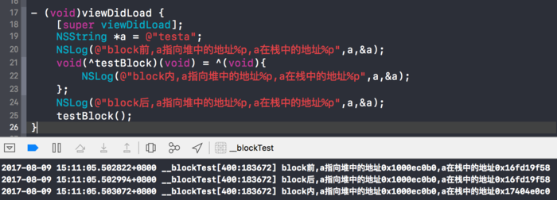
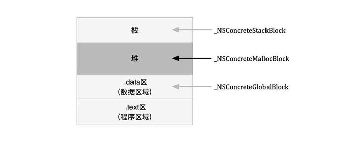
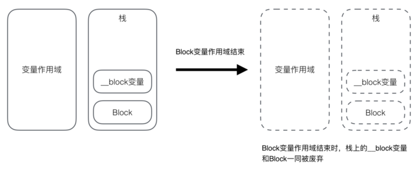
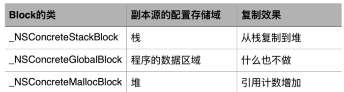
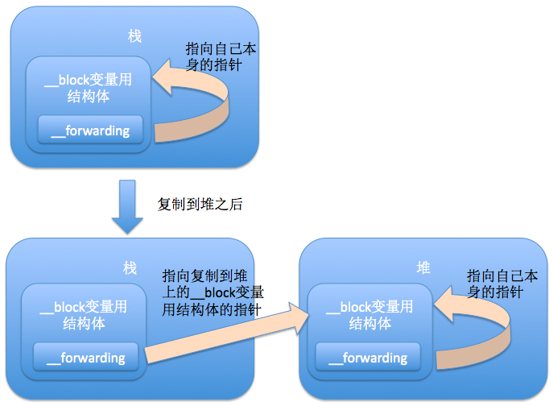

# iOS内存管理相关

<!--
create time: 2018-12-03 09:25:50
Author: <黄东鸿>
-->

### 0. 谈谈你对内存管理是怎么理解的

TODO

1. 声明变量申请内存空间，变量存储的位置（栈，堆）
2. 引用计数器，retain/release
3. autorelease
4. ARC MRC 区别

### 1. ARC通过什么方式帮助开发者管理内存？

ARC相对于MRC，不是在编译时添加retain/release/autorelease这么简单。应该是编译期和运行期两部分共同帮助开发者管理内存。

在编译期，ARC用的是更底层的C接口实现的retain/release/autorelease，这样做性能更好，同时对同一上下文的同一对象的成对retain/release操作进行优化（即忽略掉不必要的操作）；ARC也包含运行期组件，这个地方做的优化比较复杂，但也不能被忽略。【TODO:后续更新会详细描述下】

### 2. 为什么 retainCount 是不准确的？

> This method is of no value in debugging memory management issues. Because any number of framework objects may have retained an object in order to hold references to it, while at the same time autorelease pools may be holding any number of deferred releases on an object, it is very unlikely that you can get useful information from this method.

在该方法的特别说明部分苹果解释道：

调试内存管理问题时调用该方法是没有任何意义的。因为保不准Cocoa framework中的其它对象会retain我们的目标对象，还有对于autorelease pool中的延迟释放对象，调用这个方法也得不到有用的信息。


## Weak 相关

### 1. weak, strong, copy, assign, `__strong`, `__weak`, `__unsafe__unretained`之间的区别 (*)

* assign: 只是简单的赋值，被assign修饰的对象在释放之后，指针不会被置为nil，这样再向 assign 修饰的对象发送消息就会造成野指针错误 crash。所以一般用于修饰基本数据类型，不用来修饰对象。
* weak：用weak修饰对象会进行一次弱引用，引用计数器不变，并且对象在释放之后，指针地址会被置为nil。
* strong：用strong修饰对象会进行一次强引用，会使引用计数器+1。当一个对象不再有strong类型的指针指向它的时候，它才会被释放，并且所有剩余的weak型指针都将被清除。
* copy：在setter里直接调用传入对象的copy方法罢了，strong是两个指针指向同一个内存地址，copy会在内存里拷贝一份对象，（如果是深拷贝的话）两个指针指向不同的内存地址（如果是浅拷贝，两个指针指向相同的内容存地址，并且会使引用计数加1）。
* `__strong`: strong 相当于retain，用于声明属性（property），而`__Strong`用于声明实例变量和局部变量，默认情况下实例变量和局部变量都是 strong 型的，所以你不需要再声明一遍。
* `__weak`: 用于声明实例变量和局部变量
* `__unsafe__unretained`: 类似于`__weak`，差别在于，当所指向的对象被释放时，`__unsafe__unretained` 修饰的指针不会被置为nil，而会成为野指针，正如它的名字 unsafe 所暗示的。这是应该极力避免的。但为什么还要用`__unsafe__unretained`呢，因为`__weak` 是 iOS5以后才出现的。

### 2. 什么时候使用到weak?

* 避免循环引用的情况下，比如：delegate，block
* 自身已经对它进行一次强引用,没有必要再强引用一次,此时也会使用 weak,比如：自定义 IBOutlet 控件属性时，因为storyboard中会对UI控件产生一个强引用

### 3. 引用循环(retain cycle)是怎样产生的？

两个对象之间互相强引用，导致任一方的引用计数器都不可能变为0，谁也释放不了谁，这时就会产生循环引用。

### 4. iOS 闭包中的[weak self]在什么情况下需要使用，什么情况下可以不加?

一句话解释：只有当block直接或间接的被self持有时，才需要weak self。

```objective-c
// 这种情况没必要
[self fetchDataWithSucess:^{
     [self doSomething];
}];
	
//这种情况就有必要
self.onTapEvent = ^{
    [self doSomething];
};
```

### 5. 已经有了 `__weak` 为什么还要保留 `__unsafe_unretained` ？

已经有人回答了，__unsafe_unretained 主要跟 C 代码交互。

另外 `__weak` 是有代价的，需要检查对象是否已经消亡，而为了知道是否已经消亡，自然也需要一些信息去跟踪对象的使用情况。`__unsafe_unretained` 比 `__weak` 快。当明确知道对象的生命期时，选择 `__unsafe_unretained 会有一些性能提升。`

当 A 拥有 B 对象，当 A 消亡时 B 也消亡。这样当 B 存在，A 就一定会存在。而 B 又要调用 A 的接口时，B 就可以存储 A 的 `__unsafe_unretained` 指针。比如 MyViewController 拥有 MyView, MyView 需要调用 MyViewController 的接口。MyView 中就可以存储 `__unsafe_unretained MyViewController* _viewController`。

再举一个现实工程作为例子。CanvasView 继承 UIView, 用于在屏幕显示。考虑到性能和平台无关，真正的绘图实现是纯 C++ 编写的 gr::Canvas。CanvasView 包含 gr::Canvas，将交互操作转发给 gr::Canvas。而 gr::Canvas 绘图之后，需要通知 CanvasView 进行刷新。于是就需要定义一些接口作为间接层。

```
struct CanvasDeriver {
    virtual ~CanvasDeriver() {
    }

    virtual void setNeedsGLDisplay(const gr::GrAABB& bounds) = 0;
    virtual void setNeedsRedrawLayers() = 0;
    ......
};

class CanvasDeriverImpl : public CanvasDeriver {
public:
    void init(CanvasView* aView, EAGLContext* context) {
    virtual void setNeedsRedrawLayers() override;
    virtual void setNeedsGLDisplay(const gr::GrAABB& bounds) override;

private:
    __unsafe_unretained CanvasView* _canvas;
    __unsafe_unretained EAGLContext* _context;
};
```

这时 CanvasView 包含 gr::Canvas 和 CanvasDeriverImpl, 将 CanvasDeriverImpl 作为间接层传给 gr::Canvas。这样 gr::Canvas 就可以调用接口，而 CanvasDeriverImpl 又在实现中调用 CanvasView 的接口，于是 CanvasView 就可以刷新。

而 CanvasView 消亡之后，CanvasDeriverImpl 一定会消亡。换句话说，就是 CanvasDeriverImpl 存在，CanvasView 一定会存在。这种情况下就可以使用 `__unsafe_unretained`，会比 `__weak` 要快一点。

这种性能提升是很微小的。但当我很清楚这种情况下，`__unsafe_unretained` 也是安全的，自然可以快一点就是一点。而当情况不确定的时候，应该优先选用 `__weak` 了。

同样，使用 Swift 时，也会分 weak 和 unowned。unowned 的含义跟 `__unsafe_unretained` 差不多。假如很确切地知道对象的生命期，可以选择 unowned。比如

```
_cancelButton.addEventHandler(for: .touchUpInside) { [unowned self] bt in
    self.onButtonPressed?(.cancel)
}
```

在这里，我很明确知道 _cancelButton 存在，self 一定会存在，也就可以使用 unowned。这里选择 unowned 并非为了性能，而只是不想写成 self?。

### 6. 使用block时什么情况会发生引用循环，如何解决？

一个对象中强引用了block，在block中又强引用了该对象，就会发生循环引用。

解决方法是将该对象使用 `weak` 或者 `__block` 修饰符修饰之后再在block中使用。

```
// 使用 weak
id weak weakSelf = self;

weak __typeof(&*self)weakSelf = self

// 使用 __block
id __block weakSelf = self;
```

检测代码中是否存在循环引用问题，可使用 Facebook 开源的一个检测工具  [***FBRetainCycleDetector***](https://github.com/facebook/FBRetainCycleDetector) 。

### 7. 使用系统的某些block api（如UIView的block版本写动画时），是否也考虑引用循环问题？

看情况，有些需要，有些不需要。

所谓“引用循环”是指双向的强引用，所以那些“单向的强引用”是没有问题的，比如这些：

```Objective-C
[UIView animateWithDuration:duration animations:^{ [self.superview layoutIfNeeded]; }]; 
```

```Objective-C
[[NSOperationQueue mainQueue] addOperationWithBlock:^{ self.someProperty = xyz; }]; 
```

```Objective-C
[[NSNotificationCenter defaultCenter] addObserverForName:@"someNotification" 
                                                  object:nil 
                           queue:[NSOperationQueue mainQueue]
                                              usingBlock:^(NSNotification * notification) {
                                                    self.someProperty = xyz; }]; 
```

这些情况不需要考虑“引用循环”。

但如果你使用一些参数中可能含有 ivar 的系统 api 就要小心一点。比如GCD 内部如果引用了 self，而且 GCD 的其他参数是 ivar，则要考虑到循环引用：

```objective-c
__weak __typeof__(self) weakSelf = self;
dispatch_group_async(_operationsGroup, _operationsQueue, ^
{
	__typeof__(self) strongSelf = weakSelf;
	[strongSelf doSomething];
	[strongSelf doSomethingElse];
});
```

类似的：

```objective-c
__weak __typeof__(self) weakSelf = self;
_observer = [[NSNotificationCenter defaultCenter] addObserverForName:@"testKey" object:nil queue:nil usingBlock:^(NSNotification *note) {
	__typeof__(self) strongSelf = weakSelf;
   [strongSelf dismissModalViewControllerAnimated:YES];
}];
```
self --> _observer --> block --> self 显然这也是一个循环引用。

## Copy/Block 相关

### 1. 怎么用 copy 关键字？

 1. NSString、NSArray、NSDictionary 等经常使用copy关键字，是因为他们有对应的可变类型：NSMutableString、NSMutableArray、NSMutableDictionary；
 2. block 也经常使用 copy 关键字，具体原因见 [深入理解 Block](#understanding-block)
	
* block 使用 copy 是从 MRC 遗留下来的“传统”，在 MRC 中, block 是在栈区的,使用 copy 可以把它放到堆区。
* 在 ARC 中对于 block 使用 copy 还是 strong 效果是一样的，因为编译器自动对 block 进行了 copy 操作，但写上 copy 也无伤大雅，还能时刻提醒我们。
* 如果不写 copy ，该类的调用者有可能会忘记或者根本不知道“编译器会自动对 block 进行了 copy 操作”，他们有可能会在调用之前自行拷贝属性值。这种操作多余而低效。你也许会感觉我这种做法有些怪异，不需要写依然写。如果你这样想，其实是你“日用而不知”，你平时开发中是经常在用我说的这种做法的，比如下面的属性不写copy也行，但是你会选择写还是不写呢？
  
```objective-c
@property (nonatomic, copy) NSString *userId;

- (instancetype)initWithUserId:(NSString *)userId {
    self = [super init];
    if (!self) {
        return nil;
    }
    _userId = [userId copy];
    return self;
}

```

### 2. 用@property声明的NSString（或NSArray，NSDictionary）经常使用copy关键字，为什么？如果改用strong关键字，可能造成什么问题？

1. 用 `@property` 声明 NSString（NSArray、NSDictionary）经常使用 copy 关键字，是因为它有对应的可变类型：NSMutableString（NSMutableArray、NSMutableDictionary），这是NSString的子类（父类指针可以指向子类对象），它们之间可能进行赋值操作，为了让本对象的属性不受外界影响，确保对象中的字符串值不会无意间变动，应该使用 copy在设置新属性值时拷贝一份。这样，无论给我传入是一个可变对象还是不可对象，我本身持有的就是一个不可变的副本。
2. 如果我们使用是 strong ，那么这个属性（指针）就有可能指向一个可变对象，如果这个可变对象在外部被修改了，那字符串的值就可能会在对象不知情的情况下遭人更改，会影响该属性值。因此，为确保对象中的字符串值不会无意间变动，拷贝一份“不可变” (immutable)的字符串。

举例说明：(详见 [JFPropertyCopyDemo]())

```
// 声明一个以 strong 修饰的 array
@property (nonatomic ,readwrite, strong) NSArray *array;

// 然后进行下面的操作
NSArray *array = @[ @1, @2, @3, @4 ];
NSMutableArray *mutableArray = [NSMutableArray arrayWithArray:array];
    
self.array = mutableArray;
[mutableArray removeAllObjects];;
NSLog(@"%@",self.array);
    
[mutableArray addObjectsFromArray:array];
self.array = [mutableArray copy];
[mutableArray removeAllObjects];;
NSLog(@"%@",self.array);
```

打印结果如下所示：

```Objective-C
2018-12-07 10:56:16.781146+0800 JFPropertyCopyDemo[52861:17054714] (
)
2018-12-07 10:56:16.781462+0800 JFPropertyCopyDemo[52861:17054714] (
    1,
    2,
    3,
    4
)
```

### 3. 这个写法会出什么问题：`@property (copy) NSMutableArray *array;`

两个问题：

1. 添加,删除,修改数组内的元素的时候,程序会因为找不到对应的方法而崩溃.因为 copy 就是复制一个不可变 NSArray 的对象；
2. 使用了 atomic 属性会严重影响性能 ； 

比如下面的代码就会发生崩溃

```Objective-C
// .h文件
@property (nonatomic, copy) NSMutableArray *mutableArray;

// .m文件
NSMutableArray *array = [NSMutableArray arrayWithObjects:@1,@2,nil];
self.mutableArray = array;
[self.mutableArray removeObjectAtIndex:0];
```

接下来就会奔溃：
 
```Objective-C
 -[__NSArrayI removeObjectAtIndex:]: unrecognized selector sent to instance 0x7fcd1bc30460
```

第2条原因，如下：

> 该属性使用了同步锁，会在创建时生成一些额外的代码用于帮助编写多线程程序，这会带来性能问题，通过声明 nonatomic 可以节省这些虽然很小但是不必要额外开销。

在默认情况下，由编译器所合成的方法会通过锁定机制确保其原子性(atomicity)。如果属性具备 nonatomic 特质，则不使用同步锁。请注意，尽管没有显式地声明为“atomic”(如果某属性不具备 nonatomic 特质，那它就是“原子的”(atomic))。

在iOS开发中，你会发现，几乎所有属性都声明为 nonatomic。

一般情况下并不要求属性必须是“原子的”，因为这并不能保证“线程安全” ( thread safety)，若要实现“线程安全”的操作，还需采用更为深层的锁定机制才行。例如，一个线程在连续多次读取某属性值的过程中有别的线程在同时改写该值，那么即便将属性声明为 atomic，也还是会读到不同的属性值。

因此，开发iOS程序时一般都会使用 nonatomic 属性。但是在开发 Mac OS X 程序时，使用
 atomic 属性通常都不会有性能瓶颈。
 
### 4. 如何让自己的类用 copy 修饰符？

1. 若想让自己所写的对象具有拷贝功能，则需遵守 NSCopying 协议，实现 `- (id)copyWithZone:(NSZone *)zone;`，在该方法中创建对象需要调用 `allocWithZone:` 方法。
2. 如果自定义的对象分为可变版本与不可变版本，那么还要遵守 `NSMutableCopying` 协议，实现 `- (id)mutableCopyWithZone:(NSZone *)zone;`

以第一题的代码为例：
   
 ```Objective-C
// .h文件
typedef NS_ENUM(NSInteger, CYLSex) {
    CYLSexMan,
    CYLSexWoman
};

@interface CYLUser : NSObject<NSCopying>

@property (nonatomic, readonly, copy) NSString *name;
@property (nonatomic, readonly, assign) NSUInteger age;
@property (nonatomic, readonly, assign) CYLSex sex;

- (instancetype)initWithName:(NSString *)name age:(NSUInteger)age sex:(CYLSex)sex;

@end
 ```

然后实现协议中规定的方法：

```Objective-C
- (id)copyWithZone:(NSZone *)zone {
	CYLUser *copy = [[[self class] allocWithZone:zone] 
		             initWithName:_name
 							      age:_age
						          sex:_sex];
	return copy;
}
```

但在实际的项目中，不可能这么简单，遇到更复杂一点，比如类对象中的数据结构可能并未在初始化方法中设置好，需要另行设置。举个例子，假如 CYLUser 中含有一个数组，与其他 CYLUser 对象建立或解除朋友关系的那些方法都需要操作这个数组。那么在这种情况下，你得把这个包含朋友对象的数组也一并拷贝过来。下面列出了实现此功能所需的全部代码:

```Objective-C
// .h文件
typedef NS_ENUM(NSInteger, CYLSex) {
    CYLSexMan,
    CYLSexWoman
};

@interface CYLUser : NSObject<NSCopying>

@property (nonatomic, readonly, copy) NSString *name;
@property (nonatomic, readonly, assign) NSUInteger age;
@property (nonatomic, readonly, assign) CYLSex sex;

- (instancetype)initWithName:(NSString *)name age:(NSUInteger)age sex:(CYLSex)sex;
- (void)addFriend:(CYLUser *)user;
- (void)removeFriend:(CYLUser *)user;

@end
```

```Objective-C
// .m文件
@implementation CYLUser {
    NSMutableSet *_friends;
}

- (instancetype)initWithName:(NSString *)name
                         age:(NSUInteger)age
                         sex:(CYLSex)sex {
    if(self = [super init]) {
        _name = [name copy];
        _age = age;
        _sex = sex;
        _friends = [[NSMutableSet alloc] init];
    }
    return self;
}

- (void)addFriend:(CYLUser *)user {
    [_friends addObject:user];
}

- (void)removeFriend:(CYLUser *)user {
    [_friends removeObject:user];
}

- (id)copyWithZone:(NSZone *)zone {
    CYLUser *copy = [[[self class] allocWithZone:zone]
                     initWithName:_name
                     age:_age
                     sex:_sex];
    copy->_friends = [_friends mutableCopy];
    return copy;
}

@end
```

以上做法能满足基本的需求，但是也有缺陷：

> 如果你所写的对象需要深拷贝，那么可考虑新增一个专门执行深拷贝的方法。

在例子中，存放朋友对象的 set 是用 “copyWithZone:” 方法来拷贝的，这种浅拷贝方式不会逐个复制 set 中的元素。若需要深拷贝的话，则可像下面这样，编写一个专供深拷贝所用的方法:

```Objective-C
- (id)deepCopy {
    CYLUser *copy = [[[self class] alloc]
                     initWithName:_name
                     age:_age
                     sex:_sex];
    copy->_friends = [[NSMutableSet alloc] initWithSet:_friends
                                             copyItems:YES];
    return copy;
}
```

### 5. 如何重写带 copy 关键字的 setter？

不要在 setter 里进行像 `if(_obj != newObj)` 这样的判断，该观点参考链接：[ ***How To Write Cocoa Object Setters： Principle 3: Only Optimize After You Measure*** ](http://vgable.com/blog/tag/autorelease/)。

`readwrite` 的属性只需要这样写就行了：

```objective-c
- (void)setName:(NSString *)name {
    _name = [name copy];
}
```

什么情况会在 copy setter 里做 if 判断？

例如，车速可能就有最高速的限制，车速也不可能出现负值，如果车子的最高速为300，则 setter 的方法就要改写成这样：
 
```Objective-C
-(void)setSpeed:(int)_speed{
    if(_speed < 0) speed = 0;
    if(_speed > 300) speed = 300;
    _speed = speed;
}
```

对于**只读**属性，我们不需要也不能重写 setter （编译器不会为其创建对应的setter），确保 name 被 copy，我们需要在初始化方法中使用 copy 设置好属性：

```Objective-C
- (instancetype)initWithName:(NSString *)name 
							 age:(NSUInteger)age 
							 sex:(CYLSex)sex {
     if(self = [super init]) {
     	_name = [name copy];
     	_age = age;
     	_sex = sex;
     	_friends = [[NSMutableSet alloc] init];
     }
     return self;
}
```

（ 在本例中，之所以还要声明属性的“内存管理语义”--copy，是因为：如果不写 copy，该类的调用者就不知道初始化方法里会拷贝这些属性，他们有可能会在调用初始化方法之前自行拷贝属性值，这种操作多余而低效）。

### 6. 深拷贝/浅拷贝

[iOS 集合的深复制与浅复制](https://www.zybuluo.com/MicroCai/note/50592)

两种情况：

 1. 对非集合类对象的 copy 与 mutableCopy 操作；
 2. 对集合类对象的 copy 与 mutableCopy 操作。

#### 1. 对非集合类对象的copy操作

在非集合类对象中：对 immutable 对象进行 copy 操作，是指针复制，mutableCopy 操作时内容复制；对 mutable 对象进行 copy 和 mutableCopy 都是内容复制。用代码简单表示如下：

 - [immutableObject copy] // 浅复制
 - [immutableObject mutableCopy] //深复制
 - [mutableObject copy] //深复制
 - [mutableObject mutableCopy] //深复制
	
比如以下代码：

```Objective-C
NSMutableString *string = [NSMutableString stringWithString:@"origin"];//copy
NSString *stringCopy = [string copy];
```

查看内存，会发现 string、stringCopy 内存地址都不一样，说明此时都是做内容拷贝、深拷贝。即使你进行如下操作：

```Objective-C
[string appendString:@"origion!"]
```

stringCopy 的值也不会因此改变，但是如果不使用 copy，stringCopy 的值就会被改变，集合类对象以此类推。

所以，

> 用 @property 声明 NSString、NSArray、NSDictionary 经常使用 copy 关键字，是因为他们有对应的可变类型：NSMutableString、NSMutableArray、NSMutableDictionary，他们之间可能进行赋值操作，为确保对象中的字符串值不会无意间变动，应该在设置新属性值时拷贝一份。

#### 2. 集合类对象的copy操作

在集合类对象中，对 immutable 对象进行 copy，是指针复制， mutableCopy 是内容复制；对 mutable 对象进行 copy 和 mutableCopy 都是内容复制。但是：集合对象的内容复制仅限于对象本身，对象元素仍然是指针复制。用代码简单表示如下：

- [immutableObject copy] // 浅复制
- [immutableObject mutableCopy] //单层深复制
- [mutableObject copy] //单层深复制
- [mutableObject mutableCopy] //单层深复制

集合类对象是指 NSArray、NSDictionary、NSSet ... 之类的对象。下面先看集合类immutable对象使用 copy 和 mutableCopy 的一个例子：

 ```Objective-C
NSArray *array = @[@[@"a", @"b"], @[@"c", @"d"]];
NSArray *copyArray = [array copy];
NSMutableArray *mCopyArray = [array mutableCopy];
 ```

查看内容，可以看到 copyArray 和 array 的地址是一样的，而 mCopyArray 和 array 的地址是不同的。说明 copy 操作进行了指针拷贝，mutableCopy 进行了内容拷贝。但需要强调的是：此处的内容拷贝，仅仅是拷贝 array 这个对象，array 集合内部的元素仍然是指针拷贝。这和上面的非集合 immutable 对象的拷贝还是挺相似的，那么mutable对象的拷贝会不会类似呢？我们继续往下，看 mutable 对象拷贝的例子：

```Objective-C
NSMutableArray *array = [NSMutableArray arrayWithObjects:[NSMutableString stringWithString:@"a"],@"b",@"c",nil];
NSArray *copyArray = [array copy];
NSMutableArray *mCopyArray = [array mutableCopy];
```

查看内存，如我们所料，copyArray、mCopyArray和 array 的内存地址都不一样，说明 copyArray、mCopyArray 都对 array 进行了内容拷贝。


## <span id="">深入理解 Block</span>

[通过__block的作用深入研究block](https://hk.saowen.com/a/3b3856817819dd873205938a6f6867b90457ec1638f6789e49498f188bfd0f54)

[深入研究Block捕获外部变量和__block实现原理](https://halfrost.github.io/2016/08/%E6%B7%B1%E5%85%A5%E7%A0%94%E7%A9%B6Block%E6%8D%95%E8%8E%B7%E5%A4%96%E9%83%A8%E5%8F%98%E9%87%8F%E5%92%8C__block%E5%AE%9E%E7%8E%B0%E5%8E%9F%E7%90%86/)

> 我们都知道：Block不允许修改外部变量的值，这里所说的外部变量的值，指的是栈中指针的内存地址。在block内调用变量，在不使用__block的情况下，是在堆中新建了一个变量地址指向原变量，block作用域结束则销毁，不影响原变量。

默认情况下，在block中访问外部变量是通过复制变量来操作的，可以读，但是写操作不对原变量生效，下面通过代码来举证

```objective-c
NSString *a = @"testa";
NSLog(@"block前,a在堆中的地址%p,a在栈中的地址%p",a,&a);
void(^testBlock)(void) = ^(void){
    NSLog(@"block内,a在堆中的地址%p,a在栈中的地址%p",a,&a);
};
NSLog(@"block后,a在堆中的地址%p,a在栈中的地址%p",a,&a);
testBlock();
```



可以看出变量在堆中的地址其实是一直不变的，在栈中的地址，在block外是不变的，block内重新开辟了一个空间来存放。

#### __block

而通过 `__block` 修饰，block内部不仅仅可以对外部变量进行读操作，也可以进行写操作了，那这是为什么呢？同样用代码研究两者区别

```objective-c
__block NSString *a = @"testa";
NSLog(@"block前,a指向堆中的地址%p,a在栈中的地址%p",a,&a);
void(^testBlock)(void) = ^(void){
    NSLog(@"block内,a指向堆中的地址%p,a在栈中的地址%p",a,&a);
};
testBlock();
NSLog(@"block后,a指向堆中的地址%p,a在栈中的地址%p",a,&a);
```

打印结果是

```
block前,a指向堆中的地址0x10007c0d0,a在栈中的地址0x16fd89f58
block内,a指向堆中的地址0x10007c0d0,a在栈中的地址0x1740533a8
block后,a指向堆中的地址0x10007c0d0,a在栈中的地址0x1740533a8
```

根据内存地址变化可见，__block所起到的作用就是只要观察到该变量被 block 所持有，就将“外部变量”在栈中的内存地址放到了堆中。进而在block内部也可以修改外部变量的值。

#### 苹果为什么要这么设计

> Block不允许修改外部变量的值，Apple这样设计，应该是考虑到了block的特殊性，block也属于“函数”的范畴，变量进入block，实际就是已经改变了作用域。在几个作用域之间进行切换时，如果不加上这样的限制，变量的可维护性将大大降低。又比如我想在block内声明了一个与外部同名的变量，此时是允许呢还是不允许呢？只有加上了这样的限制，这样的情景才能实现。

#### 编译器做了什么

我们已经知道了加上 __block 关键字之后，编译器通过将外部变量同block一起copy到了堆区，并且将“外部变量”在栈中的内存地址改为了堆中的新地址。

如果多问一个为什么？编译器是怎么做到这样的呢？

我们通过clang将 OC 代码转换为 C++：

```shell
$ clang -rewrite-objc 源代码文件名
```

**详细过程 - TODO**

精简后就是

```
//加__block前的声明变量是这样的
int a = 1;
//加__block后的声明变量是这样的
__attribute__((__blocks__(byref))) __Block_byref_b_0 b = {
  (void*)0,
  (__Block_byref_b_0 *)&b, 
  0,
   sizeof(__Block_byref_b_0), 
  2};
```


可以看到增加了 \__block 修饰之后，编译器做了不少工作，修饰词中有`__Block_byref_b_0`重复出现，这是一个与block一样的结构体类型的自动变量实例！！！！
此时我们在block内部访问val变量则需要通过一个叫`__forwarding`的成员变量来间接访问val变量。
讲`__forwarding`之前，需要先讨论一下block的存储域及copy操作。

#### __block 的存储域及copy操作

前面提到，block内部的作用域是在堆上的，并且调用变量时会将变量copy到堆上，那么block本身是存储在堆上还是栈上呢？

我们先来看看一个进程占用内存分布的结构：


实际上，block有三种类型:

* 全局块(_NSConcreteGlobalBlock)
* 栈块(_NSConcreteStackBlock)
* 堆块(_NSConcreteMallocBlock)

这三种block各自的存储域如下图：



简而言之，存储在栈中的Block就是栈块、存储在堆中的就是堆块、既不在栈中也不在堆中的块就是全局块。

那么，我们如何判断这个block的存储位置呢？

1. Block不访问外界变量（包括栈中和堆中的变量）
<br><br>
Block 既不在栈又不在堆中，在代码段中，ARC和MRC下都是如此。此时为全局块。(_NSConcreteGlobalBlock)

2. Block访问外界变量

* MRC 环境下：访问外界变量的 Block 默认存储栈中。
* ARC 环境下：访问外界变量的 Block 默认存储在堆中（实际是放在栈区，然后ARC情况下由编译器自动又拷贝到堆区），自动释放。

#### 为什么要Block自动从栈区拷贝到堆区呢？

栈上的Block，如果其所属的变量作用域结束，该Block就被废弃，如同一般的自动变量。当然，Block中的__block变量也同时被废弃。如下图：



**为了解决栈块在其变量作用域结束之后被废弃（释放）的问题，我们需要把Block复制到堆中，延长其生命周期。**

开启ARC时，大多数情况下编译器会恰当地进行判断是否有需要将Block从栈复制到堆，如果有，自动生成将Block从栈上复制到堆上的代码。**Block的复制操作执行的是copy实例方法。Block只要调用了copy方法，栈块就会变成堆块。**

在非ARC情况下则需要开发者调用copy方法手动复制。

如下图：


将Block从栈上复制到堆上相当消耗CPU，所以当Block设置在栈上也能够使用时，就不要复制了，因为此时的复制只是在浪费CPU资源。
Block的复制操作执行的是copy实例方法。不同类型的Block使用copy方法的效果如下表：



根据表得知，Block在堆中copy会造成引用计数增加，这与其他Objective-C对象是一样的。虽然Block在栈中也是以对象的身份存在，但是栈块没有引用计数，因为不需要，我们都知道栈区的内存由编译器自动分配释放。

#### \__block变量与\__forwarding

在copy操作之后，既然__block变量也被copy到堆上去了, 那么访问该变量是访问栈上的还是堆上的呢?__forwarding 终于要闪亮登场了，如下图：



通过 `__forwarding`, 无论是在block中还是 block外访问 `__block` 变量, 也不管该变量在栈上或堆上, 都能顺利地访问同一个`__block` 变量。
值得注意的是，在ARC下，使用 `__block` 也有可能带来的循环引用

