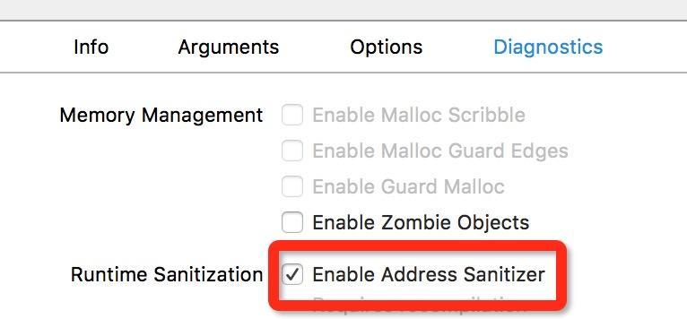

iOS 基础面试题
=========

### 1. 简述ViewController的生命周期

* initWithCoder
* loadView 
* viewDidLoad 
* viewWillAppear
* viewWillLayoutSubviews
* viewDidLayoutSubviews
* viewDidAppear 
* viewWillDisappear 
* viewDidDisappear
* dealloc(deinit)

#### 2. Cocoa 有哪些消息传递机制？

[消息传递机制](https://objccn.io/issue-7-4/)

* KVO
* NotificationCenter
* Delegate
* Block
* Target-Action

### 3. 通知中心、代理和block的区别

* 通知中心：主要特征是一对多，它在程序内部提供了一种消息广播的机制，我们需要在通知中心注册我们想要监听的消息，当项目中有地方发出这个消息的时候，通知中心会根据内部的一个消息转发表，来将消息转发给监听了这个消息的对象，通知中心可以通知多个对象。
* 代理：主要特征一对一，只能在代理者跟被代理者之间通信。代理更注重信息传输的过程：比如发起一个网络请求，可能想要知道此时请求是否已经开始、是否收到了数据、数据是否已经接受完成或数据接收失败等过程
* block和delegate一样，一般都是“一对一”之间的通信，相比代理，block有以下特点
	* 写法更简练，不需要写protocol、函数等
    * block注重传输的结果：比如对于一个事件，只想知道成功或者失败，并不需要知道进行了多少或者额外的一些信息
	* block需要注意防止循环引用

### 4. 使用 atomic 是“线程安全”的吗？

automic表明该属性使用了同步锁，是“原子性的”，但这并不能保证“线程安全” ( thread safety)，若要实现“线程安全”的操作，还需采用更为深层的锁定机制才行。例如，一个线程在连续多次读取某属性值的过程中有别的线程在同时改写该值，那么即便将属性声明为 atomic，也还是会读到不同的属性值。

因此，开发iOS程序时一般都会使用 nonatomic 属性。但是在开发 Mac OS X 程序时，使用 atomic 属性通常都不会有性能瓶颈。

也即:

> 在属性所指的对象遭到摧毁时，属性值也会清空(nil out)。


### 5. 简述iOS的沙盒机制

* iOS系统下每个应用都有自己对应的沙盒，每个沙盒之间都是相互独立的，互不能访问（没有越狱的情况下）。正因为这样的沙盒机制让iOS的系统变得更安全。
* Documents：保存应用运行时生成的需要持久化的数据，一般用来存储用户生成的重要数据，比如账号信息、游戏进度存档等。
	* 通过 iTunes、iCloud 备份时, 会备份该目录下的数据。
	* 此目录下保存相对重要的数据。
* Library：可创建子文件夹。这里一般用来存储应用相关的数据或用户生成的不重要的数据，比如一些配置信息等，可以用来放置您希望被备份但不希望被用户看到的数据。该路径下的文件夹，除Caches以外，都会被iTunes备份。
* Library/Caches：一般存储的是缓存文件，例如图片、音乐、视频等。
	* 此目录下的数据不会自动删除，需要程序员手动清除。
	* iTunes、iCloud 备份时不会备份此目录下的数据。
	* 主要用于保存应用在运行时生成的需要长期使用、体积较大、不需要备份的非重要数据。
* Library/Preferences：专门用来保存应用程序的配置信息，最好不要存储任何和用户相关的数据。
	* iTunes、iCloud备份时，会备份该目录下的数据。
	* 不应该直接在这里创建文件，而是需要通过NSUserDefault来访问应用程序的偏好设置。
* tmp：临时文件目录，保存应用运行时产生的一些临时数据。
	* 在程序退出（或重新运行），系统磁盘空间不够，手机重启的时候，会自动清空该目录的数据，无需程序员手动清除。
	* iTunes、iCloud备份时，不会备份该目录


### 6. iOS有哪些数据存储方式？

* Plist：只能保存最基本的数据类型，比如NSArray、NSDictionary。
	* 一般保存在`Document`文件夹。
	* 通过 `writeToFile` 将数据写入文件中，通过类似 `dictionaryWithContentsOfFile` 的方法读取数据。
* Preference（偏好设置）：保存应用程序的偏好设置。
	* 会将所有的数据都保存到 `Library/Preferences`的文件夹下的同一个plist文件中。
	* 需要通过 NSUserDefault 来存取偏好设置。
* `NSKeydeArchiver(归档)`：可以保存自定义的类对象
	* 保存在`Document`文件夹，文件后缀名可以任意命名，通过归档方法保存的数据在文件中打开是编码，更安全。
	* 必须使被归档的类遵守`NSCoding`协议并且实现 `encodeWithCoder:` 和 `initWithCoder:` 这两个协议方法。
	* 通过 `archiveRootObject: toFile:`将自定义的对象保存到文件中，通过 `unarchiveObjectWithFile:` 读取数据。
* Sqlite
* CoreData
* Realm

### 7. imageNamed 和 imageWithContentsOfFile 的区别

* 前者会对图片进行缓存，而后者只是简单的从硬盘加载文件。
* 在整个程序运行的过程中，当你需要加载一张较大的图片，并且只会使用它一次，那么你就没必要缓存这个图片，这时你可以使用 `-[UIImage imageWithContentsOfFile:]`，这样系统也不会浪费内存来做缓存了。当然，如果你会多次使用到一张图时（比如UITableViewCell），用 `- [UIImage imageNamed:]` 就会高效很多，因为这样就不用每次都从硬盘上加载图片了。

### 8.BAD_ACCESS在什么情况下出现？

* 访问了野指针，比如给一个已经释放的对象发消息、访问已经释放对象的成员变量
* 死循环

### 9. IBOutlet连出来的视图属性为什么可以被设置成weak?

参考链接：[ ***Should IBOutlets be strong or weak under ARC?*** ](http://stackoverflow.com/questions/7678469/should-iboutlets-be-strong-or-weak-under-arc)

文章告诉我们：

> 因为既然有外链那么视图在xib或者storyboard中肯定存在，视图已经对它有一个强引用了。

不过这个回答漏了个重要知识，使用storyboard（xib不行）创建的vc，会有一个叫_topLevelObjectsToKeepAliveFromStoryboard的私有数组强引用所有top level的对象，所以这时即便outlet声明成weak也没关系

### 10. 如何调试BAD_ACCESS错误

 1. 重写object的respondsToSelector方法，现实出现EXEC_BAD_ACCESS前访问的最后一个object
 2. 通过 Zombie 


 3. 设置全局断点快速定位问题代码所在行
 4. Xcode 7 已经集成了BAD_ACCESS捕获功能：**Address Sanitizer**，内存越界检测。
用法如下：在配置中勾选✅Enable Address Sanitizer 

 [Xcode7 新特性 AddressSanitizer](http://ios.jobbole.com/92502/)

### 11. iOS有哪些检测内存泄漏的方法

* 启用Zombie Object的检测
* 使用 Product -> Analysis 对代码进行静态分析，进行内存泄露的初步检测
* 可以在 xcode 的 build setting 中打开 `implicit retain of ‘self’ within blocks`，xcode 编译器会给出警告，逐个排查警告
* 使用 Instrument `Leak` 工具进行内存泄露查找
* 在以上方法不奏效的情况下，通过查看 dealloc 是否调用，查看某个class是否泄露的问题。

### 12. layoutSubviews 调用时机是什么？

1. init 初始化不会触发 layoutSubviews
2. addSubview 会触发 layoutSubviews
3. 设置 view 的 Frame（setFrame) 会触发 layoutSubviews，当然前提是 frame 的值设置前后发生了变化
4. 滚动一个 UIScrollView 会触发 layoutSubviews 
5. 旋转屏幕会触发父 view 上的 layoutSubviews 事件
6. 改变一个 view 大小(resize)时也会触发 superview 上的 layoutSubviews 事件

### 13. setNeedsLayout 和 layoutIfNeeded 的区别

* setNeedsLayout: 标记为需要重新布局，会异步调用刷新布局，不立即刷新，但 layoutSubviews 一定会被调用(在系统 runloop 的下一个周期自动调用)
* layoutIfNeeded: 如果有需要刷新的标记，立即调用 layoutSubviews 进行布局, 如果没有标记，不会调用 layoutSubviews

如果要立即刷新，要先调用 `[view setNeedsLayout]`，把标记设为需要布局，然后马上调用 `[view layoutIfNeeded]`，实现布局

### 重绘时机

* `-drawRect:(CGRect)rect`方法 : 重写此方法，执行重绘任务
* `-setNeedsDisplay`方法 : 标记为需要重绘，异步掉用drawRect
* `-setNeedsDisplayInRect:(CGRect)invalidRect`方法 : 标记为需要局部重绘

```
sizeToFit会自动调用sizeThatFits方法；
sizeToFit不应该在子类中被重写，应该重写sizeThatFits
sizeThatFits传入的参数是receiver当前的size，返回一个适合的size
sizeToFit可以被手动直接调用
sizeToFit和sizeThatFits方法都没有递归，对subviews也不负责，只负责自己
```

```
layoutSubviews对subviews重新布局
layoutSubviews方法调用先于drawRect
```

### 14. iOS子线程更新UI到主线程的三种方法

1. `performSelectorOnMainThread: withObject: waitUntilDone:`
2. `[NSOperationQueue mainQueue] addOperationWithBlock:`
3. `dispatch_async(dispatch_get_main_queue(), ^{}`

```
// 1.NSThread
[self performSelectorOnMainThread:@selector(updateUI) withObject:nil waitUntilDone:NO];

- (void)updateUI {
    // UI更新代码
    self.alert.text = @"Thanks!";
}

// 2.NSOperationQueue
[[NSOperationQueue mainQueue] addOperationWithBlock:^{
    // UI更新代码
    self.alert.text = @"Thanks!";
    }];

// 3.GCD
dispatch_async(dispatch_get_main_queue(), ^{
   // UI更新代码
   self.alert.text = @"Thanks!";
});
```

### 15. isKindOfClass和isMemberOfClass区别

* isKindOfClass : 判断一个对象是否是一个类的成员，或者是派生自该类的成员
* isMemberOfClass : 判断一个对象是否是当前类的成员

特殊情况

NSArray、NSMutableArray属于类簇，使用isMemberOfClass不能得到正确的结果
原因：由于类簇的性质，这类对象实际返回的实例有不确定性。NSArray 对象可能会在运行时发现其实运作的是 `__NSArray0`, `__NSArrayI`等，这两个类都是 NSArray 的子类。

### 16. NSMutableArray 的实现原理

[https://ciechanow.ski/exposing-nsmutablearray/](https://ciechanow.ski/exposing-nsmutablearray/)

### 17. NSDictionary 的实现原理

[https://ciechanow.ski/exposing-nsdictionary/](https://ciechanow.ski/exposing-nsdictionary/)

### 18. NSNotification 是同步还是异步的？在哪个线程中执行？

同步的。

在多线程应用中，Notification在哪个线程中post，就在哪个线程中被转发，而不一定是在注册观察者的那个线程中。

[Notification与多线程](http://southpeak.github.io/2015/03/14/nsnotification-and-multithreading/)

[Foundation: NSNotificationCenter](http://southpeak.github.io/2015/03/20/cocoa-foundation-nsnotificationcenter/)

## KVC/KVO

### 1. 若一个类有实例变量 `NSString *_foo` ，调用setValue:forKey:时，可以以foo还是 `_foo` 作为key？</span>

都可以。

[若一个类有实例变量 NSString *_foo ，调用setValue:forKey:时，可以以foo还是 _foo 作为key?](https://blog.csdn.net/Shan_Wangwang/article/details/79583404)

[- (nullable id)valueForKey:(NSString *)key;](https://blog.csdn.net/Shan_Wangwang/article/details/79590895)

### 2. addObserver:forKeyPath:options:context:各个参数的作用分别是什么，observer中需要实现哪个方法才能获得KVO回调？

```Objective-C
// 添加键值观察
/*
1 观察者，负责处理监听事件的对象
2 观察的属性
3 观察的选项
4 上下文
*/
[self.person addObserver:self forKeyPath:@"name" options:NSKeyValueObservingOptionNew | NSKeyValueObservingOptionOld context:@"Person Name"];
```
observer中需要实现一下方法：

```Objective-C
// 所有的 kvo 监听到事件，都会调用此方法
/*
 1. 观察的属性
 2. 观察的对象
 3. change 属性变化字典（新／旧）
 4. 上下文，与监听的时候传递的一致
 */
- (void)observeValueForKeyPath:(NSString *)keyPath ofObject:(id)object change:(NSDictionary *)change context:(void *)context;
```

### 3. 如何手动触发一个value的KVO?

所谓的“手动触发”是区别于“自动触发”：

自动触发是指类似这种场景：在注册 KVO 之前设置一个初始值，注册之后，设置一个不一样的值，就可以触发了。

想知道如何手动触发，必须知道自动触发 KVO 的原理：

键值观察通知依赖于 NSObject 的两个方法:  `willChangeValueForKey:` 和 `didChangevlueForKey:` 。在一个被观察属性发生改变之前，  `willChangeValueForKey:` 一定会被调用，这就
会记录旧的值。而当改变发生后，  `observeValueForKey:ofObject:change:context:` 会被调用，继而 `didChangeValueForKey:` 也会被调用。如果可以手动实现这些调用，就可以实现“手动触发”了。

那么“手动触发”的使用场景是什么？一般我们只在希望能控制“回调的调用时机”时才会这么做。

具体做法如下：

如果这个  `value` 是  表示时间的 `self.now` ，那么代码如下：最后两行代码缺一不可。

相关代码已放在仓库里。

 ```Objective-C
//  .m文件
//  Created by https://github.com/ChenYilong
//  微博@iOS程序犭袁(http://weibo.com/luohanchenyilong/).
//  手动触发 value 的KVO，最后两行代码缺一不可。

//@property (nonatomic, strong) NSDate *now;
- (void)viewDidLoad {
    [super viewDidLoad];
    _now = [NSDate date];
    [self addObserver:self forKeyPath:@"now" options:NSKeyValueObservingOptionNew context:nil];
    NSLog(@"1");
    [self willChangeValueForKey:@"now"]; // “手动触发self.now的KVO”，必写。
    NSLog(@"2");
    [self didChangeValueForKey:@"now"]; // “手动触发self.now的KVO”，必写。
    NSLog(@"4");
}
 ```

但是平时我们一般不会这么干，我们都是等系统去“自动触发”。“自动触发”的实现原理：

 > 比如调用 `setNow:` 时，系统还会以某种方式在中间插入 `wilChangeValueForKey:` 、  `didChangeValueForKey:` 和 `observeValueForKeyPath:ofObject:change:context:` 的调用。


大家可能以为这是因为 `setNow:` 是合成方法，有时候我们也能看到有人这么写代码:

 ```Objective-C
- (void)setNow:(NSDate *)aDate {
    [self willChangeValueForKey:@"now"]; // 没有必要
    _now = aDate;
    [self didChangeValueForKey:@"now"];// 没有必要
}
 ```

这完全没有必要，不要这么做，这样的话，KVO代码会被调用两次。KVO在调用存取方法之前总是调用 `willChangeValueForKey:`  ，之后总是调用 `didChangeValueForkey:` 。怎么做到的呢?答案是通过 isa 混写（isa-swizzling）。下文《apple用什么方式实现对一个对象的KVO？》会有详述。

参考链接： [Manual Change Notification---Apple 官方文档](https://developer.apple.com/library/ios/documentation/Cocoa/Conceptual/KeyValueObserving/Articles/KVOCompliance.html#//apple_ref/doc/uid/20002178-SW3)

### 21. <span id="Checklist-21">KVC的keyPath中的集合运算符如何使用？</span>

 1. 必须用在集合对象上或普通对象的集合属性上
 2. 简单集合运算符有@avg， @count ， @max ， @min ，@sum，
 3. 格式 @"@sum.age"或 @"集合属性.@max.age"

### 4. KVC和KVO的keyPath一定是属性么？

KVC 支持实例变量，KVO 只能手动支持[手动设定实例变量的KVO实现监听](https://yq.aliyun.com/articles/30483)

### 5. 如何关闭默认的KVO的默认实现，并进入自定义的KVO实现？

请参考：

  1. [《如何自己动手实现 KVO》](http://tech.glowing.com/cn/implement-kvo/)
  2. [**KVO for manually implemented properties**]( http://stackoverflow.com/a/10042641/3395008 )
  3. [KVO 正确使用姿势进阶及底层实现](https://blog.csdn.net/u014205968/article/details/78224820)

### 6. apple用什么方式实现对一个对象的KVO？

[Apple 的文档](https://developer.apple.com/library/mac/documentation/Cocoa/Conceptual/KeyValueObserving/Articles/KVOImplementation.html)对 KVO 实现的描述：

 > Automatic key-value observing is implemented using a technique called isa-swizzling... When an observer is registered for an attribute of an object the isa pointer of the observed object is modified, pointing to an intermediate class rather than at the true class ...

从[Apple 的文档](https://developer.apple.com/library/mac/documentation/Cocoa/Conceptual/KeyValueObserving/Articles/KVOImplementation.html)可以看出：Apple 并不希望过多暴露 KVO 的实现细节。不过，要是借助 runtime 提供的方法去深入挖掘，所有被掩盖的细节都会原形毕露：

 > 当你观察一个对象时，一个新的类会被动态创建。这个类继承自该对象的原本的类，并重写了被观察属性的 setter 方法。重写的 setter 方法会负责在调用原 setter 方法之前和之后，通知所有观察对象：值的更改。最后通过 ` isa 混写（isa-swizzling）` 把这个对象的 isa 指针 ( isa 指针告诉 Runtime 系统这个对象的类是什么 ) 指向这个新创建的子类，对象就神奇的变成了新创建的子类的实例。我画了一张示意图，如下所示：


 KVO 确实有点黑魔法：

 > Apple 使用了 ` isa 混写（isa-swizzling）`来实现 KVO 。

下面做下详细解释：

键值观察通知依赖于 NSObject 的两个方法:  `willChangeValueForKey:` 和 `didChangevlueForKey:` 。在一个被观察属性发生改变之前，  `willChangeValueForKey:` 一定会被调用，这就会记录旧的值。而当改变发生后， `observeValueForKey:ofObject:change:context:` 会被调用，继而  `didChangeValueForKey:` 也会被调用。可以手动实现这些调用，但很少有人这么做。一般我们只在希望能控制回调的调用时机时才会这么做。大部分情况下，改变通知会自动调用。

 比如调用 `setNow:` 时，系统还会以某种方式在中间插入 `wilChangeValueForKey:` 、  `didChangeValueForKey:`  和 `observeValueForKeyPath:ofObject:change:context:` 的调用。大家可能以为这是因为 `setNow:` 是合成方法，有时候我们也能看到有人这么写代码:

 ```Objective-C
- (void)setNow:(NSDate *)aDate {
    [self willChangeValueForKey:@"now"]; // 没有必要
    _now = aDate;
    [self didChangeValueForKey:@"now"];// 没有必要
}
 ```

这完全没有必要，不要这么做，这样的话，KVO代码会被调用两次。KVO在调用存取方法之前总是调用 `willChangeValueForKey:`  ，之后总是调用 `didChangeValueForkey:` 。怎么做到的呢?答案是通过 isa 混写（isa-swizzling）。第一次对一个对象调用 `addObserver:forKeyPath:options:context:` 时，框架会创建这个类的新的 KVO 子类，并将被观察对象转换为新子类的对象。在这个 KVO 特殊子类中， Cocoa 创建观察属性的 setter ，大致工作原理如下:

 ```Objective-C
- (void)setNow:(NSDate *)aDate {
    [self willChangeValueForKey:@"now"];
    [super setValue:aDate forKey:@"now"];
    [self didChangeValueForKey:@"now"];
}
 ```
这种继承和方法注入是在运行时而不是编译时实现的。这就是正确命名如此重要的原因。只有在使用KVC命名约定时，KVO才能做到这一点。

KVO 在实现中通过 ` isa 混写（isa-swizzling）` 把这个对象的 isa 指针 ( isa 指针告诉 Runtime 系统这个对象的类是什么 ) 指向这个新创建的子类，对象就神奇的变成了新创建的子类的实例。这在[Apple 的文档](https://developer.apple.com/library/mac/documentation/Cocoa/Conceptual/KeyValueObserving/Articles/KVOImplementation.html)可以得到印证：

 > Automatic key-value observing is implemented using a technique called isa-swizzling... When an observer is registered for an attribute of an object the isa pointer of the observed object is modified, pointing to an intermediate class rather than at the true class ...

然而 KVO 在实现中使用了 ` isa 混写（ isa-swizzling）` ，这个的确不是很容易发现：Apple 还重写、覆盖了 `-class` 方法并返回原来的类。 企图欺骗我们：这个类没有变，就是原本那个类。。。

但是，假设“被监听的对象”的类对象是 `MYClass` ，有时候我们能看到对 `NSKVONotifying_MYClass` 的引用而不是对  `MYClass`  的引用。借此我们得以知道 Apple 使用了 ` isa 混写（isa-swizzling）`。具体探究过程可参考[ 这篇博文 ](https://www.mikeash.com/pyblog/friday-qa-2009-01-23.html)。

那么 `wilChangeValueForKey:` 、  `didChangeValueForKey:`  和 `observeValueForKeyPath:ofObject:change:context:` 这三个方法的执行顺序是怎样的呢？

 `wilChangeValueForKey:` 、  `didChangeValueForKey:` 很好理解，`observeValueForKeyPath:ofObject:change:context:` 的执行时机是什么时候呢？

先看一个例子：

代码已放在仓库里。

 ```Objective-C
- (void)viewDidLoad {
    [super viewDidLoad];
    [self addObserver:self forKeyPath:@"now" options:NSKeyValueObservingOptionNew context:nil];
    NSLog(@"1");
    [self willChangeValueForKey:@"now"]; // “手动触发self.now的KVO”，必写。
    NSLog(@"2");
    [self didChangeValueForKey:@"now"]; // “手动触发self.now的KVO”，必写。
    NSLog(@"4");
}

- (void)observeValueForKeyPath:(NSString *)keyPath ofObject:(id)object change:(NSDictionary<NSString *,id> *)change context:(void *)context {
    NSLog(@"3");
}

 ```


如果单单从下面这个例子的打印上， 

顺序似乎是 `wilChangeValueForKey:` 、 `observeValueForKeyPath:ofObject:change:context:` 、 `didChangeValueForKey:` 。

其实不然，这里有一个 `observeValueForKeyPath:ofObject:change:context:`  , 和 `didChangeValueForKey:` 到底谁先调用的问题：如果 `observeValueForKeyPath:ofObject:change:context:` 是在 `didChangeValueForKey:` 内部触发的操作呢？ 那么顺序就是： `wilChangeValueForKey:` 、  `didChangeValueForKey:`  和 `observeValueForKeyPath:ofObject:change:context:` 

不信你把 `didChangeValueForKey:` 注视掉，看下 `observeValueForKeyPath:ofObject:change:context:` 会不会执行。

了解到这一点很重要，正如  [46. 如何手动触发一个value的KVO](https://github.com/ChenYilong/iOSInterviewQuestions/blob/master/01《招聘一个靠谱的iOS》面试题参考答案/《招聘一个靠谱的iOS》面试题参考答案（下）.md#46-如何手动触发一个value的kvo)  所说的：

“手动触发”的使用场景是什么？一般我们只在希望能控制“回调的调用时机”时才会这么做。

而“回调的调用时机”就是在你调用 `didChangeValueForKey:` 方法时。


## Swift

### Swift与OC的区别

1. Swift 中有引用类型和值类型，OC中只有引用类型，Swift的结构体是值类型
2. Swift 的Array，Dictionary是结构体而不是类
3. 苹果官网对swift优点的描述：

Safe.（安全）
The most obvious way to write code should also behave in a safe manner. Undefined behavior is the enemy of safety, and developer mistakes should be caught before software is in production. Opting for safety sometimes means Swift will feel strict, but we believe that clarity saves time in the long run.

Fast. （快）
Swift is intended as a replacement for C-based languages (C, C++, and Objective-C). As such, Swift must be comparable to those languages in performance for most tasks. Performance must also be predictable and consistent, not just fast in short bursts that require clean-up later. There are lots of languages with novel features — being fast is rare.

Expressive.（表达能力）
Swift benefits from decades of advancement in computer science to offer syntax that is a joy to use, with modern features developers expect. But Swift is never done. We will monitor language advancements and embrace what works, continually evolving to make Swift even better.

