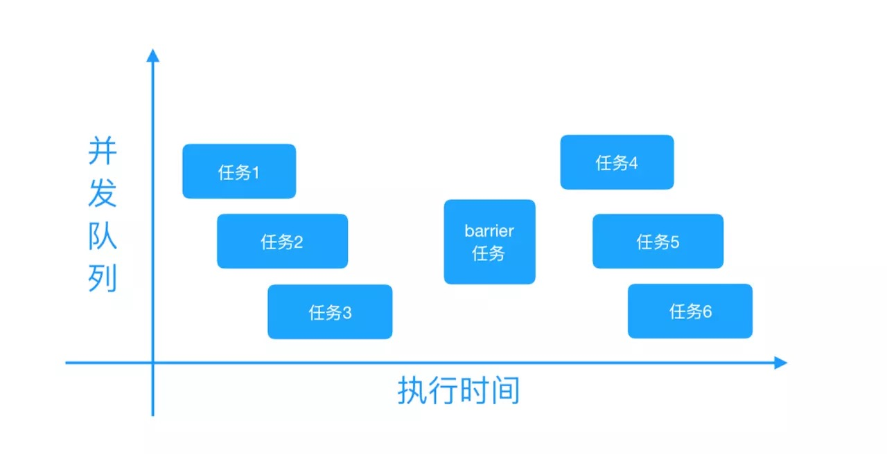
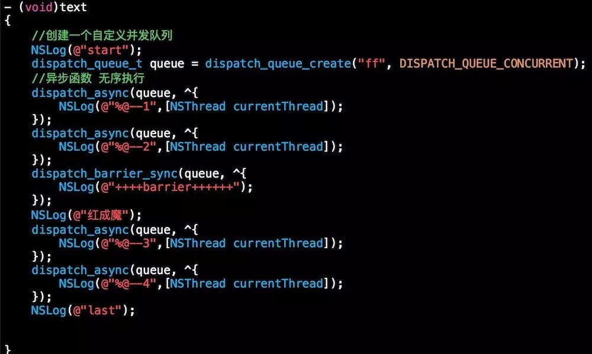
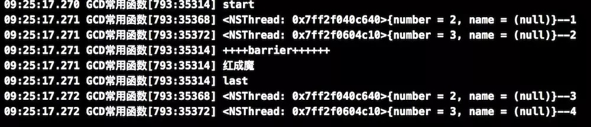
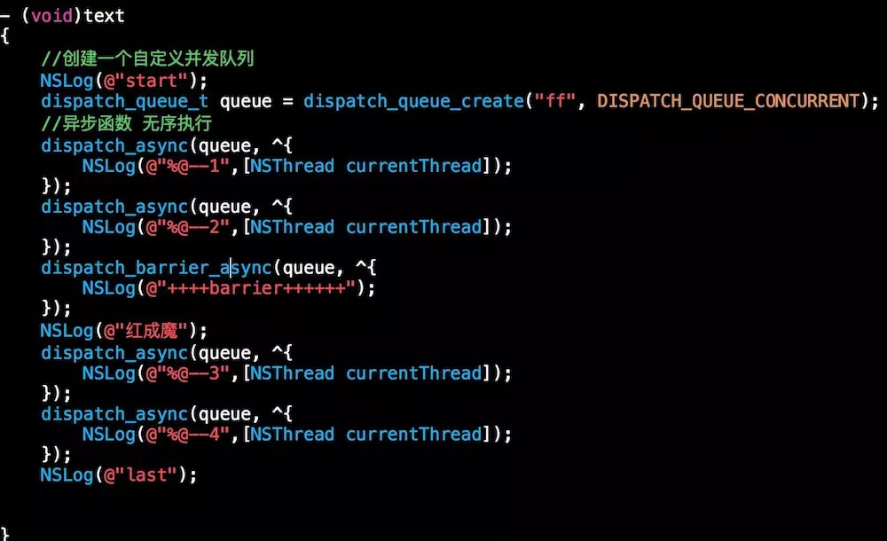
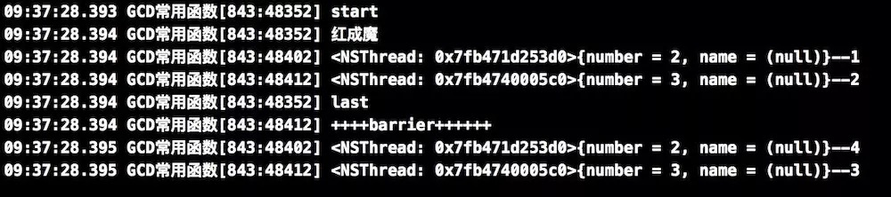

iOS 多线程相关-GCD
=========

## 多线程安全的理解

[iOS多线程到底不安全在哪里？](http://mrpeak.cn/blog/ios-thread-safety/)

[细说GCD（Grand Central Dispatch）如何用](https://github.com/ming1016/study/wiki/细说GCD（Grand-Central-Dispatch）如何用)

[iOS多线程：『GCD』详尽总结](https://juejin.im/post/5a90de68f265da4e9b592b40)

## GCD

GCD 属于系统级的线程管理，是基于队列的并发编程API, 它是通过集中管理一个协同使用的线程池来执行并发任务的，GCD 会自动管理线程的生命周期（创建线程、调度任务、销毁线程），程序员只需要告诉 GCD 想要执行什么任务，不需要编写任何线程管理的代码。

GCD这块已经开源，地址 [http://libdispatch.macosforge.org](http://libdispatch.macosforge.org)。

### 队列和任务

GCD 中有两个核心概念：**任务和队列**

**任务**：就是在线程中执行的那段代码。

GCD 的任务有两种执行方式：**同步执行和异步执行**。两者的主要区别是：**是否等待队列的任务执行结束，以及是否具备开启新线程的能力。**

* 同步执行（sync）：
    - 同步添加任务到指定的队列中，在添加的任务执行结束之前，会一直等待，直到队列里面的任务完成之后再继续执行。
    - 只能在当前线程中执行任务，不具备开启新线程的能力。
* 异步执行（async）：
    - 异步添加任务到指定的队列中，它不会做任何等待，可以继续执行任务。
    - 可以在新的线程中执行任务，具备开启新线程的能力。

> 注意： 异步执行（async） 虽然具有开启新线程的能力，但是并不一定开启新线程。这跟任务所指定的队列类型有关（下面会讲）。

**队列（Dispatch Queue）**：执行任务的等待队列，即用来存放任务的队列，采用 FIFO（先进先出）的原则, 用来保证先进来的任务先得到执行。两者的主要区别是：**执行顺序不同，以及开启线程数不同。**

GCD 有两种队列：**串行队列和并行队列**。

* 串行队列（Serial Dispatch Queue）：
    - 每次只有一个任务被执行。让任务一个接着一个地执行。（只开启一个线程，一个任务执行完毕后，再执行下一个任务）
* 并发队列（Concurrent Dispatch Queue）：
    - 可以让多个任务并发（同时）执行。（可以开启多个线程，并且同时执行任务）

> 注意：当你创建多个 Serial queue 时，虽然各自是同步，但 serial queue 之间是并发执行。

系统标准两个队列

```
// 全局队列，一个并行的队列
dispatch_get_global_queue(DISPATCH_QUEUE_PRIORITY_DEFAULT, 0);
// 主队列，主线程中的唯一队列，一个串行队列
dispatch_get_main_queue();
```

自定义队列

```
// 串行队列
dispatch_queue_t queue = dispatch_queue_create("com.jumpingfrog0.serialqueue", DISPATCH_QUEUE_SERIAL);
// 并发队列
dispatch_queue_t queue = dispatch_queue_create("com.jumpingfrog0.concurrentqueue", DISPATCH_QUEUE_CONCURRENT);
```

同步任务和异步任务

```
// 同步任务
dispatch_sync(queue, ^{
    // 这里放同步执行任务代码
});
// 异步任务
dispatch_async(queue, ^{
    // 这里放异步执行任务代码
});
```

#### 队列和任务组合

GCD 有四种不同的组合方式：

```
1. 同步执行 + 并发队列
2. 异步执行 + 并发队列
3. 同步执行 + 串行队列
4. 异步执行 + 串行队列
```

但是主队列因为有点特殊，所以我们就又多了两种组合方式:

```
5. 同步执行 + 主队列
6. 异步执行 + 主队列
```

| | 并行队列 | 串行队列 | 主队列 |
|:--: | :--: | :--: | :--: |
| 同步(sync) | 不开启新线程，任务顺序执行 | 不开启新线程，任务顺序执行 | 不开启新线程，任务顺序执行?(死锁？) |
| 异步(async) | 开启新线程(多个)，任务并发执行 | 开启一个新线程，任务顺序执行；不同队列间的任务所属线程不同 | 不开启新线程，任务顺序执行 |

// TODO - 不同组合方式具体的情况

#### 队列的优先级

// TODO: 优先级

##### dispatch_set_target_queue 的作用

[iOS 浅谈dispatch_set_target_queue作用](https://blog.csdn.net/samuelandkevin/article/details/51187923)

[GCD子队列的优先级](https://www.jianshu.com/p/12ce81ebfa24)

[GCD 源码分析之全局线程优先级](http://ios.jobbole.com/90207/)

[GCD中的dispatch_set_target_queue的用法及作用](https://www.cnblogs.com/denz/p/5214297.html)

[GCD 中那些你可能不熟悉的知识](http://liuduo.me/2018/02/17/gcd-maybe-you-dont-know/)

获取全局队列

```
dispatch_queue_t dispatch_get_global_queue(long identifier, unsigned long flags);
```

获取全局队列时，系统对外提供了 5 个级别的优先级:

```
// 服务于与用户交互的优先级，该级别任务会占用几乎所有的时间片和 I/O 带宽。可以进行处理主事件循环、视图绘制、动画等操作，
 *  - QOS_CLASS_USER_INTERACTIVE
// 服务于用户发起并等待的优先级 
 *  - QOS_CLASS_USER_INITIATED
// 默认的优先级
 *  - QOS_CLASS_DEFAULT
// 用户不太关心任务的进度，但是需要知道结果，比如下拉刷新操作
 *  - QOS_CLASS_UTILITY
// 用户不会察觉的任务，比如，预加载一些数据，
 *  - QOS_CLASS_BACKGROUND

 QOS_CLASS_USER_INTERACTIVE：user interactive 等级表示任务需要被立即执行，用来在响应事件之后更新 UI，来提供好的用户体验。这个等级最好保持小规模。
QOS_CLASS_USER_INITIATED：user initiated 等级表示任务由 UI 发起异步执行。适用场景是需要及时结果同时又可以继续交互的时候。
QOS_CLASS_DEFAULT：default 默认优先级
QOS_CLASS_UTILITY：utility 等级表示需要长时间运行的任务，伴有用户可见进度指示器。经常会用来做计算，I/O，网络，持续的数据填充等任务。这个任务节能。
QOS_CLASS_BACKGROUND：background 等级表示用户不会察觉的任务，使用它来处理预加载，或者不需要用户交互和对时间不敏感的任务。
QOS_CLASS_UNSPECIFIED：unspecified 未指明

作者：fuyoufang
链接：https://www.jianshu.com/p/5a16dfd36fad
来源：简书
简书著作权归作者所有，任何形式的转载都请联系作者获得授权并注明出处。
```

DISPATCH_QUEUE_PRIORITY 和 QOS_CLASS 的对应关系如下所示：

```
 *  - DISPATCH_QUEUE_PRIORITY_HIGH:         QOS_CLASS_USER_INITIATED
 *  - DISPATCH_QUEUE_PRIORITY_DEFAULT:      QOS_CLASS_DEFAULT
 *  - DISPATCH_QUEUE_PRIORITY_LOW:          QOS_CLASS_UTILITY
 *  - DISPATCH_QUEUE_PRIORITY_BACKGROUND:   QOS_CLASS_BACKGROUND
```

获取队列优先级

```
dispatch_qos_class_t dispatch_queue_get_qos_class(dispatch_queue_t queue,
  int *relative_priority_ptr);
```

获取队列优先级的结果比上面多个一种结果：`QOS_CLASS_UNSPECIFIED`

如果这个队列是由 dispatch_queue_attr_make_with_qos_class() 返回的属性创建的，则返回创建时使用的优先级。其它的任何属性都会返回 QOS_CLASS_UNSPECIFIED。

dispatch_queue_attr_make_with_qos_class 的用法如下：

```
 dispatch_queue_t queue;
 dispatch_queue_attr_t attr;
 attr = dispatch_queue_attr_make_with_qos_class(DISPATCH_QUEUE_SERIAL,
   QOS_CLASS_UTILITY, 0);
 queue = dispatch_queue_create("com.example.myqueue", attr);
```

### GCD 的其他用法和应用场景

#### 1. dispatch_once

使用 dispatch_once 函数能保证某段代码在程序运行过程中只被执行1次，并且即使在多线程的环境下，dispatch_once 也可以保证线程安全，常用于单例模式。

```
- (void)once {
    static dispatch_once_t onceToken;
    dispatch_once(&onceToken, ^{
        // 只执行1次的代码(这里面默认是线程安全的)
    });
}
```

#### 2. dispatch_after 延时执行

dispatch_after 函数可以延迟执行一个任务，但并不是在指定时间之后才开始执行处理，而是在指定时间之后将任务追加到队列中。

```
double delaySeconds=5;
dispatch_time_t delay_time = dispatch_time(DISPATCH_TIME_NOW, (int64_t)(delaySeconds * NSEC_PER_SEC));
dispatch_after(delay_time, dispatch_get_main_queue(), ^{
    NSLog(@"hello world");
});
```

例子中的 `dispatch_time` 的参数，可以先看看函数原型

```
dispatch_time_t dispatch_time ( dispatch_time_t when, int64_t delta );
```

第一个参数为 `DISPATCH_TIME_NOW` 表示当前。第二个参数的 delta 表示纳秒，一秒对应的纳秒为1000000000，系统提供了一些宏来简化

```
 #define NSEC_PER_SEC 1000000000ull //每秒有多少纳秒
 #define USEC_PER_SEC 1000000ull    //每秒有多少毫秒
 #define NSEC_PER_USEC 1000ull      //每毫秒有多少纳秒
 ```

这样如果要表示一秒就可以这样写

```
dispatch_time(DISPATCH_TIME_NOW, 1 * NSEC_PER_SEC);
dispatch_time(DISPATCH_TIME_NOW, 1000 * USEC_PER_SEC);
dispatch_time(DISPATCH_TIME_NOW, USEC_PER_SEC * NSEC_PER_USEC);
```

#### 3. dispatch\_barrier\_async 栅栏

dispatch_barrier_async 方法在两个操作组间形成一个栅栏，将两组异步执行的操作组给分割起来。

dispatch_barrier_async 函数会等待前边追加到并发队列中的任务全部执行完毕之后，再将 barrier 的任务追加到该异步队列中，然后在追加的任务执行完毕之后，异步队列才恢复为一般动作，然后才开始执行 barrier 后面追加到该异步队列的任务。具体如下图所示：




> 注意：`dispatch_barrier_async` 只在自己创建的队列上有这种作用，在全局并发队列和串行队列上，效果和 `dispatch_sync` 一样，对于 `dispatch_barrier_sync` 也是同理。

```
dispatch_queue_t queue = dispatch_queue_create("com.jumpingfrog0.testQueue", DISPATCH_QUEUE_CONCURRENT);
dispatch_async(queue, ^{NSLog(@"1");});
dispatch_async(queue, ^{NSLog(@"2");});
dispatch_async(queue, ^{NSLog(@"3");});
dispatch_barrier_async(queue, ^{NSLog(@"barrier");});
dispatch_async(queue, ^{ NSLog(@"4");});
dispatch_async(queue, ^{NSLog(@"5");});
```

执行结果：

```
2
1
3
barrier
4
5
```

**dispatch_barrier_async可以解决多线程并发中读写同一个临界资源发生死锁的问题（单写多读）**

例子1

```
// 
self.isolationQueue = dispatch_queue_create([label UTF8String], DISPATCH_QUEUE_CONCURRENT);

- (void)setCount:(NSUInteger)count forKey:(NSString *)key
{
     key = [key copy];
     dispatch_barrier_async(self.isolationQueue, ^(){
          if (count == 0) {
               [self.counts removeObjectForKey:key];
          } else {
               self.counts[key] = @(count);
          }
     });
}
```

例子2

```
- (void)dispatchBarrierAsyncDemo {
    //防止文件读写冲突，可以创建一个串行队列，操作都在这个队列中进行，没有更新数据读用并行，写用串行。
    dispatch_queue_t dataQueue = dispatch_queue_create("com.starming.gcddemo.dataqueue", DISPATCH_QUEUE_CONCURRENT);
    dispatch_async(dataQueue, ^{
        [NSThread sleepForTimeInterval:2.f];
        NSLog(@"read data 1");
    });
    dispatch_async(dataQueue, ^{
        NSLog(@"read data 2");
    });
    //等待前面的都完成，在执行barrier后面的
    dispatch_barrier_async(dataQueue, ^{
        NSLog(@"write data 1");
        [NSThread sleepForTimeInterval:1];
    });
    dispatch_async(dataQueue, ^{
        [NSThread sleepForTimeInterval:1.f];
        NSLog(@"read data 3");
    });
    dispatch_async(dataQueue, ^{
        NSLog(@"read data 4");
    });
}
```

例子3

```
//使用dispatch_queue_create初始化一个并发队列。第一个参数遵循反向DNS命名习惯，方便描述，第二个参数是指出是并发还是顺序。
private let concurrentPhotoQueue = dispatch_queue_create(
"com.raywenderlich.GooglyPuff.photoQueue", DISPATCH_QUEUE_CONCURRENT)

func addPhoto(photo: Photo) {
     dispatch_barrier_async(concurrentPhotoQueue) { // 将写操作加入到自定义的队列。开始执行时这个就是队列中唯一的一个在执行的任务。
          self._photos.append(photo) // barrier能够保障不会和其他任务同时进行。
          dispatch_async(GlobalMainQueue) { // 涉及到UI所以这个通知应该在主线程中，所以分派另一个异步任务到主队列中。
               self.postContentAddedNotification()
          }
     }
}

//上面是解决了写可能发生死锁，下面是使用dispatch_sync解决读时可能会发生的死锁。
var photos: [Photo] {
     var photosCopy: [Photo]!
     dispatch_sync(concurrentPhotoQueue) { // 同步调度到concurrentPhotoQueue队列执行读操作
          photosCopy = self._photos // 保存
     }
     return photosCopy
}
//这样读写问题都解决了。
```

#### 4. dispatch\_barrier\_sync

作用于 `dispatch_barrier_async` 一样

不同点：

* `dispatch_barrier_sync` 将自己的任务插入到队列的时候，需要等待自己的任务结束之后才会继续插入被写在它后面的任务，然后执行它们。
* `dispatch_barrier_async` 将自己的任务插入到队列之后，不会等待自己的任务结束，它会继续把后面的任务插入到队列，然后等待自己的任务结束后才执行后面任务。

#### 5. dispatch_apply

类似 for 循环，按照指定的次数将任务追加到指定的队列中，并等待队列中的任务全部执行结束。在并发队列的情况下 dispatch_apply 会并发执行 block 任务。

```
// 因为是在并发队列中异步执行任务，各个任务的执行顺序不定
- (void)dispatchApplyDemo {
    dispatch_queue_t concurrentQueue = dispatch_queue_create("com.starming.gcddemo.concurrentqueue", DISPATCH_QUEUE_CONCURRENT);
    dispatch_apply(10, concurrentQueue, ^(size_t i) {
        NSLog(@"%zu",i);
    });
    NSLog(@"The end"); //这里有个需要注意的是，dispatch_apply这个是会阻塞主线程的。这个log打印会在dispatch_apply都结束后才开始执行
}
```

dispatch_apply 能避免线程爆炸，因为GCD会管理并发。

```
- (void)dealWiththreadWithMaybeExplode:(BOOL)explode {
    dispatch_queue_t concurrentQueue = dispatch_queue_create("com.starming.gcddemo.concurrentqueue",DISPATCH_QUEUE_CONCURRENT);
    if (explode) {
        //有问题的情况，可能会死锁
        for (int i = 0; i < 999 ; i++) {
            dispatch_async(concurrentQueue, ^{
                NSLog(@"wrong %d",i);
                //do something hard
            });
        }
    } else {
        //会优化很多，能够利用GCD管理
        dispatch_apply(999, concurrentQueue, ^(size_t i){
            NSLog(@"correct %zu",i);
            //do something hard
        });
    }
}
```

示例：

```
func downloadPhotosWithCompletion(completion: BatchPhotoDownloadingCompletionClosure?) {
     var storedError: NSError!
     var downloadGroup = dispatch_group_create()
     let addresses = [OverlyAttachedGirlfriendURLString,
          SuccessKidURLString,
          LotsOfFacesURLString]

     dispatch_apply(UInt(addresses.count), GlobalUserInitiatedQueue) {
          i in
          let index = Int(i)
          let address = addresses[index]
          let url = NSURL(string: address)
          dispatch_group_enter(downloadGroup)
          let photo = DownloadPhoto(url: url!) {
               image, error in
               if let error = error {
                    storedError = error
               }
               dispatch_group_leave(downloadGroup)
          }
          PhotoManager.sharedManager.addPhoto(photo)
     }

     dispatch_group_notify(downloadGroup, GlobalMainQueue) {
          if let completion = completion {
               completion(error: storedError)
          }
     }
}
```

#### 6. GCD 队列组 dispatch_group

有时候我们会有这样的需求：分别异步执行2个耗时任务，然后当2个耗时任务都执行完毕后再回到主线程执行任务。这时候我们可以用到 GCD 的队列组。

有两种方式使用队列组：
* 调用队列组的 dispatch_group_async 先把任务放到队列中，然后将队列放入队列组中
* 使用队列组的 dispatch_group_enter、dispatch_group_leave 组合来实现

当 group 里所有事件都完成, 有两种方式发送通知:
* 调用队列组的 dispatch_group_notify 回到指定线程异步执行闭包，不会阻塞
* 使用 dispatch_group_wait 会阻塞当前线程，等所有任务都完成或等待超时，然后回到当前线程继续向下执行

注意事项:
* dispatch_group_async等价于dispatch_group_enter() 和 dispatch_group_leave()的组合。
* dispatch_group_enter() 必须运行在 dispatch_group_leave() 之前。
* dispatch_group_enter() 和 dispatch_group_leave() 需要成对出现的

##### dispatch\_group\_wait

如果group的所有任务都执行完毕，它会返回 0 ，如果超时，则会返回一个不为 0 的long类型的值。

```
func downloadPhotosWithCompletion(completion: BatchPhotoDownloadingCompletionClosure?) {
     dispatch_async(GlobalUserInitiatedQueue) { // 因为dispatch_group_wait会租塞当前进程，所以要使用dispatch_async将整个方法要放到后台队列才能够保证主线程不被阻塞
          var storedError: NSError!
          var downloadGroup = dispatch_group_create() // 创建一个dispatch group

          for address in [OverlyAttachedGirlfriendURLString,
               SuccessKidURLString,
               LotsOfFacesURLString]
          {
               let url = NSURL(string: address)
               dispatch_group_enter(downloadGroup) // dispatch_group_enter是通知dispatch group任务开始了，dispatch_group_enter和dispatch_group_leave是成对调用，不然程序就崩溃了。
               let photo = DownloadPhoto(url: url!) {
                    image, error in
                    if let error = error {
                         storedError = error
                    }
                    dispatch_group_leave(downloadGroup) // 保持和dispatch_group_enter配对。通知任务已经完成
               }
               PhotoManager.sharedManager.addPhoto(photo)
          }

          dispatch_group_wait(downloadGroup, DISPATCH_TIME_FOREVER) // dispatch_group_wait等待所有任务都完成直到超时。如果任务完成前就超时了，函数会返回一个非零值，可以通过返回值判断是否超时。也可以用DISPATCH_TIME_FOREVER表示一直等。
          dispatch_async(GlobalMainQueue) { // 这里可以保证所有图片任务都完成，然后在main queue里加入完成后要处理的闭包，会在main queue里执行。
               if let completion = completion { // 执行闭包内容
                    completion(error: storedError)
               }
          }
     }
}
```

```
- (void)dispatchGroupWaitDemo {
    dispatch_queue_t concurrentQueue = dispatch_queue_create("com.starming.gcddemo.concurrentqueue",DISPATCH_QUEUE_CONCURRENT);
    dispatch_group_t group = dispatch_group_create();
    //在group中添加队列的block
    dispatch_group_async(group, concurrentQueue, ^{
        [NSThread sleepForTimeInterval:2.f];
        NSLog(@"1");
    });
    dispatch_group_async(group, concurrentQueue, ^{
        NSLog(@"2");
    });
    dispatch_group_wait(group, DISPATCH_TIME_FOREVER);
    NSLog(@"go on");
}
```

##### dispatch\_group\_notify

```
func downloadPhotosWithCompletion(completion: BatchPhotoDownloadingCompletionClosure?) {
     // 不用加dispatch_async，因为没有阻塞主进程
     var storedError: NSError!
     var downloadGroup = dispatch_group_create()

     for address in [OverlyAttachedGirlfriendURLString,
          SuccessKidURLString,
          LotsOfFacesURLString]
     {
          let url = NSURL(string: address)
          dispatch_group_enter(downloadGroup)
          let photo = DownloadPhoto(url: url!) {
               image, error in
               if let error = error {
                    storedError = error
               }
               dispatch_group_leave(downloadGroup)
          }
          PhotoManager.sharedManager.addPhoto(photo)
     }

     dispatch_group_notify(downloadGroup, GlobalMainQueue) { // dispatch_group_notify和dispatch_group_wait的区别就是是异步执行闭包的，当dispatch groups中没有剩余的任务时闭包才执行。这里是指明在主队列中执行。
          if let completion = completion {
               completion(error: storedError)
          }
     }
}
```

```
// dispatch_group_notify
- (void)dispatchGroupNotifyDemo {
    dispatch_queue_t concurrentQueue = dispatch_queue_create("com.starming.gcddemo.concurrentqueue",DISPATCH_QUEUE_CONCURRENT);
    dispatch_group_t group = dispatch_group_create();
    dispatch_group_async(group, concurrentQueue, ^{
        NSLog(@"1");
    });
    dispatch_group_async(group, concurrentQueue, ^{
        NSLog(@"2");
    });
    dispatch_group_notify(group, dispatch_get_main_queue(), ^{
        NSLog(@"end");
    });
    NSLog(@"can continue");
}
```


如何 dispatch_group 优化现有API

```
// 给Core Data的-performBlock:添加groups。组合完成任务后使用dispatch_group_notify来运行一个block即可。
- (void)withGroup:(dispatch_group_t)group performBlock:(dispatch_block_t)block
{
     if (group == NULL) {
          [self performBlock:block];
     } else {
          dispatch_group_enter(group);
          [self performBlock:^(){
               block();
               dispatch_group_leave(group);
          }];
     }
}

// NSURLConnection也可以这样做
+ (void)withGroup:(dispatch_group_t)group
     sendAsynchronousRequest:(NSURLRequest *)request
     queue:(NSOperationQueue *)queue
     completionHandler:(void (^)(NSURLResponse*, NSData*, NSError*))handler
{
     if (group == NULL) {
          [self sendAsynchronousRequest:request
               queue:queue
               completionHandler:handler];
     } else {
          dispatch_group_enter(group);
          [self sendAsynchronousRequest:request
                    queue:queue
                    completionHandler:^(NSURLResponse *response, NSData *data, NSError *error){
               handler(response, data, error);
               dispatch_group_leave(group);
          }];
     }
}
```

#### 7. Dispatch Block

##### 创建 dispatch block

有2种方式创建 dispatch block：

* dispatch_block_create
    
    ```
    dispatch_block_t dispatch_block_create(dispatch_block_flags_t flags, dispatch_block_t block);
    ```
* dispatch_block_create_with_qos_class: 创建 block 的同时可以指定了相应的优先级

    ```
    dispatch_block_t dispatch_block_create_with_qos_class(dispatch_block_flags_t flags,
    dispatch_qos_class_t qos_class, int relative_priority,
    dispatch_block_t block);
    ```

例子

```
- (void)createDispatchBlock {
    //normal way
    dispatch_queue_t concurrentQueue = dispatch_queue_create("com.starming.gcddemo.concurrentqueue",DISPATCH_QUEUE_CONCURRENT);
    dispatch_block_t block = dispatch_block_create(0, ^{
        NSLog(@"run block");
    });
    dispatch_async(concurrentQueue, block);

    //QOS way
    dispatch_block_t qosBlock = dispatch_block_create_with_qos_class(0, QOS_CLASS_USER_INITIATED, -1, ^{
        NSLog(@"run qos block");
    });
    dispatch_async(concurrentQueue, qosBlock);
}
```

##### 监听 block 执行结束

有两种方式监听 block 执行结束：

* dispatch_block_wait
* dispatch_block_notify 

###### dispatch\_block\_wait

该函数会阻塞当前线程进行等待。

```
long dispatch_block_wait(dispatch_block_t block, dispatch_time_t timeout);
```

timeout 参数表示等待时间，在等待 block 执行完毕时，应该等待多久，如果执行 block 所需的时间小于 timeout，则返回 0，否则返回非 0 值。此参数也可以取常量 `DISPATCH_TIME_FOREVER`，表示函数会一直等待 block 执行完，而不会超时。

例子

```
dispatch_queue_t allTasksQueue = dispatch_queue_create("allTasksQueue", DISPATCH_QUEUE_CONCURRENT);

dispatch_block_t block = dispatch_block_create(0, ^{
    NSLog(@"开始执行");
    [NSThread sleepForTimeInterval:3];
    NSLog(@"结束执行");
});

dispatch_async(allTasksQueue, block);
// 等待时长，10s 之后超时
dispatch_time_t timeout = dispatch_time(DISPATCH_TIME_NOW, (int64_t)(10 * NSEC_PER_SEC));
long resutl = dispatch_block_wait(block, timeout);
if (resutl == 0) {
    NSLog(@"执行成功");
} else {
    NSLog(@"执行超时");
}
```

输出结果：

```
开始执行
结束执行
执行成功
```

###### dispatch\_block\_notify: 

```
void dispatch_block_notify(dispatch_block_t block,     
    dispatch_queue_t queue, 
    dispatch_block_t notification_block);
```

该函数接收三个参数，第一个参数是需要监视的 block，第二个参数是监听的 block 执行结束之后要提交执行的队列 queue，第三个参数是待加入到队列中的 block。 

和 `dispatch_block_wait` 的不同之处在于：`dispatch_block_notify` 函数不会阻塞当前线程。

例子

```
NSLog(@"---- 开始设置任务 ----");
dispatch_queue_t serialQueue =   dispatch_queue_create("com.fyf.serialqueue",   DISPATCH_QUEUE_SERIAL);

// 耗时任务
dispatch_block_t taskBlock = dispatch_block_create(0, ^{
    NSLog(@"开始耗时任务");
    [NSThread sleepForTimeInterval:2.f];
    NSLog(@"完成耗时任务");
});

dispatch_async(serialQueue, taskBlock);

// 更新 UI
dispatch_block_t refreshUI = dispatch_block_create(0, ^{
    NSLog(@"更新 UI");
});

// 设置监听
dispatch_block_notify(taskBlock, dispatch_get_main_queue(), refreshUI);
NSLog(@"---- 完成设置任务 ----");
```

输出结果：

```
---- 开始设置任务 ----
---- 完成设置任务 ----
开始耗时任务
完成耗时任务
更新 UI
```

##### dispatch block 的取消

iOS8 后 GCD 支持对 dispatch block 的取消。

```
void dispatch_block_cancel(dispatch_block_t block);
```

这个函数用异步的方式取消指定的 block。取消操作使将来执行 dispatch block 立即返回，但是对已经在执行的任务不起作用，只能取消尚未执行的任务。

```
dispatch_queue_t serialQueue = dispatch_queue_create("com.fyf.serialqueue", DISPATCH_QUEUE_SERIAL);

// 耗时任务
dispatch_block_t firstTaskBlock = dispatch_block_create(0, ^{
    NSLog(@"开始第一个任务");
    [NSThread sleepForTimeInterval:1.5f];
    NSLog(@"结束第一个任务");
});

// 耗时任务
dispatch_block_t secTaskBlock = dispatch_block_create(0, ^{
    NSLog(@"开始第二个任务");
    [NSThread sleepForTimeInterval:2.f];
    NSLog(@"结束第二个任务");
});

dispatch_async(serialQueue, firstTaskBlock);
dispatch_async(serialQueue, secTaskBlock);

// 等待 1s，让第一个任务开始运行
[NSThread sleepForTimeInterval:1];

dispatch_block_cancel(firstTaskBlock);
NSLog(@"尝试过取消第一个任务");

dispatch_block_cancel(secTaskBlock);
NSLog(@"尝试过取消第二个任务");
```

输出：

```
开始第一个任务
尝试过取消第一个任务
尝试过取消第二个任务
结束第一个任务
```

#### dispatch\_suspend & dispatch\_resume

`dispatch_suspend` : 挂起指定的队列
`dispatch_resume` : 恢复指定队列

```
dispatch_queue_t queue = dispatch_get_main_queue();
dispatch_suspend(queue); //暂停队列queue
dispatch_resume(queue);  //恢复队列queue
```

### 信号量

GCD 中的信号量是指 Dispatch Semaphore，是持有计数的信号。类似于过高速路收费站的栏杆。可以通过时，打开栏杆，不可以通过时，关闭栏杆。在 Dispatch Semaphore 中，计数小于0时等待，不可通过。计数大于或等于0时，可通过。

Dispatch Semaphore 提供了三个函数。

* `dispatch_semaphore_create`：创建一个Semaphore并初始化信号的总量
* `dispatch_semaphore_signal`：发送一个信号，让信号总量加1
* `dispatch_semaphore_wait`：可以使总信号量减1，当信号总量小于0时就会一直等待（阻塞所在线程），否则就可以正常执行。

Dispatch Semaphore 在实际开发中主要用于：

* 保持线程同步，将异步执行任务转换为同步执行任务
* 保证线程安全，为线程加锁

#### Dispatch Semaphore 线程同步

我们在开发中，会遇到这样的需求：异步执行耗时任务，并使用异步执行的结果进行一些额外的操作。换句话说，相当于，将将异步执行任务转换为同步执行任务。比如说：AFNetworking 中 AFURLSessionManager.m 里面的 `tasksForKeyPath:` 方法。通过引入信号量的方式，等待异步执行任务结果，获取到 tasks，然后再返回该 tasks。

```objective-c
- (NSArray *)tasksForKeyPath:(NSString *)keyPath {
    __block NSArray *tasks = nil;
    dispatch_semaphore_t semaphore = dispatch_semaphore_create(0);
    [self.session getTasksWithCompletionHandler:^(NSArray *dataTasks, NSArray *uploadTasks, NSArray *downloadTasks) {
        if ([keyPath isEqualToString:NSStringFromSelector(@selector(dataTasks))]) {
            tasks = dataTasks;
        } else if ([keyPath isEqualToString:NSStringFromSelector(@selector(uploadTasks))]) {
            tasks = uploadTasks;
        } else if ([keyPath isEqualToString:NSStringFromSelector(@selector(downloadTasks))]) {
            tasks = downloadTasks;
        } else if ([keyPath isEqualToString:NSStringFromSelector(@selector(tasks))]) {
            tasks = [@[dataTasks, uploadTasks, downloadTasks] valueForKeyPath:@"@unionOfArrays.self"];
        }

        dispatch_semaphore_signal(semaphore);
    }];

    dispatch_semaphore_wait(semaphore, DISPATCH_TIME_FOREVER);

    return tasks;
}
```

#### 线程安全（使用 semaphore 加锁）

```objective-c
/**
 * 线程安全：使用 semaphore 加锁
 * 初始化火车票数量、卖票窗口(线程安全)、并开始卖票
 */
- (void)initTicketStatusSave {
    NSLog(@"currentThread---%@",[NSThread currentThread]);  // 打印当前线程
    NSLog(@"semaphore---begin");
    
    semaphoreLock = dispatch_semaphore_create(1);
    
    self.ticketSurplusCount = 50;
    
    // queue1 代表北京火车票售卖窗口
    dispatch_queue_t queue1 = dispatch_queue_create("net.bujige.testQueue1", DISPATCH_QUEUE_SERIAL);
    // queue2 代表上海火车票售卖窗口
    dispatch_queue_t queue2 = dispatch_queue_create("net.bujige.testQueue2", DISPATCH_QUEUE_SERIAL);
    
    __weak typeof(self) weakSelf = self;
    dispatch_async(queue1, ^{
        [weakSelf saleTicketSafe];
    });
    
    dispatch_async(queue2, ^{
        [weakSelf saleTicketSafe];
    });
}

/**
 * 售卖火车票(线程安全)
 */
- (void)saleTicketSafe {
    while (1) {
        // 相当于加锁
        dispatch_semaphore_wait(semaphoreLock, DISPATCH_TIME_FOREVER);
        
        if (self.ticketSurplusCount > 0) {  //如果还有票，继续售卖
            self.ticketSurplusCount--;
            NSLog(@"%@", [NSString stringWithFormat:@"剩余票数：%d 窗口：%@", self.ticketSurplusCount, [NSThread currentThread]]);
            [NSThread sleepForTimeInterval:0.2];
        } else { //如果已卖完，关闭售票窗口
            NSLog(@"所有火车票均已售完");
            
            // 相当于解锁
            dispatch_semaphore_signal(semaphoreLock);
            break;
        }
        
        // 相当于解锁
        dispatch_semaphore_signal(semaphoreLock);
    }
}
```

输出结果为：

```
currentThread---<NSThread: 0x6000000783c0>{number = 1, name = main}
semaphore---begin
剩余票数：49 窗口：<NSThread: 0x6040002709c0>{number = 3, name = (null)}
剩余票数：48 窗口：<NSThread: 0x60000046c640>{number = 4, name = (null)}
剩余票数：47 窗口：<NSThread: 0x6040002709c0>{number = 3, name = (null)}
......
剩余票数：4 窗口：<NSThread: 0x60000046c640>{number = 4, name = (null)}
剩余票数：3 窗口：<NSThread: 0x6040002709c0>{number = 3, name = (null)}
剩余票数：2 窗口：<NSThread: 0x60000046c640>{number = 4, name = (null)}
剩余票数：1 窗口：<NSThread: 0x6040002709c0>{number = 3, name = (null)}
剩余票数：0 窗口：<NSThread: 0x60000046c640>{number = 4, name = (null)}
所有火车票均已售完
所有火车票均已售完
```

## 其他

### 1. dispatch_barrier_sync 和 dispatch_barrier_async 的区别

先看官方文档

* dispatch_barrier_sync: Submits a barrier block object for execution and waits until that block completes.(提交一个栅栏函数在执行中,它会等待栅栏函数执行完)
* dispatch_barrier_async: Submits a barrier block for asynchronous execution and returns immediately.(提交一个栅栏函数在异步执行中,它会立马返回)

上面的意思是：

dispatch_barrier_sync 需要等待栅栏执行完才会执行栅栏后面的任务,而dispatch_barrier_async 无需等待栅栏执行完,会继续往下走(栅栏任务会保留在队列里)

dispatch_barrier_sync 例子





dispatch_barrier_async 例子





## NSOperation

[iOS多线程之NSOperation](http://www.jianshu.com/p/c6650fcc6612)

[NSOperation 和 NSOperationQueue](http://www.jianshu.com/p/e97bab6d6520)

[Concurrency Programming Guide](https://developer.apple.com/library/content/documentation/General/Conceptual/ConcurrencyProgrammingGuide/OperationObjects/OperationObjects.html#//apple_ref/doc/uid/TP40008091-CH101-SW8)

`NSOperation` 不可以直接创建，其实用的比较多的是 `NSOperationQueue` 和 它的两个子类 `NSBlockOperation`  和 `NSInvocationOperation`（Swift 不支持）。

### NSOperationQueue

`NSOperationQueue` 底层是基于 GCD 的封装，queue 会根据 operation 的优先级、依赖等来决定如何执行添加进来的操作。所有的自定义队列，都是在子线程中执行的。

创建一个线程队列

```
NSOperationQueue *queue = [[NSOperationQueue alloc]init];
queue.maxConcurrentOperationCount = 2; // 设置最大并发数（同时并发的最大线程数）
```

获取main队列

```
NSOperationQueue *mainQueue = [NSOperationQueue mainQueue];
```

### NSBlockOperation

`NSBlockOperation` 是 `NSOperation` 的子类，用于管理一个或多个 block 的**并发执行**，会开启一个或多个线程，这些线程都由 queue 自己管理。可以通过设置依赖来控制执行顺序。

```
NSOperationQueue *queue = [[NSOperationQueue alloc]init];

NSBlockOperation *op1 = [NSBlockOperation blockOperationWithBlock:^{
    NSLog(@"下载图片 %@",[NSThread currentThread]);
}];
NSBlockOperation *op2 = [NSBlockOperation blockOperationWithBlock:^{
    NSLog(@"修饰图片 %@",[NSThread currentThread]);
}];
NSBlockOperation *op3 = [NSBlockOperation blockOperationWithBlock:^{
    NSLog(@"保存图片 %@",[NSThread currentThread]);
}];
NSBlockOperation *op4 = [NSBlockOperation blockOperationWithBlock:^{
    NSLog(@"更新UI %@",[NSThread currentThread]);
}];
    
// 设置执行顺序（依赖）
[op2 addDependency:op1];
[op3 addDependency:op2];
[op4 addDependency:op3];
    
[queue addOperation:op1];
[queue addOperation:op2];
[queue addOperation:op3];

// 所有UI的更新需要在主线程上进行
[[NSOperationQueue mainQueue] addOperation:op4];
```

 执行结果：
 
```
2017-04-20 02:25:56.693 02-NSOperation[73278:10188500] 下载图片 <NSThread: 0x6180000619c0>{number = 3, name = (null)}
2017-04-20 02:25:56.693 02-NSOperation[73278:10188502] 修饰图片 <NSThread: 0x610000063b40>{number = 4, name = (null)}
2017-04-20 02:25:56.693 02-NSOperation[73278:10188500] 保存图片 <NSThread: 0x6180000619c0>{number = 3, name = (null)}
2017-04-20 02:25:56.697 02-NSOperation[73278:10188413] 更新UI <NSThread: 0x608000062c40>{number = 1, name = main}
```

### NSInvocationOperation

`NSInvocationOperation` 是 NSOperation 的子类，用于管理调用单个封装任务的执行，此类实现**非并发操作**。

```
- (void)performHelloWorld:(id)obj
{
    NSLog(@"%@ - %@",[NSThread currentThread], obj);
}

- (void)test
	// 需要定义一个方法，接收一个参数，使用起来不够灵活
	NSInvocationOperation *op = [[NSInvocationOperation alloc] initWithTarget:self selector:@selector(performHelloWorld:) object:@"hello world"];
	[[NSOperationQueue mainQueue] addOperation:op];
}
```

### 进阶

NSOperation 有四种状态：

* `isReady`: 表示操作是否已经准备好被执行。
* `isExecuting`: 表示操作是否正在执行。
* `isFinished`: 表示操作是否执行成功了。
* `isCancelled`: 表示操作是否被取消了。


#### cancel

NSOperation 的 `- (void)cancel` 方法作用是：建议操作对象停止执行任务。

此方法不会强制停止操作，而是更新对象的内部标志以反映状态的变化，但取消尚未执行的操作可以使该操作更早地从队列中删除。

* 如果操作已经完成，则此方法无效。
* 如果某个操作处于队列中，但正在等待未完成的依赖操作，则会从队列中删除该操作。
* 如果取消不在队列中的操作，则此方法会立即将对象标记为已完成。

#### CompletionBlock

每个 NSOperation 执行完毕之后，就会执行该block，提供了一个非常好的方式让你能在 View Controller 或者 Model里加入自己更多自己的代码逻辑。比如说，你可以在一个网络请求操作的completionBlock来处理操作执行完以后从服务器下载下来的数据。

```
NSOperationQueue *queue = [NSOperationQueue mainQueue];
NSBlockOperation *operation = [NSBlockOperation blockOperationWithBlock:^{
    NSLog(@"执行操作");
}];
[operation setCompletionBlock:^{
    NSLog(@"执行操作完成");
}];
[queue addOperation:operation];
```

#### 手动调用 operation

待补充...

#### 自定义同步的 operation

待补充...

#### 自定义异步的 operation

待补充...

## NSThread

NSThread 是基于线程使用的、轻量级的多线程编程方法（相对GCD和NSOperation），一个NSThread对象代表一个线程，需要手动管理线程的生命周期，处理线程同步等问题。一般不推荐使用。

有两种创建方式：

```
NSThread * newThread = [[NSThread alloc]initWithTarget:self selector:@selector(threadRun) object:nil];
```

```
[NSThread detachNewThreadSelector:@selector(threadRun) toTarget:self withObject:nil];
```

获取当前线程

```
[NSThread currentThread];
```

获取主线程

```
[NSThread mainThread];
```

### 线程操作

#### 开启线程

```
[newThread start];
```

#### 暂停线程

```
// NSThread的暂停会有阻塞当前线程的效果
[NSThread sleepForTimeInterval:1.0];　（以暂停一秒为例）
[NSThread sleepUntilDate:[NSDate dateWithTimeIntervalSinceNow:1.0]];
```

#### 取消线程

```
[newThread cancel];
```

#### 终止线程

```
[[NSThread currentThread] exit]];
```

应该避免调用此方法，因为它不会让你的线程有机会清理在执行过程中分配的任何资源，可能会导致内存问题。

#### 设置优先级

有以下几种优先级：

* NSQualityOfServiceUserInteractive：最高优先级，用于用户交互事件
* NSQualityOfServiceUserInitiated：次高优先级，用于用户需要马上执行的事件
* NSQualityOfServiceDefault：默认优先级，主线程和没有设置优先级的线程都默认为这个优先级
* NSQualityOfServiceUtility：普通优先级，用于普通任务
* NSQualityOfServiceBackground：最低优先级，用于不重要的任务

```
[newThread setQualityOfService: NSQualityOfServiceUserInitiated];
```

#### 执行

```
// 在当前线程中执行
[self performSelector:@selector(threadRun)];
[self performSelector:@selector(threadRun) withObject:nil];
[self performSelector:@selector(threadRun) withObject:nil afterDelay:2.0];

// 在指定的线程中执行
[self performSelector:@selector(threadRun) onThread:newThread withObject:nil waitUntilDone:YES];

// 在后台线程中执行
[self performSelectorInBackground:@selector(threadRun) withObject:nil];

// 在主线程中执行
[self performSelectorOnMainThread:@selector(threadRun) withObject:nil waitUntilDone:YES];
```

## 多线程相关问题

### 1. GCD的队列（`dispatch_queue_t`）分哪两种类型？

 1. 串行队列Serial Dispatch Queue
 2. 并行队列Concurrent Dispatch Queue

### 2. 如何用GCD同步若干个异步调用？（如根据若干个url异步加载多张图片，然后在都下载完成后合成一张整图)

使用Dispatch Group追加block到Global Group Queue,这些block如果全部执行完毕，就会执行Main Dispatch Queue中的结束处理的block。

```Objective-C
dispatch_queue_t queue = dispatch_get_global_queue(DISPATCH_QUEUE_PRIORITY_DEFAULT, 0);
dispatch_group_t group = dispatch_group_create();
dispatch_group_async(group, queue, ^{ /*加载图片1 */ });
dispatch_group_async(group, queue, ^{ /*加载图片2 */ });
dispatch_group_async(group, queue, ^{ /*加载图片3 */ }); 
dispatch_group_notify(group, dispatch_get_main_queue(), ^{
        // 合并图片
});
```


### 3. `dispatch_barrier_async`的作用是什么？

在并行队列中，为了保持某些任务的顺序，需要等待一些任务完成后才能继续进行，使用 barrier 来等待之前任务完成，避免数据竞争等问题。 
`dispatch_barrier_async` 函数会等待追加到Concurrent Dispatch Queue并行队列中的操作全部执行完之后，然后再执行 `dispatch_barrier_async` 函数追加的处理，等 `dispatch_barrier_async` 追加的处理执行结束之后，Concurrent Dispatch Queue才恢复之前的动作继续执行。

（注意：使用 `dispatch_barrier_async` ，该函数只能搭配自定义并行队列 `dispatch_queue_t` 使用。不能使用： `dispatch_get_global_queue` ，否则 `dispatch_barrier_async` 的作用会和 `dispatch_async` 的作用一模一样。 ）

### 4. 苹果为什么要废弃`dispatch_get_current_queue`？

`dispatch_get_current_queue`容易造成死锁

### 5. 以下代码运行结果如何？

```
- (void)viewDidLoad
{
    [super viewDidLoad];
    NSLog(@"1");
    dispatch_sync(dispatch_get_main_queue(), ^{
        NSLog(@"2");
    });
    NSLog(@"3");
}
```

只输出：1 。发生主线程锁死。

### 6. 为什么 actomic 是线程不安全的？

在 [objc4-723](https://opensource.apple.com/source/objc4/objc4-723/runtime/objc-accessors.mm.auto.html) 的 Objective-C runtime 实现中 property 的 atomic 是采用 spinlock_t 也就是俗称的自旋锁实现的。

```
// getter
id objc_getProperty(id self, SEL _cmd, ptrdiff_t offset, BOOL atomic) 
{
    // ...
    if (!atomic) return *slot;

    // Atomic retain release world
    spinlock_t& slotlock = PropertyLocks[slot];
    slotlock.lock();
    id value = objc_retain(*slot);
    slotlock.unlock();

    // for performance, we (safely) issue the autorelease OUTSIDE of the spinlock.
    return objc_autoreleaseReturnValue(value);
}
```

```
// setter
static inline void reallySetProperty(id self, SEL _cmd, id newValue, ptrdiff_t offset, bool atomic, bool copy, bool mutableCopy)
{
    // ...
    if (!atomic) {
        oldValue = *slot;
        *slot = newValue;
    } else {
        spinlock_t& slotlock = PropertyLocks[slot];
        slotlock.lock();
        oldValue = *slot;
        *slot = newValue;        
        slotlock.unlock();
    }
    objc_release(oldValue);
}
```

atomic 仅仅是保证了set,get方法的原子性, 这种线程是不安全的。

举例：

```
@property (atomic, assign)    int       intA;

//线程A
for (int i = 0; i < 10000; i ++) 
{
    self.intA = self.intA + 1;

    NSLog(@"Thread A: %d\n", self.intA);
}

//线程B
for (int i = 0; i < 10000; i ++) 
{
    self.intA = self.intA + 1;

    NSLog(@"Thread B: %d\n", self.intA);
}
```

即使我将intA声明为atomic，最后的结果也不一定会是20000。原因就是因为self.intA = self.intA + 1;不是原子操作，虽然intA的getter和setter是原子操作，但当我们使用intA的时候，整个语句并不是原子的，这行赋值的代码至少包含读取(load)，+1(add)，赋值(store)三步操作，当前线程store的时候可能其他线程已经执行了若干次store了，导致最后的值小于预期值。这种场景我们也可以称之为多线程不安全。

> 另一种解释：
> self.intA 是原子操作，但是 `self.intA = self.intA + 1` 这个表达式并不是原子操作, 所以线程是不安全的。 
>
> threadA 在执行表达式 self.intA 之后 `self.intA = self.intA + 1;` 并没有执行完毕, 此时 threadB 执行 `self.intA = self.intA + 1;` 再回到threadA时，self.intA的数值就被更新了，导致 self.initA 的值不可控。
> 
> 所以仅仅使用atomic并不能保证线程安全。
 
另外，如果我们自己重写 setter 或 getter, 那么在 @property 中声明的 automic 关键字也就不再有用了，因为此时会将系统默认合成的 setter 或 getter 给覆盖掉，这样就不是线程安全的了。

### 7. 什么情况下使用 automic? 既然 automic 是线程不安全的，那苹果为什么要设计这个关键字？

// TODO