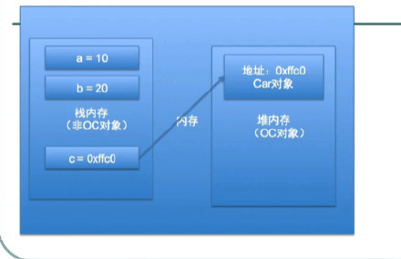
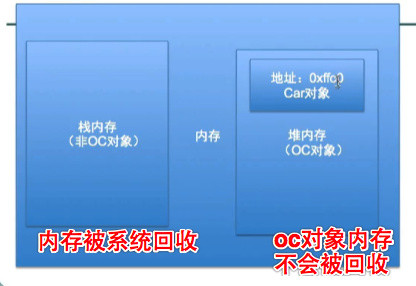
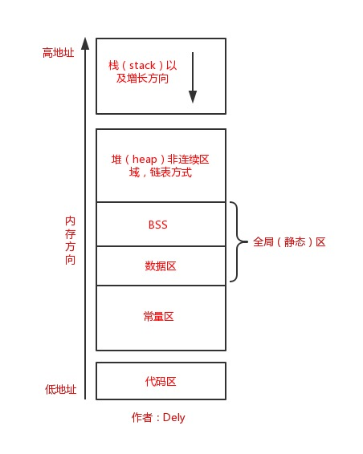

# 操作系统

<!--
create time: 2018-12-03 10:17:19
Author: <黄东鸿>
-->

### 1. 堆和栈的区别

[堆和栈的区别](https://blog.csdn.net/hairetz/article/details/4141043)

一、预备知识—程序的内存分配  

一个由C/C++编译的程序占用的内存分为以下几个部分：

1. 栈区（stack）— 由编译器自动分配释放，不需要程序员手动管理，存放函数的参数值，局部变量的值等。其操作方式类似于数据结构中的栈。  
2. 堆区（heap） — 一般由程序员手动分配释放，若程序员不释放，不及时回收容易产生内存泄漏。注意它与数据结构中的堆是两回事，分配方式类似于链表。
3. 全局区（静态区）（static）
	* 全局变量和静态变量的存储是放在一块的，初始化的全局变量和静态变量在一块区域，未初始化的全局变量和未初始化的静态变量在相邻的另一块区域。
	* 程序结束后由系统释放。  
4. 文字常量区 — 常量字符串就是放在这里的。程序结束后由系统释放  
5. 程序代码区 — 存放函数体的二进制代码。  







二、例子程序  

``` 
//main.cpp    
int a = 0;   // 全局初始化区    
char *p1;    // 全局未初始化区    
main()    
{    
	int   b;   // 栈    
  	char  s[]   =   "abc";   // 栈    
  	char  *p2;   // 栈    
  	char  *p3   =   "123456"; // 123456在常量区，p3在栈上。    
  	static int   c   = 0; //全局（静态）初始化区
  	// 分配得来的10和20字节的区域就在堆区
  	p1   =   (char *)malloc(10);    
  	p2   =   (char *)malloc(20);    
  	strcpy(p1,   "123456");   // 123456/0放在常量区，编译器可能会将它与p3所指向的"123456"优化成一个地方。    
}    
```
   
三、堆和栈的理论知识  
  
1. 申请方式    
  * stack: 由系统自动分配。
  
  例如，声明在函数中一个局部变量 int   b; 系统自动在栈中为b开辟空间    
  
  * heap: 需要程序员自己申请，并指明大小。

  在c中malloc函数如：p1 = (char *)malloc(10);    
  在C++中用new运算符如：p2 = new char[10];    
  但是注意p1、p2本身是在栈中的。    
   
2. 申请后系统的响应    
  * 栈：只要栈的剩余空间大于所申请空间，系统将为程序提供内存，否则将报异常提示栈溢出。    
  * 堆：
  		- 首先应该知道操作系统有一个记录空闲内存地址的链表，当系统收到程序的申请时，会遍历该链表，寻找第一个空间大于所申请空间的堆结点，然后将该结点从空闲结点链表中删除，并将该结点的空间分配给程序。
  		- 另外，对于大多数系统，会在这块内存空间中的首地址处记录本次分配的大小，这样，代码中的delete语句才能正确的释放本内存空间。  
  		- 另外，由于找到的堆结点的大小不一定正好等于申请的大小，系统会自动的将多余的那部分重新放入空闲链表中。

3. 申请大小的限制
	* 栈：在Windows下,栈是向低地址扩展的数据结构，是一块连续的内存的区域。
  
  这句话的意思是栈顶的地址和栈的最大容量是系统预先规定好的，在WINDOWS下，栈的大小是2M（也有的说是1M，总之是一个编译时就确定的常数），如果申请的空间超过栈的剩余空间时，将提示 overflow。因此，能从栈获得的空间较小。

	* 堆：堆是向高地址扩展的数据结构，是不连续的内存区域。这是由于系统是用链表来存储的空闲内存地址的，自然是不连续的，而链表的遍历方向是由低地址向高地址。堆的大小受限于计算机系统中有效的虚拟内存。由此可见，堆获得的空间比较灵活，也比较大。
   
4. 申请效率的比较
  * 栈由系统自动分配，速度较快。但程序员是无法控制的。    
  * 堆是由new分配的内存，一般速度比较慢，而且容易产生内存碎片,不过用起来最方便。 
   
5. 堆和栈中的存储内容    
	* 栈：在函数调用时，第一个进栈的是主函数中后的下一条指令（函数调用语句的下一条可执行语句）的地址，然后是函数的各个参数，在大多数的C编译器中，参数是由右往左入栈的，然后是函数中的局部变量。注意静态变量是不入栈的。当本次函数调用结束后，局部变量先出栈，然后是参数，最后栈顶指针指向最开始存的地址，也就是主函数中的下一条指令，程序由该点继续运行。
	* 堆：一般是在堆的头部用一个字节存放堆的大小。堆中的具体内容由程序员安排。    
   
6. 小结：    
  堆和栈的区别可以用如下的比喻来看出： 
     
  使用栈就象我们去饭馆里吃饭，只管点菜（发出申请）、付钱、和吃（使用），吃饱了就走，不必理会切菜、洗菜等准备工作和洗碗、刷锅等扫尾工作，他的好处是快捷，但是自由度小。    
  
  使用堆就象是自己动手做喜欢吃的菜肴，比较麻烦，但是比较符合自己的口味，而且自由度大。(经典！)  