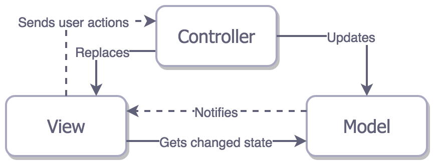
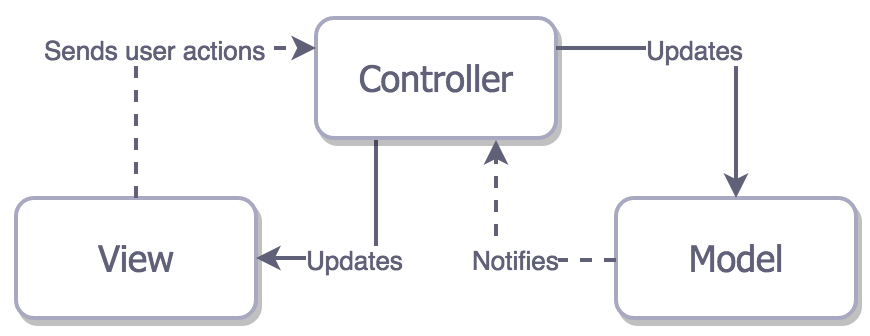
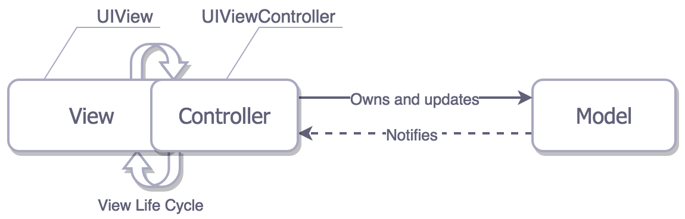
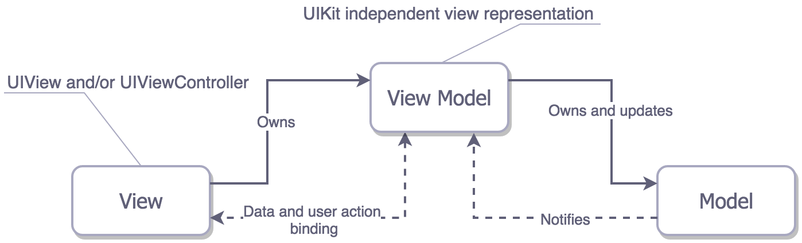
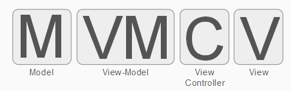
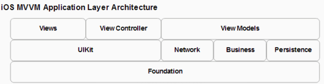

# 问题

<!--
create time: 2018-11-27 14:34:43
Author: <黄东鸿>
-->

### 你对 MVC 是怎么理解的

[iOS 架构模式 - 简述 MVC, MVP, MVVM 和 VIPER (译)](https://blog.coding.net/blog/ios-architecture-patterns)

[iOS 关于MVC和MVVM设计模式的那些事](http://www.cocoachina.com/cms/wap.php?action=article&id=19500)

[深入分析MVC、MVP、MVVM、VIPER](https://juejin.im/post/59fc625d51882529c0468dc9)

[浅谈 MVC、MVP 和 MVVM 架构模式](https://draveness.me/mvx)

[iOS应用架构谈 view层的组织和调用方案](https://casatwy.com/iosying-yong-jia-gou-tan-viewceng-de-zu-zhi-he-diao-yong-fang-an.html)

概述

* Model（模型）：数据层或负责处理数据的数据接口层。
* View（视图）：展示层，负责模型层的可视化展示，并且负责响应用户的交互。
* Controller（控制器）：Model和View之间的胶水或者说是中间人。负责组装模型和视图，把数据在视图层展示出来，同时监听各种事件，负责对数据的各种操作。当用户对 View 有操作时它负责去修改相应 Model；当 Model 的值发生变化时它负责去更新对应 View。

MVC 各层的职责

controller 层:

* 生成view，然后组装view
* 响应View的事件和作为view的代理
* 调用model的数据获取接口，拿到返回数据，处理加工，渲染到view显示
* 处理view的生命周期
* 处理界面之间的跳转

model 层：

* 业务逻辑封装
* 提供数据接口给controller使用
* 数据持久化存储和读取
* 作为数据模型存储数据

view 层：

* 界面元素搭建，动画效果，数据展示，
* 接受用户操作并反馈视觉效果

#### MVC是为了解决什么问题而被提出的

* 并行开发：MVC 将应用程序划分为不同的组件，开发者可以在自己负责的组件上进行开发，而不阻塞其他人的工作。MVC 一开始是用于桌面图形界面（GUI）的，后来被广泛应用于 Web 开发。在很久以前在软件工程刚发展的时候，还没有前后端分离，前后端的工作都是由一人完成的，有了MVC后，后端开发可以在用户界面还没有完而成的时候设计数据结构和处理如何交互的逻辑，比如从数据库读取数据，而前端开发可以在数据结构确定之前，写写界面布局等。
* 代码复用：视图和模型都是相对独立的，没有关联的，不同的视图可以使用同一模型，视图也可以复用，组装成一个大的视图，同样的，这些视图和模型也可以复用到其他项目中。

MVC 带来的好处(优点）：

* 划分职责：用严格定义的角色，平衡的将职责 划分 给不同的实体。随着代码量的增加，软件工程的复杂度是呈指数级增长的，为了尽可能的降低复杂性，最简单的方法就是在遵循 **单一责任原则** 的前提下，将功能划分给不同的实体。
* 可测性：我们希望尽可能多的功能都能进行单元测试。通常取决于上面说的第一点（不用太担心，如果架构合适的话，做到这点并不难）。
* 易用性：易用并且维护成本低。
* 低耦合性

#### 经典MVC



#### Apple 理想的 MVC (Cocoa MVC)



典型的MVC架构不适用于iOS开发，所以苹果做了一点点改进，就变成了这样。

View 和 Model 之间是相互独立的，它们只通过 Controller 来相互联系。

view将用户交互事件通知给controller，controller通过更新model来反应状态的改变。model（通常使用KVO）通知controller来更新他们负责的view。

在上图中，尽管从技术上看View 和 Controller 是相互独立的，但事实上它们几乎总是结对出现，一个 View 只能与一个 Controller 进行匹配，所以实际上 iOS 中的 MVC 是下面这样的。

#### iOS 中 实际的 MVC



苹果的 MVC 又被戏称为“重控制器模式”，这是因为 Controller 变得异常臃肿。

Cocoa MVC 鼓励你去写重控制器是因为 View 的整个生命周期都需要它去管理，Controller 和 View 很难做到相互独立。虽然你可以把控制器里的一些业务逻辑和数据转换的工作交给 Model，但是你再想把负担往 View 里面分摊的时候就没办法了；因为 View 的主要职责就只是将用户的操作行为交给 Controller 去处理而已。于是 Controller 最终就承载着大量的业务逻辑，变成了所有东西的代理和数据源，甚至还负责网络请求的发起和取消，还有...

然而，实际开发中，我们并没有严格遵守MVC模式，我们经常可以看到这样的代码：

```
var userCell = tableView.dequeueReusableCellWithIdentifier("identifier") as UserCell
userCell.configureWithUser(user)
```

Cell 作为一个 View 直接用 Model 来完成了自身的配置，MVC 的原则被打破了，这种情况一直存在，而且还没人觉得有什么问题。如果是严格遵循 MVC 的话，应该是在 ViewController 里面去配置 Cell，而不是直接将 Model 丢给 Cell，当然这样会让你的 ViewController 更重。

> Cocoa MVC 被戏称为重控制器模式还是有原因的。

### MVVM

[iOS 关于MVVM Without ReactiveCocoa设计模式的那些事](https://www.j4ml.com/t/14603)

[MVVM With ReactiveCocoa](http://blog.leichunfeng.com/blog/2016/02/27/mvvm-with-reactivecocoa/)

一种可以很好地解决 Massive View Controller 问题的办法就是将 Controller 中的展示逻辑抽取出来，放置到一个专门的地方，而这个地方就是 viewModel 。MVVM衍生于MVC，是对 MVC 的一种演进，它促进了 UI 代码与业务逻辑的分离。它正式规范了视图和控制器紧耦合的性质，并引入新的组件。他们之间的结构关系如下：



* Model: 与 MVC 中的 Model 一致。
* View: 由 MVC 中的 View 和 Controller 组成，负责 UI 的展示，绑定 viewModel 中的属性，触发 viewModel 中的命令以及呈现有 viewModel 提供的数据。
* ViewModel: 作为一个表现视图显示自身所需数据的静态模型，也有收集，解释和转换数据的责任。它是从 controller 中抽取出来的展示逻辑，负责从 model 中获取 view 所需的数据，转换成 view 可以展示的数据，并暴露公开的属性和命令供 view 进行绑定。
* Data Binding: 数据绑定，将 view 和 viewModel 进行双向数据绑定，优雅地实现数据同步，可以使用 KVO 实现，也可以引入响应式编程框架 ReactiveCocoa。

职责划分

viewModel 职责：

* 封装业务逻辑处理
* 封装网络处理
* 封装数据缓存

viewModel 从必要的资源(数据库，网络请求等)中获取原始数据，根据视图的展示逻辑，并处理成 view (controller)的展示数据。它暴露给视图控制器需要知道的仅关于显示视图工作的信息，理想情况下，你不会暴漏你的 data-model 对象。

viewModel 存在的目的在于抽离 ViewController 中的业务逻辑，给 Controller 做瘦身减负，而不是替代 ViewController。既然不负责视图操作逻辑，就不应该存在任何 View 对象，更不应该存在 Push/Present 等视图跳转逻辑



从上图可知， Controller 夹在 View 和 ViewModel 之间做的其中一个主要事情就是将 View 和 ViewModel 进行绑定。在逻辑上，Controller知道应当展示哪个View，Controller也知道应当使用哪个ViewModel来提供数据，然而View和ViewModel它们之间是互相不知道的，所以Controller仅关注于用 ViewModel 的数据配置和管理各种各样的视图。

所以Controller在MVVM中，一方面负责View和ViewModel之间的绑定，另一方面也负责常规的UI逻辑处理。

MVVM模块层级图



切记：

1. view 和 controller，都不能直接引用 model，而是引用 viewModel
2. view 持有（引用） viewModel，但反过来不行
3. viewModel 持有（引用） model，但反过来不行
4. MVVM的关键是要有ViewModel，而不是 ReactiveCocoa, ViewModel 其实就是视图的抽象。

#### 模型层的设计

瘦Model只包含数据模型，而胖Model可以包含访问数据库操作和网络请求等，甚至可以将业务模型层独立成一个库供其他组件调用。

### 整个持续集成过程中可以做些什么事情


### app审核有哪些常见的被拒的原因

生产者消费者

为什么reactViewController为空