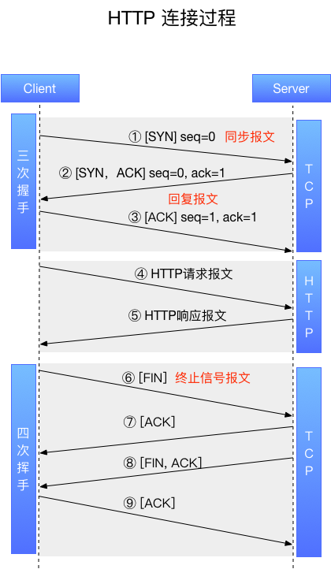

计算机网络基础知识
=========

[http 、TCP /IP 、Socket 、UDP区别](http://www.jianshu.com/p/219eb040479b)

[HTTP、TCP、UDP详解](http://www.jianshu.com/p/a5cf81b1a976)

### 1. HTTP 、TCP/IP、UDP、Socket 的区别

网络由下往上分为: 物理层、数据链路层、网络层、传输层、会话层、表示层和应用层。

IP协议对应于网络层，TCP协议对应于传输层，而HTTP协议对应于应用层，三者从本质上来说没有可比性，socket则是对TCP/IP协议的封装和应用(程序员层面上)。

* TPC/IP协议是传输层协议，主要解决数据在网络中如何传输
* HTTP是应用层协议，主要解决如何包装数据，规定了客户端和服务器之间的通信格式，默认使用80端口。

关于TCP/IP和HTTP协议的关系，网络有一段比较容易理解的介绍：

> 我们在传输数据时，可以只使用(传输层)TCP/IP协议，但是那样的话，如果没有应用层，便无法识别数据内容。
> 如果想要使传输的数据有意义，则必须使用到应用层协议。
> 应用层协议有很多，比如HTTP、FTP、TELNET等，也可以自己定义应用层协议。
> WEB使用HTTP协议作应用层协议，以封装HTTP文本信息，然后使用TCP/IP做传输层协议将它发到网络上。

而我们平时说的最多的socket是什么呢，实际上socket是对TCP/IP协议的封装，Socket本身并不是协议，而是一个调用接口(API)。

通过Socket，我们才能使用TCP/IP协议。实际上，Socket跟TCP/IP协议没有必然的联系。Socket编程接口在设计的时候，就希望也能适应其他的网络协议。

所以说，Socket的出现只是使得程序员更方便地使用TCP/IP协议栈而已，是对TCP/IP协议的抽象，从而形成了我们知道的一些最基本的函数接口，比如create、listen、connect、accept、send、read和write等等。

网络有一段关于socket和TCP/IP协议关系的说法比较容易理解：

> TCP/IP只是一个协议栈，就像操作系统的运行机制一样，必须要具体实现，同时还要提供对外的操作接口。
> 这个就像操作系统会提供标准的编程接口，比如win32编程接口一样，
> TCP/IP也要提供可供程序员做网络开发所用的接口，这就是Socket编程接口。

实际上，传输层的TCP是基于网络层的IP协议的，而应用层的HTTP协议又是基于传输层的TCP协议的，而Socket本身不算是协议，就像上面所说，它只是提供了一个针对TCP或者UDP编程的接口。

### HTTP 连接过程

#### 什么是TCP连接的三次握手

* 第一次握手：客户端发送syn包(syn=j)到服务器，并进入SYN_SEND状态，等待服务器确认;
* 第二次握手：服务器收到syn包，必须对这个syn包进行确认，即ack(ack=j+1)，同时自己也发送一个syn包(syn=k)，即SYN+ACK包，此时服务器进入SYN_RECV状态;
* 第三次握手：客户端收到服务器的SYN+ACK包，向服务器发送确认包ACK(ack=k+1)，此包发送完毕，客户端和服务器进入ESTABLISHED状态，建立起连接了，完成三次握手。

握手过程中传送的包里不包含数据，三次握手完毕后，客户端与服务器才正式开始传送数据。
理想状态下，TCP连接一旦建立，在通信双方中的任何一方主动关闭连接之前，TCP 连接都将被一直保持下去。断开连接时服务器和客户端均可以主动发起断开TCP连接的请求，断开过程需要经过“四次握手”。

### 3. 利用Socket建立网络连接的步骤

建立Socket连接至少需要一对套接字，其中一个运行于客户端，称为ClientSocket ，另一个运行于服务器端，称为ServerSocket 。

套接字之间的连接过程分为三个步骤：服务器监听，客户端请求，连接确认。

1. 服务器监听：服务器端套接字并不定位具体的客户端套接字，而是处于等待连接的状态，实时监控网络状态，等待客户端的连接请求。
2. 客户端请求：指客户端的套接字提出连接请求，要连接的目标是服务器端的套接字。
为此，客户端的套接字必须首先描述它要连接的服务器的套接字，指出服务器端套接字的地址和端口号，然后就向服务器端套接字提出连接请求。
3. 连接确认：当服务器端套接字监听到或者说接收到客户端套接字的连接请求时，就响应客户端套接字的请求，建立一个新的线程，把服务器端套接字的描述发给客户端，一旦客户端确认了此描述，双方就正式建立连接。
4. 而服务器端套接字继续处于监听状态，继续接收其他客户端套接字的连接请求。

### 4. TCP和UDP的区别

> TCP和UDP协议属于传输层协议。

1. TCP 是面向连接的协议，就是说在正式通信前必须要通过`三次握手`与对方建立起连接，比如你给别人打电话，必须等线路接通了、对方拿起话筒才能相互通话。因为`三次握手`，所以 TCP 连接是可靠的。
2. UDP 不是面向连接的，就是说 UDP 传送数据前不必与对方建立连接，对方接收到数据也不发送确认信号。与手机短信非常相似：你在发短信的时候，只需要输入对方手机号就OK了。发送端不知道数据是否会正确接收，当然也不用重发，所以说UDP是无连接的、不可靠的一种数据传输协议。
3. UDP 适用于一次只传送少量数据、对可靠性要求不高的应用环境；TCP 适用于传输大量数据、对数据传输可靠性要求高的应用环境
4. 正因为UDP协议没有连接的过程，所以UDP的开销更小，数据传输速率更高，实时性更好，而 TCP 的传输速率低；但也正因为如此，它的可靠性不如TCP协议高。QQ就使用UDP发消息，因此有时会出现收不到消息的情况。
5. TCP协议提供了可靠的数据传输,但是其拥塞控制、数据校验、重传机制的网络开销很大,不适合实时通信。UDP 协议是无连接的数据传输协议并且无重传机制,会发生丢包、收到重复包、乱序等情况。

TCP 使用窗口机制进行流量控制。连接建立时，各端分配一块缓冲区用来存储接收的数据，并将缓冲区的尺寸发送给另一端，接收方发送的确认信息中包含了自己剩余的缓冲区尺寸，剩余缓冲区空间的数量叫做窗口。
TCP的流控过程（滑动窗口）：

> 知道了TCP和UDP的区别，就不难理解为何采用TCP传输协议的MSN比采用UDP的QQ传输文件慢了，但并不能说QQ的通信是不安全的
> 因为程序员可以手动对UDP的数据收发进行验证，比如发送方对每个数据包进行编号然后由接收方进行验证啊什么的
> 即使是这样，UDP因为在底层协议的封装上没有采用类似TCP的“三次握手”而实现了TCP所无法达到的传输效率。

TCP使用场景：

对数据传输可靠性要求非常高，例如大家浏览网页，通过网页注册帐号、转帐等服务，这是不容许出错的，使用TCP协议能把出错的可能性降到最低（当然，网络自身很糟糕，TCP协议也没办法）。但是，提供这种可靠服务，会加大网络带宽的开销，因为“虚拟信道”是持续存在的，同时网络中还会出现大量的ACK和FIN包！

UDP使用场景：

TCP协议提供了可靠的数据传输,但是其拥塞控制、数据校验、重传机制的网络开销很大,不适合实时通信,所以选择开销很小的UDP协议来传输数据。  UDP 协议是无连接的数据传输协议并且无重传机制,会发生丢包、收到重复包、乱序等情况。而对于数据精确性要求不高的状态数据以及视频数据,丢包的影响不大。因为会不断收到新的包,丢失的个别包会有新的包来覆盖,所以只需在远程控制系统的通信部分自行处理乱序及重复包的问题,而对于丢包的问题一般不作处理。 但对于命令包这种需要精确收发的数据, 可在程序的开发中加入丢包重发和超时丢弃的处理。 当然,如果开发的是对于实时性要求不高的事件型控制命令的传输,不希望发生指令的丢失也可以直接采用TCP协议。TCP的重传机制正好适合这种情况。

	作者：深井里的冰
	链接：https://www.zhihu.com/question/20060141/answer/22627006
	来源：知乎
	著作权归作者所有。商业转载请联系作者获得授权，非商业转载请注明出处。
	
	0、TCP是面向流字符的，数据流间无边界；UDP是面向分组的，分组间有明确的边界。对于TCP，发送一串数字（1，2，3，4，5），接收时有可能变成两次（1，2）和（2，4，5），或者变成任意接收方式，协议栈只保证接收顺序正确；UDP发送一个分组，接收方或者接收完全失败，如果成功整个分组都会接收到。
	
	1、TCP是面向连接的，UDP是无连接的。类比于打电话和发电报的关系。TCP建立一个连接需要3次握手IP数据包，断开连接需要4次握手。另外断开连接时发起方可能进入TIME_WAIT状态长达数分钟（视系统设置，windows一般为120秒），在此状态下连接（端口）无法被释放。
	
	2、TCP是可靠的，通过数据校验保证发送和接收到的数据是一致的；UDP是不可靠的，发送一串数字分组（1，2，3）可能接收到时就变成（1，0，0）了，做UDP连接时需要自己做数据校验。
	
	3、TCP数据是有序的，以什么顺序发送的数据，接收时同样会按照此顺序；UDP是无序的，发出（1，2，3），有可能按照（1，3，2）的顺序收到。应用程序必须自己做分组排序。
	
	4、TCP因为建立连接、释放连接、IP分组校验排序等需要额外工作，速度较UDP慢许多。TCP适合传输数据，UDP适合流媒体。
	
	5、UDP比TCP更容易穿越路由器防火墙。 
	
### 5. HTTP连接的特点

1. HTTP连接最显著的特点是永远都是客户端发起请求，服务器回送响应，这样就限制了使用HTTP协议，无法实现在客户端没有发起请求的时候，服务器将消息推送给客户端。从建立连接到关闭连接的过程称为“一次连接”。
2. HTTP协议是一个无状态的协议，同一个客户端的这次请求和上次请求是没有对应关系。

### 6. HTTP

HTTP协议即超文本传送协议(Hypertext Transfer Protocol )，是互联网上应用最为广泛的一种网络协议，HTTP协议是建立在TCP协议之上的一种应用。

通常，由HTTP客户端发起一个请求，建立一个到服务器指定端口（默认是80端口）的TCP连接。HTTP服务器则在那个端口监听客户端发送过来的请求。一旦收到请求，服务器（向客户端）发回一个状态行，比如"HTTP/1.1 200 OK"，和（响应的）消息，消息的消息体可能是请求的文件、错误消息、或者其它一些信息。HTTP使用TCP而不是UDP的原因在于（打开）一个网页必须传送很多数据，而TCP协议提供传输控制，按顺序组织数据，和错误纠正。

##### 客户端请求报文

客户端发送一个HTTP请求到服务器的请求消息包括以下格式：请求行（request line）、请求头部（header）、空行和请求数据四个部分组成。

请求行包括：请求方法、URL、协议版本

	GET /hello.txt HTTP/1.1
	User-Agent: curl/7.16.3 libcurl/7.16.3 OpenSSL/0.9.7l zlib/1.2.3
	Host: www.example.com
	Accept-Language: en, mi
	Accept: */*

##### 服务器响应报文

HTTP响应也由四个部分组成，分别是：状态行、消息报头、空行和响应正文。

状态行包括：协议版本 + 状态码（status code） + 状态描述

	HTTP/1.0 200 OK 
	Content-Type: text/html
	Content-Length: 137582
	Expires: Thu, 05 Dec 1997 16:00:00 GMT
	Last-Modified: Wed, 5 August 1996 15:55:28 GMT
	Server: Apache 0.84
	
	<html>
	  <body>Hello World</body>
	</html>
	
#### Request Headers/ Response Headers

* host：指定请求资源的Intenet主机和端口号
* Accept：浏览器端可以接受的媒体类型，通配符 * 代表任意类型
* Content-Type：表示属于什么MIME类型。
* User-Agent：客户端使用的操作系统和浏览器的名称和版本
* Accept-Encoding：数据的压缩方法
* Content-Length：数据的长度
* Server：指明HTTP服务器的软件信息

### 7. HTTP 和 HTTPS 的区别

HTTPS 是以安全为目标的HTTP通道，简单讲是HTTP的安全版。

* HTTPS协议需要到CA（证书认证机构）申请证书，一般免费的证书很少，需要交费
* HTTP是明文传输，HTTPS则是具有安全性的SSL加密传输
* HTTP和HTTPS使用的端口号也不一样，前者是80，后者是443
* HTTPS可进行加密传输、身份认证、比HTTP安全

### 8. HTTP 的安全从何而来

#### SSL & TLS

* SSL: Secure Sockets Layer 安全套接字层
* TLS：Transport Layer Security 传输层安全，SSL的继任者
* TLS与SSL在传输层之上对网络连接进行加密，为网络通信提供安全及数据完整性