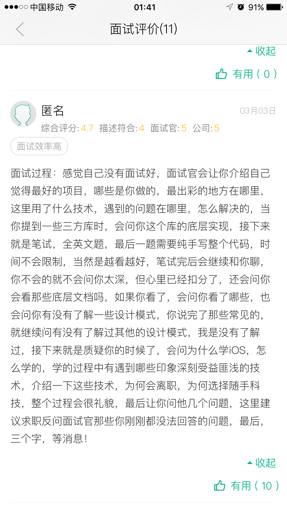

# Interview Guide

<!--
create time: 2018-11-21 11:55:27
Author: 黄东鸿
-->

### 自我介绍

> 应按照时间的顺序从前往后讲，先讲你上大学的教育经历，之后从你参加工作，一直讲到现在，因为面试官要听到你整个成长的经历。

我叫黄东鸿，2015年毕业于肇庆学院，专业是软件工程，毕业后就职于广州市伍一柒互联网技术有限公司，我当时是独立负责一款叫517.Today的外卖App客户端和司机端两个产品的开发，主要业务是为美国几个地区在校留学生提供外卖和物流配送业务，使用Swift开发，在职期间在大改版的时候负责重构了整个项目的架构，重写了整个app和之后的产品日常迭代工作，并且开发了一个叫ios-common的工具库，用xcodebuild和shell开发了自动化打包脚本。

我在2017年06月的时候，入职了深圳市梦之舵信息技术有限公司，负责过公司3个产品的iOS客户端开发工作，包括小恩爱、挖客、无猜，期间除了产品的日常迭代开发工作，还有参与技术方案讨论和调研，项目排期，以及编写fastlane、shell脚本，实现jenkins自动化集成，推进mock server等提高团队效率的工作。
一开始负责了小恩爱几个版本的业务开发，后来在一个大版本（猎人计划）中负责了账号系统的重构，以及上传组件的重构等。
后来公司成立了挖客项目组，我经历了项目从立项到上线的整个流程，由我负责搭建基础框架，迁移小恩爱的部分基础组件到项目中并进行一些扩展优化，在挖客中负责了短视频发布流程、用户模块（账号系统、关注、粉丝等）、电商等业务，还开发了一个叫jskit、mzdhybirdkit的中间层组件，在框架层解决web、reactive-native与原生之间通信的问题，与具体业务解耦。

在2018.06-2018.07，公司成立了架构组进行框架升级，当时我和我老大负责iOS客户端的技术升级工作，我主要负责梳理团队规范、整理技术文档、抽离复用组件等，期间的产出有:
* Cocoapods工具链
* API扩展分类库（MZDFoundation\MZDUIKit\MZDThirdPartySet)
* 内部SDK(MZDHTTP, MZDTCP, MZDXlib, MZDStorage, MZDJSKIt)
* 第三⽅SDK的再封装（MZDLive,MZDShare)
* 业务中间件(MZDPay, MZDHybirdKit, JUDSDK)等

之后就被调去无猜项目组，在里面只负责了少量的业务开发，主要还是负责react-native的相关业务、以及一些通⽤UI组件、​动画特效、苹果内购支付组件等

然后是在，2018.11 入职了深圳市法本信息技术股份有限公司，当时是外包到了平安科技的团金E项目组，负责团金E客户端技术预研和框架升级工作，处理一些和业务无关的技术⽀持，SDK集成等。

#### 为什么离开深圳来广州

* 我觉得在深圳太孤独了，要好的朋友基本都在广州
* 房价
* 压力大
* 文化氛围, 餐饮

#### 你为什么离开上家公司

1. 外包没有归属感，总感觉不属于团队中的一员, 无法很好的融入团队的氛围中，比如，项目组的需求评审会，从来没有叫过外包的同事一起参与过，当然这可能和我在团队中的定位有关，因为我进去是做一些技术预研和框架升级工作，我的老大也跟我说过不会安排具体的业务需求给我做，所以当然需求评审会是不需要叫上我的，但是据我平时的观察，其他的负责业务需求外包同事也没有参与过需求评审会，都是由平安内部编制的同事开完会后直接安排任务的，当然我也问过为什么会这样，老大也和我解释过，但这种感觉就很不好，加上有时候我会被安排去支持其他项目组一些边边角角的工作，比如上海的项目组需要会react-native的人，我就得临时去帮忙，然后另一个项目组需要集成平安易签的SDK，我也得去帮忙，多个项目组之间来回切换，让我觉得有点像打杂的，不能专注的去做好一件事情。
2. 平安科技的工作环境和互联网公司差距太大，我觉得受限制太多了。第一是网络的限制，在内网中连github都上不了，这个就非常麻烦了，第二个是电脑是标装的，使用不了管理员权限，连个软件都装不了，还得申请权限，特别麻烦。
3. 我萌生了离开的想法，刚好有一个朋友推荐了一家做直播的公司，而我未来也想往音视频方向发展，就去面试了一下，然后面试也通过了，本来是已经敲定12月24号入职的，我这边也提了离职，但是在我工作的最后一天的下午5点钟，对方的HR打电话和我说项目组被裁掉了，不用去入职了，这个就非常的坑了，在上午领导才刚刚找我聊过，劝我留下来，我拒绝了，所以最后就没办法了，只能重新找工作了。
 2. 我想离开深圳了

##### 为什么离开小恩爱

**裁员**

公司在经历了几波裁员，从我加入的80+号人，最终只剩下了30人不到吧，连服务端的架构师都裁了，最后技术部只剩下一些元老级别的员工。第一波裁掉了整个游戏项目组，第二波裁掉了部分测试、客服和运营人员，第三波技术部裁掉了大部分的人，只留下几个在公司呆很久的老员工，我是在第三波被裁掉的。

如果想隐瞒裁员，则这样答：

1. 负责的工作的层面：我希望多接触一些底层框架的设计，基础组件和工具的研发，但是在原来的公司没有太多这样的机会，大部分工作是负责业务上的开发，其实负责业务开发也没有什么问题，我一直想负责的是长链（IM）方面的业务，但这一块一直是由我另一个同事负责的，因为他已经进入公司很久了，对这块比较熟悉，平时版本迭代的时候要求快，所以只能是交给他去做，而我负责的业务进入公司之后呢也做了很长了时间，现在也比较熟悉了，感觉已经没有太多的挑战了。还有一点是，我原来负责的一个短视频项目-挖客在今年6月份的时候，因为一些不可控的原因被砍掉了，这个对我打击蛮大的，因为那个项目确实付出了很多的心血。8月份的时候呢，我加入另外的一个项目组，做的是社交产品，但是长链相关的业务还是原来的同事负责，我还是负责那些比较熟悉的业务，这个让我感觉挺没有干劲的。
2. 个人职业发展层面：我希望未来1-2年内能积累一些带领团队方面的经验，成为客户端技术Leader，但是原来的公司不能为我提供这样的条件。因为我不能顶替我原来老大的位置，那就只能是等我们的技术团队扩大了，但是这是需要公司的业务发展良好，需要更多的人手才有可能的，但是在未来1-2年内我觉得未必能达到。

#### 你已经离职了有2个月这么久了，这段时间在干什么？一直在找工作吗？

不是的。我离职之后在一个星期左右就拿到了一份offer。一家叫云迈网络的公司，做小爱直播的，然后我约定了元旦之后再入职，但是在我入职之前，对方的HR就打电话通知我说公司裁员，项目组解散了，不需要入职了，之后我就没有继续投简历了。就来广州玩了几天，有一次和朋友聊到了广州和深圳的区别，聊着聊着，我那个朋友就一直劝我回来广州吧，列举了各种对比，比如房价、生活压力、工作压力、美食、文化氛围等等，聊着聊着，我就开始决定回来广州了。之后就是回深圳把买的家具什么的处理掉，然后来广州找房子，回家过年。

#### 离职原因

离职原因不过2种：

1. 通过跳槽，实现薪资的提升和职位的提升
2. 在目前的工作上已经得心应手，并且没有了成长空间，也没有合适的上升通道

不会减分的回答

* 公司战略改变，个人发展与公司发展不符；
* 个人成长受限，想接触新事物；
* 剩下的就是换城市、搬家、家里有事……；
* 平台太小，资源、支持十分有限；

有几个离职原因是HR会一票否决或慎重考虑的：

* 面试中出现负面情绪或吐槽抱怨的；
* 违背职业道德的；
* 被公司非裁员解雇&辞退的；
* 和领导&同事关系处理不当的；
* 价值观不符的（看公司）；
* 违背职业道德的；
* 职业规划（履历）混乱的；
* 涨薪被驳回的

### 职业规划的理解

但无论什么平台，他们的学习曲线其实是类似的，都要经历差不多如下的环节：

1. 学习对应平台的编程语言，如：C/C++，Java，Object C，Javascript 等；
2. 熟悉对应平台提供的 API，如：UI 库，网络，文件，数据库， 图片处理，多媒体处理 等等；
3. 掌握平台相关的特性、框架和原理，如：Windows 的 WINSOCK，ODBC，WPF 等，Unix 的设计哲学，Android 的四大组件，iOS 的 MVC 模式等等；
4. 通过具体的项目，熟悉和练手，达到可完成任意功能的开发。

当你已经走到第 4 步了后，往往就会感觉遇到了**瓶颈**，产生如文章开头的问题，下一步何去何从 ？

其实我一直有一个观点，就是：

> “基于平台的 API 做应用层开发，并不是一个可以走得多远的方向，真正有价值的地方在于与具体的业务方向结合”。

具体点说，比如：

* 网络安全；
* 音视频；
* 智能硬件；
* 深度学习；
* 大数据；
* 其他（比如：金融、通信等）。

在具体的业务领域，你可以慢慢沉淀下来，用自己的努力和时间换来对领域知识的深入理解和积累，逐渐从一个开发小白走向最懂这个行业的专家。

#### 你未来有什么计划/规划/你的职业规划是什么？

我未来的计划就是希望在广州安定下来。

我的五年职业规划是这样的，未来是往技术+管理的方向发展的，但是会更偏向于技术。假设我入职了一家公司，我希望一开始去做业务开发，持续几个月到半年左右，因为我认为只有充分的理解了公司的业务之后才能更好地做架构，任何架构的设计都是无法脱离业务的，而接触业务开发能让我更快的理解公司业务，然后渐渐转向底层开发，一开始先总结下公司的技术栈和项目的架构，然后开始做一些能独立于业务的东西，例如基础组件，底层架构，持续集成等，期间我希望涉及音视频编解码、流媒体协议、socket通信等方面的技术，这个大概持续2-3年，并且在这2、3年里面我想学习并积累一些团队管理方面的经验，然后在第3年的时候能胜任客户端Leader这个职位，能带领一个5-10人左右的团队。我一直有一个观点，就是基于平台的 API 做应用层开发，并不是一个可以走得多远的方向，真正有价值的地方在于与具体的业务方向结合，所以在接下来的2年，我会在音视频编解码、流媒体协议、socket通信这几个方向上继续努力，慢慢沉淀，用自己的努力和时间换来对领域知识的深入理解和积累，成为这些行业上的专家。

#### 技术方向

1. 应用层开发，不限于各种产品，主要还是Android或iOS原生开发，主要是各种性能优化。
2. 嵌入式开发，不限于各种开发板子，物联网，智能家居
3. 安全开发，不限于各种反逆向，反汇编，寻找安全漏洞
4. 音视频开发，不限于直播、点播、音视频通话、音视频会议，短视频等
5. 插件化、组件化、热修复开发，不限于自研和使用开源框架集成开发
6. 系统开发(Android)，不限于Rom维护和FrameWork层定制需求
7. 图形图像开发，不限于OpenGL ES，EGL，GLSurfaceView，滤镜，美颜

未来Android、iOS能走多远，就取决于这些细化的方向能走多远。如果你开始想长期做Android或iOS，建议选择一个方向，持续深耕。如果不打算长期做Android或iOS，可以朝Python和人工智能上发展，毕竟现在还是萌芽时期，先入为主，赶上下一波时代的浪潮。

#### 期望薪资

1. 我想先了解下薪资结构
2. 年收入 = 工资 + 补贴 + 奖金 + 公积金
3. 在小恩爱年收入：16w
4. 在法本年收入：19.5w
5. 期望年收入：23w

#### 你最大的缺点是什么

表达能力（不是沟通能力）

* 书面表达能力
* 演讲表达能力

#### 你还有什么要问的

1. 团队的情况和公司的业务
2. 我应聘的岗位最重要的职责是什么？定位（长期规划）是什么？
5. 对于未来加入这个团队，你对我的期望是什么？
3. 接下来项目会往什么方向发展

6. 公司的技术栈有哪些？
7. 这个职位是向谁汇报工作，他的背景是什么？

4. 能否给我简单介绍下贵公司的业务与战略的未来发展
5. 公司在未来的几个月内是否可能会裁员？
6. 你觉得3年或5年后，公司会怎么样？

##### 工作内容类
1. 我应聘的这个岗位在实际工作中可能会面临哪些困难？
2. 你希望我在短期内解决哪些问题？

##### 工作体验类

1. 你在这家公司工作多久了？你觉得在这里工作的开心吗？为什么？
2. 你为什么来这个公司？你的背景是什么呢？
5. 你在公司的一天是如何度过的？
   感受下在未来的工作中是否有我的兴趣点以及最无聊的部分是否可以接受，可以从中推估到未来的发展

4. 面试官你是如何一步步成长到现在的
5. 公司是否有一套成熟的发展体系

#### 高质量的面试过程

