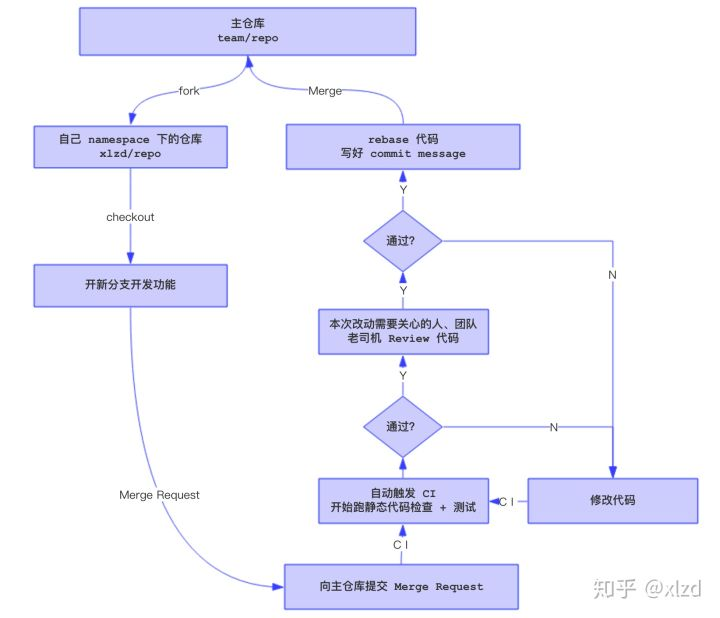

# Code Review 流程

使用 gitlab 的 `Merge Request` 作为主要工具进行代码评审。

大概流程：

1. 不准直接 merge 到 dev/master
2. 开一个新的feature分支写代码，写完代码提交`Merge Request`，指定合并分支，指定 review 人（不能指派给自己）
3. 负责 review 的人，对有疑问的代码块进行评论，提出改进意见，拒绝合并
4. 开发者对代码进行修改，再次提交 MR
5. review者对改进后的代码进行评审，如果仍有问题继续驳回MR，直到完全通过为止，Merge 代码

可以参考 github 的一个 [PR](https://github.com/realm/realm-java/pull/1713/commits)

[分支管理流程](./分支管理流程.md)