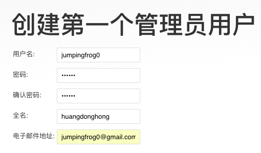
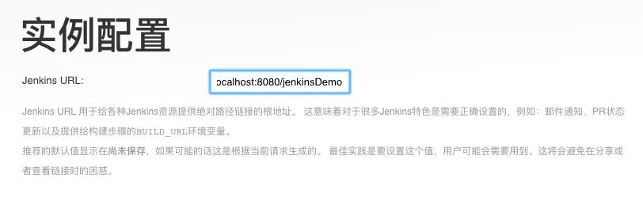
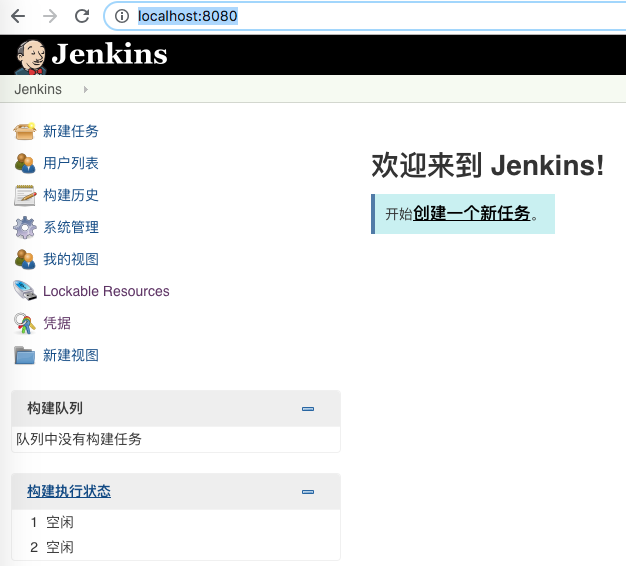

# jenkins

<!--
create time: 2019-02-19 16:46:41
Author: <黄东鸿>
-->

### 安装 jenkins

```
$ brew install jenkins
```

jenkins 的安装目录 `~/.jenkins`

使用 brew services 在后台启动 jenkins

```
$ brew services start jenkins
```

或者直接启动 

```
$ jenkins
```

在浏览器打开 `localhost:8080`，进入 jenkins 页面。

jenkins 的初始化管理员密码在 `/Users/sheldon/.jenkins/secrets/initialAdminPassword` 这个文件中，找到并输入密码。

接下来会出现安装kenkins插件的页面，我们选择自己安装插件，也可以直接使用社区推荐的一套插件。

默认推荐的插件有：

针对搭建的iOS/Android持续集成打包平台，使用如下几个插件即可。

* GIT plugin
* SSH Credentials Plugin
* Git Changelog Plugin: 获取仓库提交的commit log
* build name setter：用于修改Build名称
* description setter plugin：用于在修改Build描述信息，在描述信息中增加显示QRCode（二维码）
* Post-Build Script Plug-in：在编译完成后通过执行脚本实现一些额外功能
* Build Timeout
* Xcode integration: iOS专用（可选）
* Gradle plugin: Android专用（可选）

* Localization: Chinese(Simplified)

* Github Branch Source Plugin

安装完后创建第一个管理员用户。



这个实例配置不知道是用来干嘛的。。



然后重启 jenkins，再次打开 `http://localhost:8080/` 就可以了。



#### 删除插件

1. 停止服务
2. 在PULGIN目录下找到插件目录，删除
3. 在PULGIN目录下找到插件文件，*.JPI文件(不删除JPI文件，无效)
4. 重启

