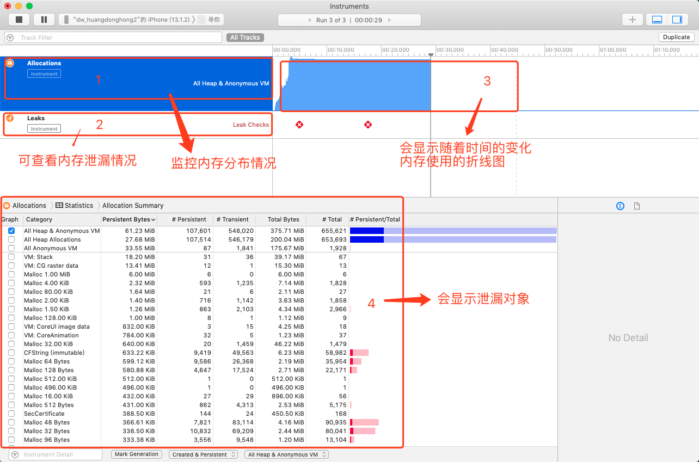
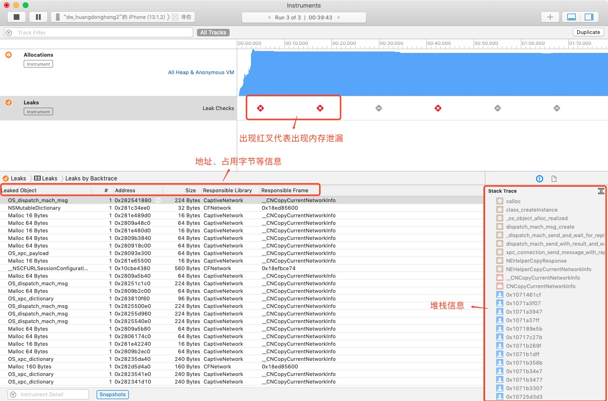

# 性能优化

<!--
create time: 2019-12-04 17:10:57
Author: <黄东鸿>
-->

## Instruments 之 Leaks 使用

### Leak Checks

Leaks 用来分析内存泄漏。ARC中引起的内存泄漏原因就是引用环。

* Leaks: 可以查看内存泄漏了多少，没有太多的调试意义
* Cycles & Roots: 对 ARC 调试很有用的部分，可以看到引用计数的详细信息，会绘制出对象引用环的图
* Call Tree: 调用树，会给出大概的内存泄漏位置，有时能精确位置，看运气

### Allocations

Allocations 纪录了内存分配，用来优化内存使用的

#### Statistics 分组

统计数据，记录了所有的内存分布情况

* Category: 类型
* Persistent Bytes: 未释放的内存和大小
* Persistent: 对象个数
* Transient: 已释放的对象
* Total Bytes: 总使用内存大小
* Total: 总对象个数
* Persistent/Total Bytes: 已使用的内存大小/总使用内存大小

##### Category

* All Heap & Anonymous VM: 所有堆内存和其他内存
* All Heap Allocations: 所有堆内存
* All Anonymous VM: 所有其他内存

##### Call Tree选项

- Separate by Category: 按分类分开
- Separate by Thread: 按线程分开
- Invert Call Tree: 反向输出调用树
- Hide System Libraries: 隐藏系统库文件，过滤各种系统调用
- Flatten Recursion: 递归

## 参考

[Instruments之Leaks学习](https://www.cnblogs.com/lxlx1798/p/6933485.html)