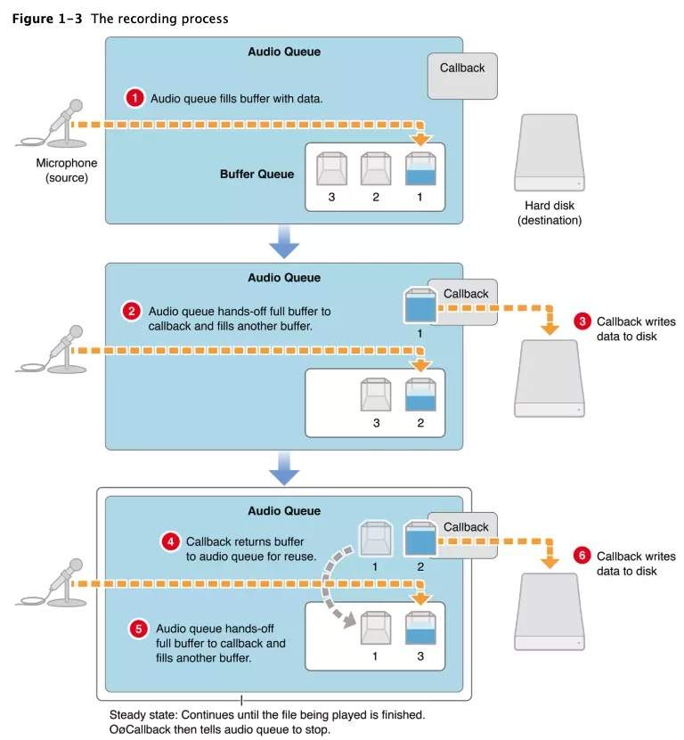
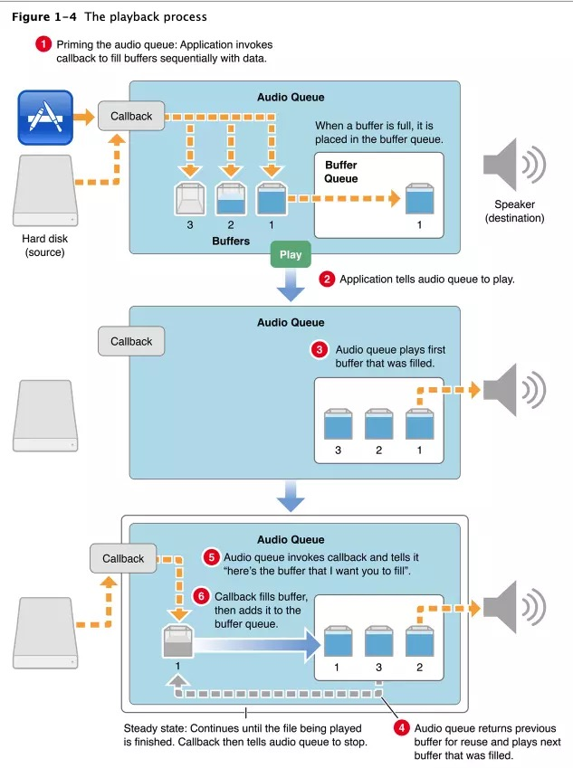
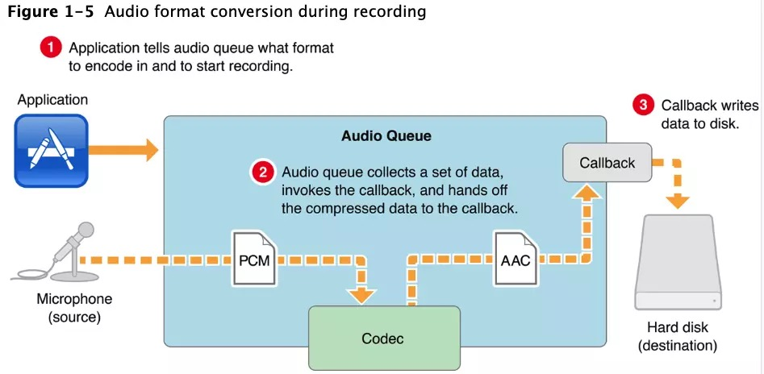
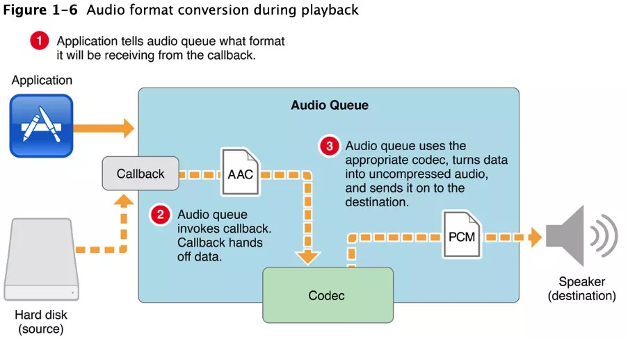

# AVFoundation

<!--
create time: 2019-06-10 10:04:51
Author: <黄东鸿>
-->

* AVCaptureSession   : 使用相机或麦克风实时采集音视频数据流, 管理输入输出音视频流
* AVCaptureDevice    : 相机硬件的接口,用于控制硬件特性，诸如镜头的位置(前后摄像头)、曝光、闪光灯等。
* AVCaptureInput     : 配置输入设备,提供来自设备的数据
* AVCaptureOutput    : 管理输出的结果(音视频数据流)
* AVCaptureConnection: 表示输入与输出的连接
* AVCaptureVideoPreviewLayer: 显示当前相机正在采集的状况

一个session可以配置多个输入输出

下图展示了向session中添加输入输出后的连接情况

配置Capture Inputs添加到Session中

一个AVCaptureInput代表一种或多种媒体数据,比如,输入设备可以同时提供视频和音频数据.每种媒体流代表一个AVCaptureInputPort对象.使用AVCaptureConnection可以将AVCaptureInputPort与AVCaptureOutput连接起来.

## Core Audio

Core Audio中包含我们最常用的Audio Toolbox与Audio Unit框架.

* 使用Audio Queue做录制,播放,暂停,循环与同步音频
* 使用Audio File, Converter, Codec Services去从磁盘读取与写入以及执行音频转换等功能.
* 使用Audio Unit与Audio Processing Graph在应用程序中管理音频单元.在OS X中可以自定义audio units.
* 使用Music Sequencing Services播放基于MIDI控制的音频数据
* 使用Core Audio Clock Services用于音频和MIDI同步以及时间格式管理
* 使用System Sound Services播放系统声音与界面的音效.

## Audio Queue Service

Audio Queue Services是官方推荐的方式以一种直接的,低开销的方式在iOS与Mac OS X中完成录制与播放的操作。它可以通过回调拿到音频帧数据，以完成更加精细的操作。

比上层API而言,可以直接获取每一帧音频数据,因此可以对音频帧做一些需要的处理. 但是无法对声音做一些更加精细的处理,如回声消除,混音,降噪等等,如果需要做更底层的操作,需要使用Audio Unit.

Audio Queue Service是Core Audio的Audio Toolbox框架中的基于C语言的一套接口.
Audio Queue Services是一套高级的API. 它不仅可以在无需了解硬件的基础上使程序与音频硬件(麦克风,扬声器等)之间完成交互,也在无需了解编解码器的原理情况下让我们使用复杂的编解码器.
同时,Audio Queue Services还提供了更加精细的定时控制以支持预定的播放与同步任务.可以使用它同步多个音频播放队列或者音视频间进行同步.

### 音频队列与入队操作

audio queue: 音频队列

audio queue buffer : 音频队列中存放的一个或多个结点数据

#### 录制过程

做录制操作时,一个audio queue buffer将被从输入设备(如:麦克风)采集的音频数据填充.音频队列中剩余的buffer按顺序排列在当前填充数据的buffer之后,依次等待被填充数据.在输出端,回调函数将按照指定时间间隔依次接收音频队列中按顺序排列好的音频数据.工作原理如下图:

* 图一: 录制开始,音频队列中填充需要的音频数据.
* 图二: 第一个buffer被填充, 回调函数取出buffer 1并将其写入文件,同时buffer2也被填充完数据.
* 图三: 在第4步,回调函数将用完的buffer 1重新放回音频队列,随后第五步回调函数再次取出音频数据buffer2,最终将其写入文件而后重新放回音频队列此后循环往复直到录制停止.

#### 播放过程

做播放操作时,一个audio queue buffer需要交给输出设备(如:扬声器).剩余的音频数据也将按顺序排列在当前取出播放的音频数据之后,等待播放.回调函数将按顺序取出音频队列中的数据交给扬声器,随后将用完的audio queue buffer重新放入音频队列.

* 图1: 应用程序启动音频播放队列,每调用依次回调函数填充一个audio queue buffers,填充完后将其放入音频队列. 当应用程序调用AudioQueueStart立即开始播放.
* 图2: 音频队列输出第一个音频数据
* 图3: 用完的audio queue buffer重新放入音频队列.一旦播放了第一个音频数据,音频队列会进入一个循环稳定的状态,即开始播放下一个buffer2(第4步)然后调用回调函数准备填充数据(第5步),最后(第6步)buffer1重新被填充并装入音频队列依次循环直到音频队列停止.

#### 控制播放的过程

Audio queue buffers始终按照入队顺序进行播放.然而可以使用AudioQueueEnqueueBufferWithParameters函数做一些额外控制

1. 设置缓冲区精确的播放时间,用于同步
2. 可以裁剪开始或结尾的audio queue buffer,这使我们可以做到开始或结尾的静音效果.
3. 增加播放的声音

### 使用编解码器

Audio Queue Services使音频编解码器用于转换音频数据格式。每个audio queue有一个自己的音频数据格式,被封装在AudioStreamBasicDescription中,通过mFormatID可以指定音频数据格式,audio queue会自动选择适当编解码器对其压缩.开发者可以指定采样率,声道数等等参数自定义音频数据.

如上图,应用程序告诉音频队列使用指定格式开始录制,音频队列在获取到原生的PCM数据后使用编码器将其转换为AAC类型数据,然后音频队列通知回调函数,将转换好的数据放入audio queue buffer中传给回调函数.最后,回调函数拿到转换好的AAC数据进行使用.

如上图,应用程序告诉音频队列播放指定的格式(AAC)的文件,音频队列调用回调函数从音频文件中读取音频数据,回调函数将原始格式的数据传给音频队列.最后,音频队列使用合适的解码器将音频数据(PCM)交给扬声器.

### 生命周期

音频队列在创建与销毁间的活动范围称为它的声明周期.

* Start (AudioQueueStart): 初始化
* Prime (AudioQueuePrime): 仅用于播放,在调用AudioQueueStart前调用它确保当有可用的音频数据时能够立即播放.
* Stop (AudioQueueStop): 重置音频队列,停止播放与录制.
* Pause (AudioQueuePause): 暂停录制,播放不会影响音频队列中已有的数据.调用AudioQueueStart恢复.
* Flush (AudioQueueFlush): 在音频队列最后一个buffer入队时调用,确保所有的音频数据处理完毕.
* Reset (AudioQueueReset): 调用后会立即静音,音频队列移除所有数据并且重置编解码器与DSP状态.

AudioQueueStop可以选择以同步或异步的方式停止.

* Synchronous: 立即停止,忽略队列中的数据
* Asynchronous: 当队列中所有数据被取出用完后再停止.

### 参考

[Core Audio音频基础概述](https://juejin.im/post/5cca9e99f265da03a54c2bc0)

[Audio Queue Services Programming Guide](https://developer.apple.com/library/archive/documentation/MusicAudio/Conceptual/AudioQueueProgrammingGuide/Introduction/Introduction.html#//apple_ref/doc/uid/TP40005343)
