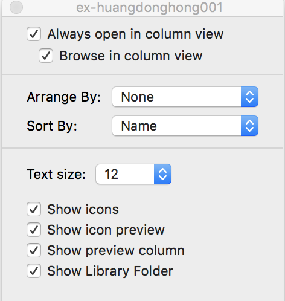

# Mac Tricky

<!--
create time: 2018-07-02 11:19:22
Author: 黄东鸿
-->

### ftp command not found

masOS High Sierra 把 ftp 命令给移除掉了，得自己安装

```
$ brew install tnftp tnftpd telnet telnetd
```

### Finder 显示 Library

第一种方式：

* Users home folder --> View --> Show View Options
* choose "Show Library Folder"



第二种方式：

1. From the Finder of Mac OS, pull down the “Go” menu and hold down the `OPTION` key
2. Choose “Library” from the drop down list


### 设置 Dropbox 代理

1. 打开代理设置：Preference --> Network --> Proxies
2. Proxy settings 选择 Manual, Proxy type 选择 `SOCKS5`
3. Server 输入 `127.0.0.1` 或者 `localhost`, 端口号 `1086`

### zsh 权限问题

[oh-my-zsh] Insecure completion-dependent directories detected:
drwxrwxrwx 7 hans admin 238 2 9 10:13 /usr/local/share/zsh
drwxrwxrwx 6 hans admin 204 10 1 2017 /usr/local/share/zsh/site-functions

```
$ chmod 755 /usr/local/share/zsh
$ chmod 755 /usr/local/share/zsh/site-functions
```