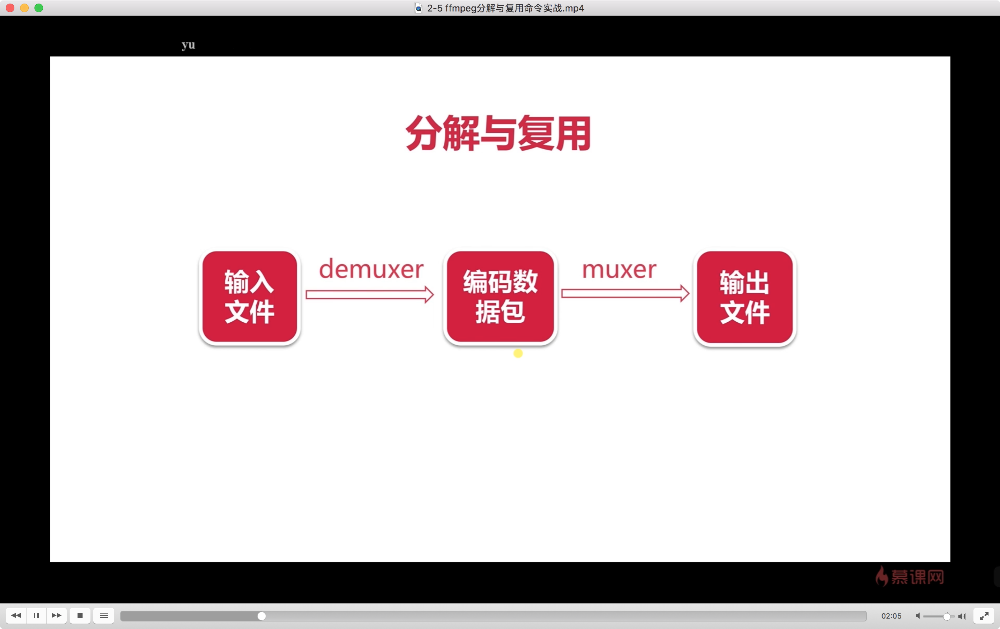
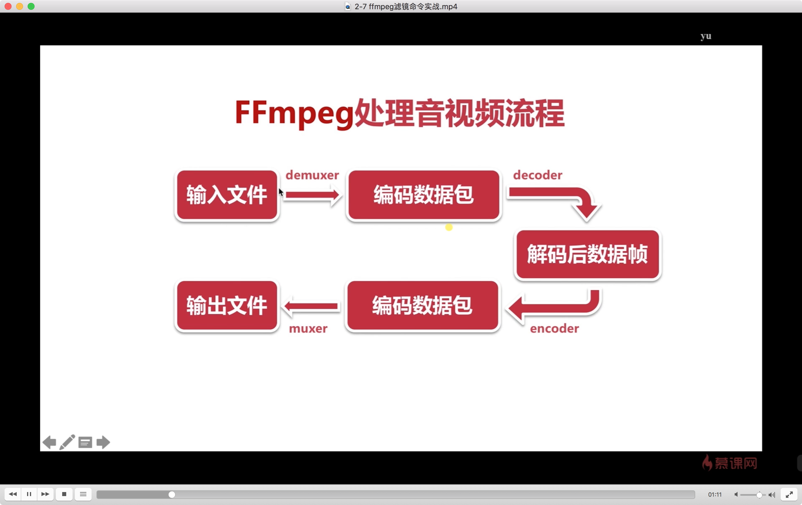
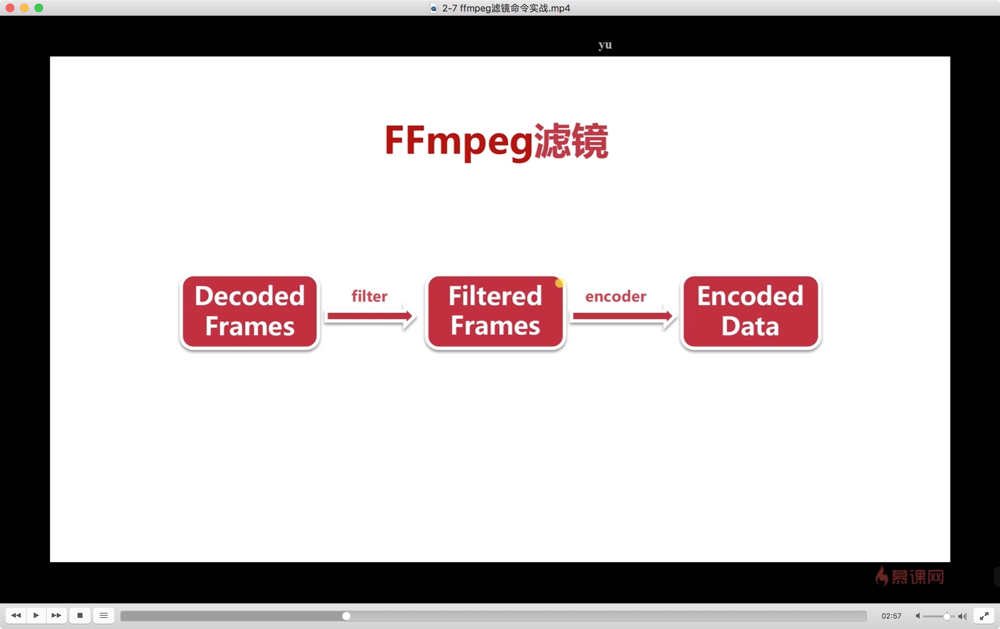

# ffmpeg & ffplay

<!--
create time: 2019-02-01 17:16:28
Author: <黄东鸿>
-->

## ffmpeg

#### ffmpeg 基本信息查询命令

* `-version`  : 显示版本
* `-demuxers` : 显示可用的demuxers（分解/解复用)
* `-muxers`   : 显示可用的demuxers（复用)
* `-devices`  : 显示可用的设备
* `-codecs`   : 显示所有编解码器
* `-decoders` : 显示可用的解码器
* `-encoders` : 显示所有的编码器
* `-bsfs`     : 显示比特流filter
* `-formats`  : 显示可用的格式
* `-protocols`    : 显示可用的协议
* `-filters`      : 显示可用的过滤器
* `-pix_fmts`     : 显示可用的像素格式
* `-sample_fmts`  : 显示可用的采样格式
* `-layouts`      : 显示channel名称
* `-colors`       : 显示识别的颜色名称

#### ffmpeg 录制命令

查询 avfoundation 录制支持的设备：

```
$ ffmpeg -f avfoundation -list_devices true -i ""
```

输出结果：

```
[AVFoundation input device @ 0x7ff704607e40] AVFoundation video devices:
[AVFoundation input device @ 0x7ff704607e40] [0] FaceTime HD Camera
[AVFoundation input device @ 0x7ff704607e40] [1] Capture screen 0
[AVFoundation input device @ 0x7ff704607e40] AVFoundation audio devices:
[AVFoundation input device @ 0x7ff704607e40] [0] Built-in Microphone
```

##### 录制视频

```
$ ffmpeg -f avfoundation -i 1 -r 30 out.yuv
```

录制时默认使用的像素格式是 `uyvy422`

* `-f avfoundation` : format, 指定使用的 avfoundation 采集数据
* `-i` : 指定从哪儿采集数据，它是一个文件索引号，1 表示屏幕，0 表示摄像头
* `-r` : 指定帧率

##### 录制音频

```
$ ffmpeg -f avfoundation -i :0 out.wav
```

* `:x` : *-i* 后边接 `:` 表示录制音频，`x` 表示使用第x个音频设备录制

#### ffmpeg 分解与复用



##### 多媒体格式转换

```
ffmpeg -i out.mp4 -vcodec copy -acodec copy out.flv
```

* `-i` : 输入文件 
* `-vcodec copy` : 视频编解码处理方式，copy 表示直接拷贝不改变视频编解码方式
* `-acodec copy` : 音频编解码处理方式

抽取源文件中的视频数据（不含音频）:

```
$ ffmpeg -i ar.mp4 -an -vcodec copy ar_out.h264
```

抽取源文件中的音频数据（不含视频）:

```
$ ffmpeg -i piano.mp4 -vn -acodec copy piano_out.aac
```

* `-an` : 不含音频数据
* `-vn` : 不含视频数据

#### ffmpeg 处理原始数据命令

##### 提取YUV数据(原始视频数据)

```
$ ffmpeg -i input.mp4 -an -c:v rawvideo -pix_fmt yuv420p out.yuv
```

* `-c:v rawvideo` : 对视频进行编码， 使用 rawvideo (原始视频)的格式进行编码

##### 提取PCM数据（原始音频数据）

```
$ ffmpeg -i input.mp4 -vn -ar 44100 -ac 2 -f s16le out.pcm
```

* `-ar 44100` : 音频采样率为 44.1k
* `-ac 2` : 音频的声道(channel)为双声道
* `-f s16le` : 抽取出的PCM数据的存储格式为 s16le（s表示有符号的，16代表每一位数值都是用16位表示，l代表小头）

#### ffmpeg 滤镜命令

ffmpeg 处理音视频流程



ffmpeg滤镜处理流程.png



```
$ ffmpeg -i in.mov -vf crop=in_w-200:in_h-200 -c:v libx264 -c:a copy out.mp4
```

* `-vf crop=....` : 指定视频的滤镜为 crop （裁剪滤镜）, 视频的高度和宽度都减少200
* `-c:v libx264` : 指定视频的编码器为 libx264
* `-c:a copy` : 不对音频做特殊处理

#### ffmpeg 音视频裁剪、合并

##### 视频裁剪

```
$ ffmpeg -i in.mp4 -ss 00:00:00 -t 10 out.ts
```

* `-ss 00:00:00` : specify a start timestamp, 指定视频裁剪开始的时间戳
* `-t 10` : 裁剪的时间时长（duration)

##### 视频合并

```
$ ffmpeg -f concat -i inputs.txt out.flv
```

* `-f concat` : 合并视频
* `inputs.txt` : 需要合并的视频文件列表，内容为 `file filename` 格式

#### ffmpeg 图片/视频互转命令

视频转图片：

```
$ ffmpeg -i in.flv -r 1 -f image2 image-%3d.png
```

* `-r 1` : 指定转换图片的帧率为1，即每秒钟转换一张图片
* `-f image2` : 表示将输入文件转成什么格式的，指定格式为 image2 

图片转视频：

```
$ ffmpeg -i image-%3d.png out_convert.mp4
```

#### 直播推流/拉流

HTTP协议直播源

CCTV1高清：http://ivi.bupt.edu.cn/hls/cctv1hd.m3u8
CCTV3高清：http://ivi.bupt.edu.cn/hls/cctv3hd.m3u8
CCTV5高清：http://ivi.bupt.edu.cn/hls/cctv5hd.m3u8
CCTV5+高清：http://ivi.bupt.edu.cn/hls/cctv5phd.m3u8
CCTV6高清：http://ivi.bupt.edu.cn/hls/cctv6hd.m3u8
苹果提供的测试源（点播）：http://devimages.apple.com.edgekey.net/streaming/examples/bipbop_4x3/gear2/prog_index.m3u8

推流

```
$ ffmpeg -re -i out.mp4 -c copy -f flv rtmp://server/live/streamName
```

* `-re` : 推流，作用是减慢帧率速度，因为本地视频文件播放的帧率是非常快的，让直播流的帧率与真正的帧率保持同步，rate e?
* `-c` : 指定音视频编解码

拉流

```
$ ffmpeg -i rtmp://server/live/streamName -c copy dump.flv
```

## ffplay

ffplay 默认使用的像素格式是 `yuv420p`，如果播放的视频录制时的像素格式不是 `yuv420p`，需要指定像素格式，否则会花屏。

* `-s` : 指定分辨率（尺寸）大小
* `-pix_fmt` : 指定像素格式

