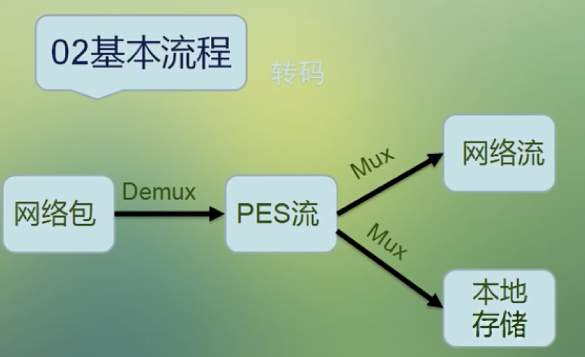

# ffmpeg学习笔记

<!--
create time: 2019-11-19 21:20:48
Author: <TODO: 请写上你的名字>

This file is created by Marboo<http://marboo.io> template file $MARBOO_HOME/.media/starts/default.md
本文件由 Marboo<http://marboo.io> 模板文件 $MARBOO_HOME/.media/starts/default.md 创建
-->

#### 名词解释

Demux: 解复用（解封装），音视频是经过RTP封装的，接收到RTP数据流后，首先要去掉RTP协议的头和分隔符等，得到裸流（纯音视频数据）
Mux: 封装（转换成MP4等视频格式）

#### 保留网络视频到本地

#### 多媒体文件的基本概念

* 多媒体文件其实是个容器
* 在容器里有很多流（Stream/Track)
* 每种流是由不同的编码器编码的
* 从流中读出的数据称为包
* 在一个包中包含着一个或多个帧

#### 处理流数据的几个重要的结构体

* AVFormatContext: 多媒体文件格式上下文
* AVStream: 音频流/视频流
* AVPacket: 数据包

#### FFmpeg 操作流数据的基本步骤

解复用 --> 获取流 --> 读数据包 --> 释放资源

#### 抽取视频数据

* Start code : 帧的特征码，分隔视频帧
* SPS/PPS : 解码的视频参数，分辨率、帧率等
* codec -> extradata

#### 将 MP4 转成 FLV 格式

* avformat_alloc_output_context2() : 新建输出上下文
* avformat_free_context() : 释放上下文
* avformat_new_stream() : 创建流
* avcodec_parameters_copy(): 拷贝编码参数
* avformat_write_header(): 写多媒体文件头
* av_write_frame() / av_interleaved_write_frame():
* av_write_trailer() : 写尾部数据

## FFmpeg API

### libavutil

* av_log_set_level(AV_LOG_DEBUG): 设置日志级别
* av_log(NULL, AV_LOG_INFO, "Hello World!\n") : 打印日志

### libavformat

* avpriv_io_delete("./mytestfile.txt") : 删除文件
* avpriv_io_move("111.txt", "222.txt") : 重命名

* avio_open_dir() : 打开目录
* avio_read_dir() : 读取目录中的文件信息
* avio_close_dir() : 关闭目录
* AVIODirContext: 操作目录的上下文
* AVIODirEntry: 目录项。用于存放文件名，文件大小等信息

* av_register_all() : 将 ffmpeg 中所知的编解码库等注册进来 （duprecated)
* avformat_open_input() : 打开一个多媒体文件
* avformat_close_input() : 关闭多媒体文件
* av_dump_format() : 打印多媒体信息

* av_init_packet() : 初始化一个多媒体数据包结构体
* av_find_best_stream() : 在多媒体文件中找到最好的一路流
* av_read_frame() : 读取流中的数据包
* av_packet_unref() : 释放数据包