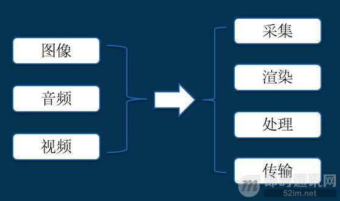
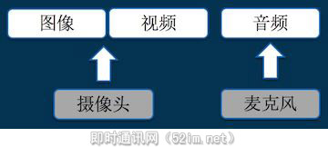
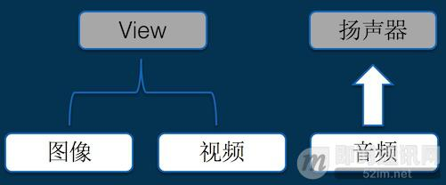
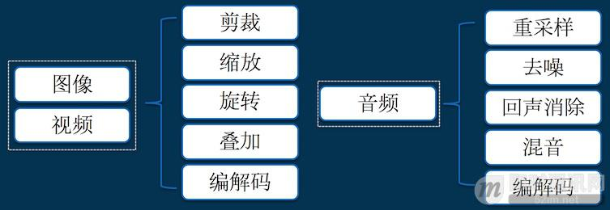

# 音视频开发

<!--
create time: 2018-11-23 17:30:07
Author: <黄东鸿>
-->

### 入门提纲

音视频开发的知识点：

具体的技术内容如下：

* 采集：它解决的是，数据从哪里来的问题；
* 渲染：它解决的是，数据怎么展现的问题；
* 处理：它解决的是，数据怎么加工的问题；
* 传输：它解决的是，数据怎么共享的问题。

每一个门类，都可以深挖，衍生出一个又一个充满技术挑战的话题，比如：如何更高效地渲染画面、如何提高音视频的压缩比，如何优化弱网下的音视频数据传输等等。

##### 具体技术点之采集

其实无论在哪个平台，图像、视频最初都是来自摄像头，而音频最初都是来自麦克风。

##### 具体技术点之渲染

其实无论在哪个平台，图像、视频最终都是要绘制到视图上面，而音频最终都是要输出到扬声器。

##### 具体技术点之处理

其实无论在哪个平台，图像和音视频的加工，除了系统的 API，大多数都会依赖一些跨平台的第三方库的，通过掌握这些第三方库的原理和使用方法，基本上就可以满足日常音视频处理工作了。

这些库包括但不限于：

1. 图像处理：OpenGL，OpenCV，libyuv，ffmpeg 等；
2. 视频编解码：x264，OpenH264，ffmpeg 等；
3. 音频处理：speexdsp，ffmpeg 等；
4. 音频编解码：libfaac，opus，speex，ffmpeg 等。

##### 具体技术点之传输

传输，它解决的是，数据怎么共享的问题，共享，最重要的一点，就是协议。

研究音视频传输，其实就是在研究协议，具体有哪些协议呢 ？

1. 音视频在传输前，怎么打包的，如：FLV，ts，mpeg4 等；
2. 直播推流，有哪些常见的协议，如：RTMP，RSTP 等；
3. 直播拉流，有哪些常见的协议，如：RTMP，HLS，HDL，RTSP 等；
4. 基于 UDP 的协议有哪些？如：RTP/RTCP，QUIC 等。

联网环境下的音视频的传输，是一个非常有挑战和价值的方向，为了解决弱网下的传输延时、卡顿，提高用户体验，整个业界都在不断地进行着深入的探索和优化。