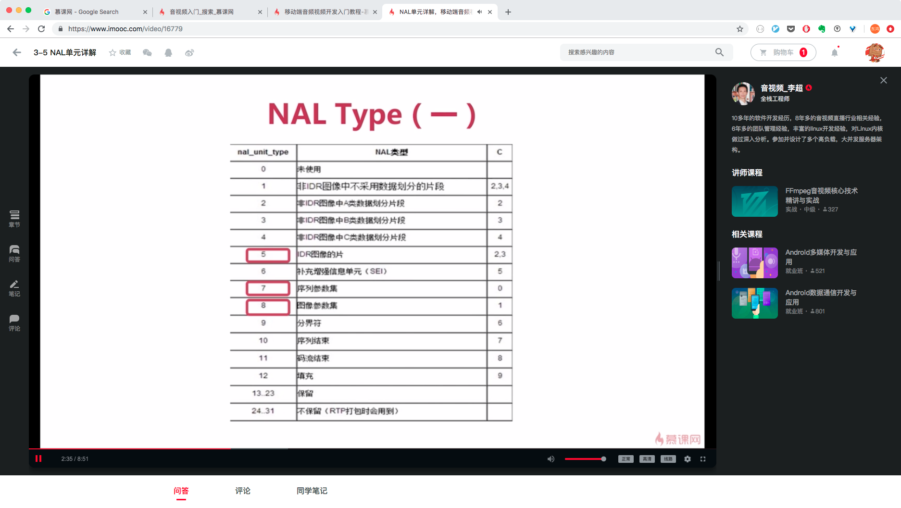

# 音视频编解码知识

<!--
create time: 2019-01-04 19:22:28
Author: <黄东鸿>
-->

## 直播架构与CDN网络

### 直播产品的种类

* 泛娱乐化直播：花椒、映客等娱乐直播，还有斗鱼、熊猫等游戏直播
* 实时互动直播：音视频会议、教育直播等，像思科、全时、声网


### CDN 构成

* 边缘节点：用户从边缘节点上获取数据
* 二级节点：主干网节点，主要用于缓存、减轻源站压力
* 源站：CP(内容提供方)将内容放到源站


### 搭建简单的直播系统

#### 常用工具

* ffmpeg
* ffplay
** flashplayer

#### 搭建流媒体服务

* 准备流媒体服务器（Linux 或 Mac）
* 编译并安装 Nginx 服务
* 配置 RTMP 服务并启动 Nginx 服务

1. 安装 nginx + rtmp 模块

```
$ brew tap denji/nginx
$ brew install nginx-full --with-rtmp-module --with-debug
```

2. 修改配置文件 `/usr/local/etc/nginx/nginx.conf`

```
rtmp {
	server {
		# 指定服务端口
		listen 1935;
		chunk_size 4000;
		
		# 指定流应用
		application live {
			live on;
			record off;
			allow play all;
		}
	}
}
```

3. 重启 nginx 服务 `nginx -s reload`

#### ffmpeg 直播命令

推流

```
ffmpeg -re -i out.mp4 -c copy -f flv rtmp://server/live/streamName
```

拉流

```
ffmpeg -i rtmp://server/live/streamName -c copy dump.flv
```

## 音频基础知识

### 声音三要素

* 音调：就是音频，男生 -> 女生 -> 儿童
* 音量：振动的幅度
* 音色：它与材质有很大的关系，本质是谐波

#### 音量与音调


#### 音色


#### 人类听觉范围


#### 听觉/发声范围


### 音频的量化与编码

#### 音频量化过程


#### 量化基本概念

* 采样大小：一个采样用多少bit存放。常用的是16bit
* 采样率：采样频率 8k、16k、32k、44.1k、48k
* 声道数：单声道、双声道、多声道

#### 码率

码率 = 采样大小 * 采样率 * 声道数

例如：采样率为44.1KHz, 采样大小为16bit, 双声道的 PCM 编码的 WAV 文件，它的码率为 44.1K * 16 * 2 = 1411.2 Kb/s

### 音频压缩技术

主要有两种压缩技术：

* 消除冗余数据
* 哈夫曼无损编码

压缩的主要方法是去除采集到的音频冗余信息，所谓冗余信息包括人耳听觉范围外的音频信号以及被掩蔽掉的音频信号

信号的掩蔽可以分为：

* 频域掩蔽
* 时域掩蔽


#### 音频编码过程


### 音频编解码器

常见的音频编解码器：OPUS、AAC、Vorbis、Speex、iLBC、AMR、G.711 等

网上测评结果：OPUS > AAC > Vorbis

音频编解码器性能对比


#### AAC

* AAC(Advanced Audio Coding) 目的是取代 MP3 格式
* MPEG-4 标准出现后，AAC 加入了 SBR 技术和 PS 技术
* 目前常见的规格有 `AAC LC`, `AAC HE V1`, `AAC HE V2`

AAC 规格：


* AAC LC(Low Compplexity)低复杂度，码流128k
* AAC HE: AAC LC + SBR(Spectral Band Replication)
* AAC HE V2: AAC LC + SBR + PS(Parametric Stereo)

AAC 格式：

* ADIF(Audio Data Interchange Format): 这种格式只能从头开始解码，常用在磁盘文件中
* ADTS(Audio Data Transport Stream): 这种格式每一帧都有一个同步字，可以在音频流的任何位置开始解码，它类似于数据流格式

AAC 编码库哪个好？

Libfdk_AAC > ffmpeg AAC > libfaac > libvo_aacenc

## 视频基础知识

### H264基本概念

* I帧：关键帧，采用帧内压缩技术
* P帧：向前参考帧，压缩时只参考前一帧，属于帧间压缩技术
* B帧：双向参考帧，压缩时既参考前一帧，也参考后一帧，属于帧间压缩技术

GOF


SPS 与 PPS

* SPS(Sequence Parameter Set): 序列参数集，存放帧数、参考帧数据、解码图像尺寸、帧场编码模式选择标识等
* PPS(Picture Parameter Set): 图像参数集，存放商编码模式选择标识、片组数目、初始量化参数和去方块滤波系数调整标识等

视频花屏/卡顿原因

* 如果 GOP 分组中的P帧丢失会造成解码端的图像发生错误
* 为了避免花屏问题的发生，一般如果发现P帧或者I帧丢失，就不显示本GOP内的所有帧，直到下一个I帧来后重新刷新图像

视频编解码器：

* x264/x265
* openH264
* vp8/vp9

### H264 宏块的划分与帧分组

#### H264压缩技术

* 帧内预测压缩：解决的是空域数据冗余问题
* 帧间预测压缩：解决的是时域数据冗余问题
* 整数离散余弦变换(DCT)：将空间上的相关性变为频域上无关的数据然后进行量化
* CABAC压缩

H264 宏块划分

### H264 结构与码流

H264 结构图


H264 编码分层

* NAL层: Network Abstraction Layer, 视频数据网络抽象层
* VCL层: Video Coding Layer, 视频数据编码层

#### 码流基本概念

* SODB: String Of Data Bits, 原始数据比特流，长度不一定是8的倍数，它是由VCL层产生的
* RBSP: Raw Byte Sequence Payload, SODB + trailing bits, 算法是在SODB最后一位补1，不按字节对齐则补0
* EBSP: Encapsulate Byte Sequence Payload, 需要两个连续的 0x00 就增加一个 0x03
* NALU: NAL Header(1B) + EBSP

### NAL 单元

NAL Unit


Slice 与 MacroBlock


H264 切片


H264 码流分层


NAL Header

* F : forbidden_zero_bit, 在 H.264 规范中规定了这一位必须为0
* NRI : 指示重要性，暂无用
* Type : 这个 NAUL 单元的类型


NAL Type




NAL 类型介绍

* 单一类型：一个 RTP 只包含一个 NALU
* 组合类型：一个 RTP 包含多个 NALU，类型是 24-27
* 分片类型：一个 NALU 单元分成多个 RTP 包，类型是 28 和 29


FU Header

* S : start bit, 用于指明分片的开始
* E : end bit, 用于指明分片的结束
* R : 未使用，设置为0
* Type : 指明分片 NAL 的类型

### YUV

* YUV(也称YCbCr)是电视系统所采用的一种颜色编码方法
* Y 表示明亮度，也就是灰阶值，它是基础信号
* U 和 V 表示的是色度，UV 的作用是描述影像色彩及饱和度，它们用于指定像素的颜色

YUV 常见格式

* YUV 4:2:0 (YCbCr 4:2:0)
* YUV 4:2:2 (YCbCr 4:2:2)
* YUV 4:4:4 (YCbCr 4:2:4)

#### YUV 4:2:0

* YUV 4:2:0 并不意味着只有Y、Cb 两个分量，而没有 Cr 分量。它实际指的是对每行扫描线来说，只有一种色度分量，它以 2:1 的抽样率存储
* 相邻的扫描行存储不同的色度分量，也就是说，如果一行是 4:2:0 的话，下一行就是 4:0:2 ，再下一行就是 4:2:0 以此类推

#### YUV 存储格式

* planar (平面)
	I420 : YYYYYYYY UU VV => YUV420P
	YV12 : YYYYYYYY VV UU => YUV420P
* packed (打包)
	NV12 : YYYYYYYY UVUV => YUV420SP
	NV21 : YYYYYYYY VUVU => YUV420SP

## 音视频知识

### 音视频技术

* 音/视频采集
* 音/视频硬件编/解码
* FFMPEG
* 视频渲染与OpenGL
* x264优化
* 交叉编译与优化
* WebRTC
* 音视频处理架构
* 网络传输

### 行业痛点

* 视频秒开
* 回音消除
* 音频降噪
* 视频出现花屏/卡顿/绿边
* 手机发烫
* 音视频同步
